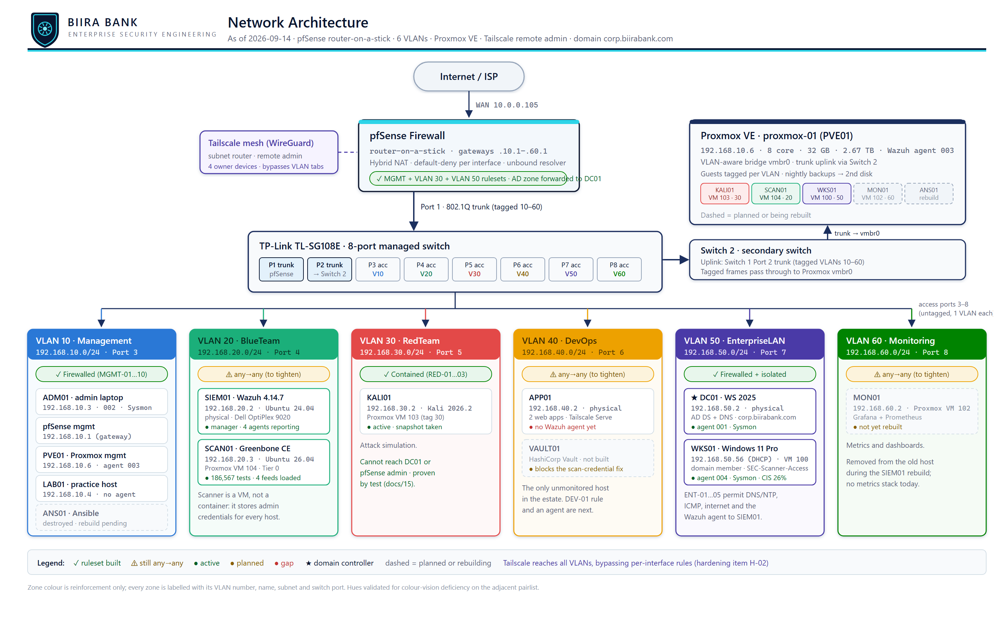

# Enterprise Information Security Lab

**The scenario.** This environment is built and documented as the infrastructure of a fictional regional bank, **Biira Bank**. The domain is real (`ad.biira.online`), the segmentation is real, and the controls are tested rather than described. Working to a named organisation rather than an abstract "lab" forces the decisions a real environment forces: who needs to reach what, why a rule exists, what an auditor would ask, and what happens when something fails. Financial services was chosen deliberately, because it is the sector where segmentation, least privilege, change control and evidence are least optional.

The sibling repository [enterprise-iam-lab](https://github.com/noble-antwi/enterprise-iam-lab) documents the same organisation's identity estate (Active Directory, Okta, Entra) and is built on the architecture described here. Both repositories share one visual identity, documented in [images/brand](images/brand/README.md): a vault door inside a shield, where the shield is the protected boundary and the vault door is the controlled way through it. That reads as network segmentation here and as authentication and authorisation there.

**Elsewhere:** project write-ups and other work at [noble-antwi.github.io](https://noble-antwi.github.io/). Selected procedures are recorded on video and linked from the document they belong to, for example [deploying the first Wazuh agent](https://youtu.be/Tsh_W0gWIRc) (`docs/16`).

[](docs/)
[]()
[]()
[]()

---

## Project Overview

A comprehensive, enterprise-grade cybersecurity homelab implementing professional security practices using **pfSense**, **VLAN segmentation**, **cross-platform automation**, **SIEM monitoring**, **remote access**, and **bare-metal virtualisation**. This lab environment mimics real-world infrastructure for Blue Team operations, Red Team simulation, and DevSecOps practices across Linux, Windows, and virtualised platforms.

---

## Architecture Highlights

- **pfSense Firewall** - Enterprise routing and security with 6-VLAN segmentation
- **Proxmox VE Hypervisor** - Bare-metal virtualisation with full multi-VLAN VM hosting
- **Cross-Platform Automation** - Ansible managing Linux, Windows, and Proxmox nodes
- **Wazuh SIEM** - Security monitoring and incident response across all platforms
- **Grafana/Prometheus** - Infrastructure observability and performance monitoring
- **Tailscale Mesh VPN** - Secure remote access to all lab resources globally
- **Windows Integration** - Professional Windows automation via WinRM and service accounts
- **Enterprise Security** - VLAN isolation, professional authentication, centralised monitoring

---

## Documentation Structure

| Module | Description | Status |
|--------|-------------|--------|
| **[01-network-infrastructure](docs/01-network-infrastructure.md)** ([PDF](docs/01-network-infrastructure.pdf)) | pfSense setup, VLAN architecture, switch configuration | Complete |
| **[02-security-monitoring](docs/02-security-monitoring.md)** ([PDF](docs/02-security-monitoring.pdf)) | Wazuh SIEM deployment and BlueTeam VLAN setup | Complete |
| **[03-observability-stack](docs/03-observability-stack.md)** ([PDF](docs/03-observability-stack.pdf)) | Grafana and Prometheus monitoring deployment | Complete |
| **[04-automation-platform](docs/04-automation-platform.md)** ([PDF](docs/04-automation-platform.pdf)) | Cross-platform Ansible automation with Linux and Windows | Complete |
| **[05-remote-access](docs/05-remote-access.md)** ([PDF](docs/05-remote-access.pdf)) | Tailscale mesh VPN implementation | Complete |
| **[06-ansible-service-account](docs/06-ansible-service-account.md)** ([PDF](docs/06-ansible-service-account.pdf)) | Ansible service account implementation for automation | Complete |
| **[07-ansible-roles-architecture](docs/07-ansible-roles-architecture.md)** ([PDF](docs/07-ansible-roles-architecture.pdf)) | Role-based automation architecture | Complete |
| **[08-windows-integration](docs/08-windows-integration.md)** ([PDF](docs/08-windows-integration.pdf)) | Windows automation and integration implementation | Complete |
| **[09-ansible-controller-setup](docs/09-ansible-controller-setup.md)** ([PDF](docs/09-ansible-controller-setup.pdf)) | Ansible controller bootstrap and configuration | Complete |
| **[10-proxmox-hypervisor](docs/10-proxmox-hypervisor.md)** ([PDF](docs/10-proxmox-hypervisor.pdf)) | Proxmox VE deployment, VLAN-aware bridge, trunk port migration | Complete |
| **[11-domain-controller-firewall](docs/11-domain-controller-firewall.md)** ([PDF](docs/11-domain-controller-firewall.pdf)) | pfSense aliases and rules for the DC01 domain controller: what each AD port does, how rules evaluate, target layout | In Progress |
| **[12-lab-expansion-roadmap](docs/12-lab-expansion-roadmap.md)** ([PDF](docs/12-lab-expansion-roadmap.pdf)) | Windows/AD estate growth plan: endpoint inventory, what each machine teaches, attack/defence scenarios, phased build, IAM repo decision | Planning |
| **[13-firewall-rulebase-governance](docs/13-firewall-rulebase-governance.md)** ([PDF](docs/13-firewall-rulebase-governance.pdf)) | Audit-grade rulebase governance: the 8 principles auditors check, a living rule register with per-rule justification and control mapping, change-control log, review cadence | In Progress |
| **[14-proxmox-storage-backup-capacity](docs/14-proxmox-storage-backup-capacity.md)** ([PDF](docs/14-proxmox-storage-backup-capacity.pdf)) | Proxmox storage layout, backup/recovery strategy (NIST CP-9), LXC-vs-VM capacity plan, and the lab-wide machine naming convention | Current |
| **[15-kali-attack-host-build](docs/15-kali-attack-host-build.md)** ([PDF](docs/15-kali-attack-host-build.pdf)) | Building the attack host on the isolated RedTeam segment, the containment evidence, and what the test does and does not prove about reachability | Current |
| **[16-siem01-build](docs/16-siem01-build.md)** ([PDF](docs/16-siem01-build.pdf)) | Recovering the SIEM after a hardware failure: the role swap that put Wazuh on dedicated hardware, the cloud-init and host-key traps, and where agent firewall rules belong | Current |
| **[ssh-configuration](docs/ssh-configuration.md)** ([PDF](docs/ssh-configuration.pdf)) | SSH configuration and key management guide | Complete |
| **[troubleshooting](troubleshooting/)** | Comprehensive troubleshooting guides by component | Complete |

---

## Current Lab Infrastructure



*Current-state architecture: Internet to pfSense, Switch 1 (Port 1 trunk to pfSense, Port 2 trunk to Switch 2, Ports 3 to 8 single-VLAN access), Switch 2 carrying the tagged VLANs to Proxmox, and the six security zones with their firewall status.*

### VLAN Architecture

| VLAN | Purpose | Subnet | Gateway | Services |
|------|---------|--------|---------|----------|
| **10 - Management** | Admin and Control | `192.168.10.0/24` | `.1` | pfSense, Ansible, Windows Systems, Proxmox |
| **20 - BlueTeam** | Security Monitoring | `192.168.20.0/24` | `.1` | SIEM01 (`192.168.20.2`), Wazuh 4.14.7 manager, indexer and dashboard |
| **30 - RedTeam** | Attack Simulation | `192.168.30.0/24` | `.1` | Kali Linux (Proxmox VM) |
| **40 - DevOps** | CI/CD Pipeline | `192.168.40.0/24` | `.1` | HashiCorp Vault desktop (staged, awaiting configuration) |
| **50 - EnterpriseLAN** | Business Services | `192.168.50.0/24` | `.1` | Windows Server 2025 domain controller (`192.168.50.2`) |
| **60 - Monitoring** | Observability | `192.168.60.0/24` | `.1` | Grafana and Prometheus, moving to a Proxmox guest |

### Deployed Systems

Machines follow a role-based naming convention, `<ROLE><NN>`: servers such as `DC01`, `CA01`, `SIEM01`, `MON01`, `VAULT01`, `ANS01`, `KALI01`, `WKS01`, and infrastructure such as `FW01` (pfSense), `SW01`/`SW02` (switches), `PVE01` (hypervisor) and `LAB01` (training host). The full scheme, the current rename status of every machine, and the reasoning behind the monitoring and SIEM role swap are in `docs/14` section 5.

| System | IP Address | VLAN | Platform | Purpose | Status |
|--------|------------|------|----------|---------|--------|
| pfSense Firewall | `192.168.10.1` | Management | FreeBSD | Gateway, firewall, Tailscale subnet router | Active |
| ANS01 (Ansible Controller) | `192.168.10.2` | Management | Ubuntu | Cross-platform automation | Rebuilding as a Proxmox guest |
| Laptop (Admin) | `192.168.10.3` | Management | Windows 11 | Administration workstation | Active |
| TCM Ubuntu | `192.168.10.4` | Management | Ubuntu 24.04 | Training and development | Active |
| Proxmox VE (proxmox-01) | `192.168.10.6` | Management | Proxmox VE 9.2 | Bare-metal VM hypervisor | Active |
| SIEM01 | `192.168.20.2` | BlueTeam | Ubuntu 24.04 (Dell OptiPlex 9020, 8 core, 16 GB) | SIEM and centralised logging | Active, DC01 reporting as agent 001 |
| KALI01 | `192.168.30.2` | RedTeam | Kali Linux 2026.2 | Attack simulation (Proxmox VM 103) | Active, containment validated |
| VAULT01 (lab-devops-svc01) | `192.168.40.2` | DevOps | Ubuntu | HashiCorp Vault secrets management | Staged, not yet configured |
| DC01 | `192.168.50.2` | EnterpriseLAN | Windows Server 2025 | Domain controller for `ad.biira.online` (AD DS + DNS) | Active |
| MON01 (Grafana + Prometheus) | `192.168.60.2` | Monitoring | Ubuntu | Observability dashboards | To be rebuilt as a Proxmox guest |

### Physical Network Layout

```
Internet
    |
pfSense (192.168.10.1)
    |
TP-Link TL-SG108E Managed Switch
    |
    |-- Port 1  Trunk (all VLANs)  pfSense ue0
    |-- Port 2  Trunk (all VLANs)  Switch 2 (secondary) -> Proxmox VE (192.168.10.6)
    |-- Port 3  VLAN 10 Access     Secondary unmanaged switch
    |               |
    |               |-- Laptop        (192.168.10.3)
    |-- Port 4  VLAN 20 Access     BlueTeam segment
    |-- Port 5  VLAN 30 Access     RedTeam segment
    |-- Port 6  VLAN 40 Access     Vault desktop (192.168.40.2, awaiting configuration)
    |-- Port 7  VLAN 50 Access     Windows Server 2025 DC (192.168.50.2)
    |-- Port 8  VLAN 60 Access     Monitoring segment
```

### Proxmox VM Hosting

Proxmox VE is connected to a trunk port carrying all VLANs, enabling VMs to be placed on any lab segment via a single VLAN-aware Linux bridge. A VM's network placement is determined solely by its VLAN Tag assignment at the virtual NIC level.

The host is an 8 core / 32 GiB / 2.67 TiB node with nightly backups to a dedicated second disk (see `docs/14`). Linux services are planned as LXC containers and Windows as full VMs, which keeps the estate within the memory budget.

| VM / CT | Bridge | VLAN Tag | Network | Purpose | Status |
|---------|--------|----------|---------|---------|--------|
| KALI01 (VM 103) | vmbr0 | 30 | 192.168.30.2 | RedTeam attack simulation | Active, containment validated |
| ANS01 | vmbr0 | 10 | 192.168.10.2 (same IP) | Fresh rebuild of the automation controller | Planned |
| MON01 | vmbr0 | 60 | 192.168.60.2 | Grafana and Prometheus, rebuilt fresh | Planned |
| DC02, CA01, WKS01/02 | vmbr0 | 50 / client | see `docs/12` | AD estate expansion for security training | Roadmap |

---

## Lab Capabilities

### Operational Capabilities

- **Virtualisation**: Proxmox VE node with multi-VLAN VM hosting across all lab segments, plus nightly backups to a dedicated disk
- **Identity Services**: Active Directory (`ad.biira.online`) on DC01 with AD-integrated DNS, forward and reverse zones, verified healthy
- **Network Segmentation**: six VLANs with per-interface default-deny firewall rulesets
- **Remote Operations**: Global access to all lab resources via Tailscale mesh VPN
- **Scalability**: Proxmox enables rapid deployment of new VMs on any VLAN without physical changes
- **Cross-Platform Automation**: Ansible (currently offline while the controller is rebuilt as ANS01)
- **Security Monitoring**: Wazuh SIEM (currently offline after a hardware failure, rebuild planned as a Proxmox guest)
- **Performance Monitoring**: Infrastructure health via Grafana and Prometheus on MON01

### Security Posture

- **Default-Deny Segmentation**: MANAGEMENT, ENTERPRISELAN and REDTEAM run explicit least-privilege rulesets; every rule carries a business justification and a NIST control mapping (`docs/13`)
- **Management-Plane Isolation**: verified by test. VLAN 50 cannot reach the pfSense administrative interface on any interface, while retaining the DNS, NTP and internet access it legitimately needs
- **Attack-Segment Containment**: RedTeam (VLAN 30) has no standing path to the domain controller or any other VLAN. Exercise access is granted temporarily and withdrawn afterwards
- **Change Control**: firewall changes are logged with tester, rollback and validation evidence, and controls are re-tested before and after each change
- **Backup and Recovery**: nightly Proxmox backups to a separate physical disk, with documented restore procedure (NIST CP-9)
- **Software Integrity**: installation media verified by SHA256 before use (NIST SI-7)
- **Secure Remote Access**: WireGuard encryption via Tailscale. Its ability to bypass per-interface rules is recorded as a known, risk-accepted hardening item (H-02)

### Platform Coverage Metrics

| Platform | Systems | Authentication | Management | Status |
|----------|---------|---------------|------------|--------|
| Linux | MON01, TCM Ubuntu (ANS01 and SIEM01 pending rebuild) | SSH keys (ED25519) | Ansible + SSH | Automation paused until ANS01 is rebuilt |
| Windows | Admin laptop, DC01 | WinRM + service accounts | Ansible + WinRM | DC01 onboarding pending |
| Kali | KALI01 (VM 103, VLAN 30) | Local account + SSH | Manual | Active, containment validated |
| Proxmox VE | proxmox-01 (1 node) | SSH + Web UI (port 8006) | Web UI + SSH | Active, nightly backups |
| Network | pfSense + 2 switches | Web UI + SSH | Manual | 3 of 6 VLAN rulesets hardened |
| Total | 7 active, 1 staged, 2 rebuilding | Multi-method | Cross-platform | Phase 2 in progress |

---

## Development Roadmap

### Phase 1: Foundation (Complete)

- Network infrastructure with 6-VLAN segmentation
- Security monitoring with Wazuh SIEM
- Cross-platform automation with Ansible
- Remote access via Tailscale mesh VPN
- Observability stack with Grafana and Prometheus

### Phase 2: Virtualisation and Advanced Security (In Progress)

Complete:

- Proxmox VE hypervisor deployed with VLAN-aware trunk port configuration
- DC01 (Windows Server 2025) promoted as domain controller for `ad.biira.online`, with AD-integrated forward and reverse DNS zones and clean `dcdiag` health
- pfSense rulebase hardened on three interfaces: MANAGEMENT (MGMT-01 to 10), ENTERPRISELAN (ENT-01 to 04) and REDTEAM (RED-01 to 03), each rule justified and control-mapped
- Management-plane isolation proven by before and after testing (`docs/13` section 3.1)
- KALI01 (Kali Linux) built on VLAN 30 and its containment validated against a live host: no reachability to the domain controller or the firewall management plane, while DNS, time and internet all function (`docs/15`)
- Nightly Proxmox backups to a dedicated second disk, verified by an on-demand restore point

In progress:

- Ansible controller rebuild as ANS01 (Proxmox guest, retaining `192.168.10.2`)
- Wazuh installed on SIEM01 after the role swap with the monitoring hardware, with DC01 enrolled as the first agent and CIS baselines recorded for both hosts (`docs/16`)
- MON01 rebuild as a Proxmox guest, replacing the physical monitoring host

Remaining:

- BlueTeam, DevOps and Monitoring VLAN rulesets (still permissive)
- Tailscale scoping (hardening item H-02)
- Wazuh agent deployment across all platforms, custom detection rules, and security dashboards

### Phase 3: Red Team Capabilities (Started)

- Kali Linux operational on VLAN 30 and contained (`docs/15`)
- Attack simulation and penetration testing environment
- Purple team exercise frameworks
- Security tool development and testing environment

### Phase 4: DevSecOps Integration (Future)

- CI/CD pipeline integration with security scanning
- Infrastructure as Code enhancement
- Automated compliance checking and reporting
- Advanced automation workflows and orchestration

---

## Monitoring and Health Checks

- **All Systems**: Accessible and manageable via Tailscale mesh network
- **Centralised Logging**: Comprehensive log collection through Wazuh SIEM
- **Infrastructure Metrics**: Real-time performance monitoring via Prometheus
- **Visual Dashboards**: System health and security status via Grafana
- **Cross-Platform Status**: Unified monitoring via Ansible automation platform
- **Network Health**: pfSense monitoring and VLAN performance tracking

---

## Maintenance and Operations

### Regular Maintenance Tasks

- **Security Updates**: Automated and manual patching across Linux and Windows systems
- **Wazuh Rule Tuning**: Continuous optimisation of detection rules and alert thresholds
- **Grafana Dashboard Enhancement**: Regular improvement of monitoring visualisations
- **Ansible Playbook Development**: Ongoing automation enhancement and capability additions
- **System Performance Optimisation**: Regular review and tuning of infrastructure performance
- **Documentation Updates**: Continuous improvement of procedures and troubleshooting guides
- **Proxmox Maintenance**: Periodic host and VM updates via web UI and CLI

---

## Contributing

This project serves as a comprehensive reference implementation for enterprise-grade security homelabs.

Community involvement is welcomed:

- **Fork and Adapt**: Use as foundation for your own security lab environment
- **Submit Improvements**: Pull requests for documentation, procedures, and automation enhancements
- **Share Experiences**: Issue discussions for troubleshooting and best practices
- **Knowledge Sharing**: Contribute lessons learned and advanced configurations

### Contribution Guidelines

- Maintain focus on enterprise-grade practices and professional standards
- Include comprehensive documentation for any new features or procedures
- Test thoroughly across all platforms where applicable
- Follow existing documentation structure and formatting standards

---

## Acknowledgments

- **pfSense Community** - Outstanding firewall platform with comprehensive VLAN and routing capabilities
- **Proxmox Team** - Excellent bare-metal hypervisor with powerful VLAN-aware networking
- **Wazuh Team** - Exceptional SIEM solution with powerful threat detection and analysis features
- **Tailscale** - Revolutionary mesh networking solution that transformed remote access capabilities
- **Grafana Labs** - Excellent observability platform with powerful visualisation and monitoring tools
- **Ansible Community** - Robust automation platform with outstanding cross-platform support

---

## Quick Status Overview

The enterprise homelab demonstrates professional security practices, comprehensive cross-platform automation, advanced monitoring capabilities, and bare-metal virtualisation in a scalable, well-documented infrastructure. The implementation showcases real-world enterprise security operations, making it suitable for Blue Team training, security research, professional development, and demonstrating advanced cybersecurity capabilities.

**Current Achievement**: an Active Directory domain (`ad.biira.online`) running on DC01, sitting behind a pfSense rulebase that has been converted from permissive any-to-any rules to explicit, least-privilege, control-mapped rulesets on three interfaces. Management-plane isolation and RedTeam containment are enforced and evidenced by repeatable tests, with every change recorded in a firewall rule register (`docs/13`). Proxmox VE hosts the growing estate on a VLAN-aware trunk with nightly backups to a separate disk.

**Being honest about current state**: the Wazuh SIEM host has failed and the Ansible controller was deliberately destroyed for rebuild, so centralised monitoring and automation are offline while both are rebuilt as Proxmox guests. Three of the six VLANs still carry permissive rules. Those gaps are tracked openly in the roadmap above and in `docs/13` rather than presented as complete.
