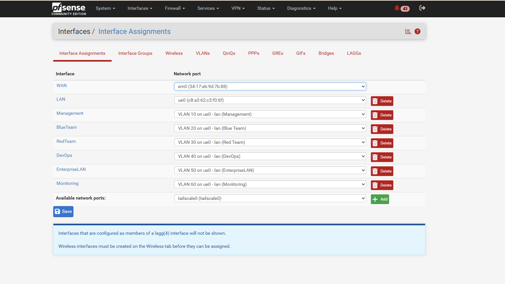
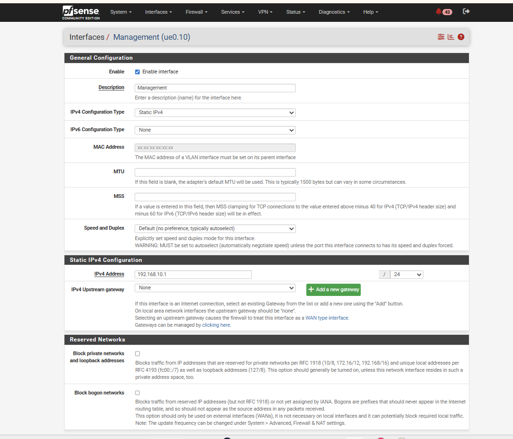
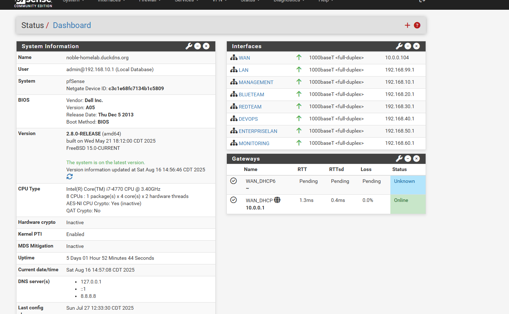
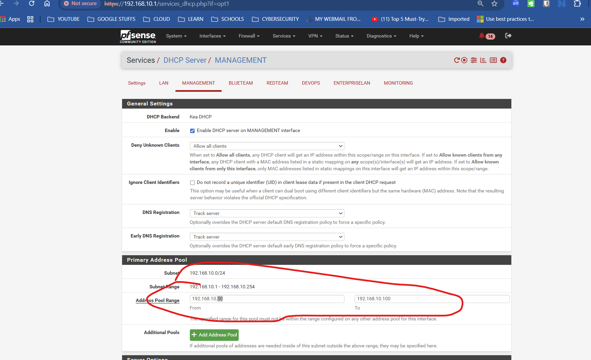
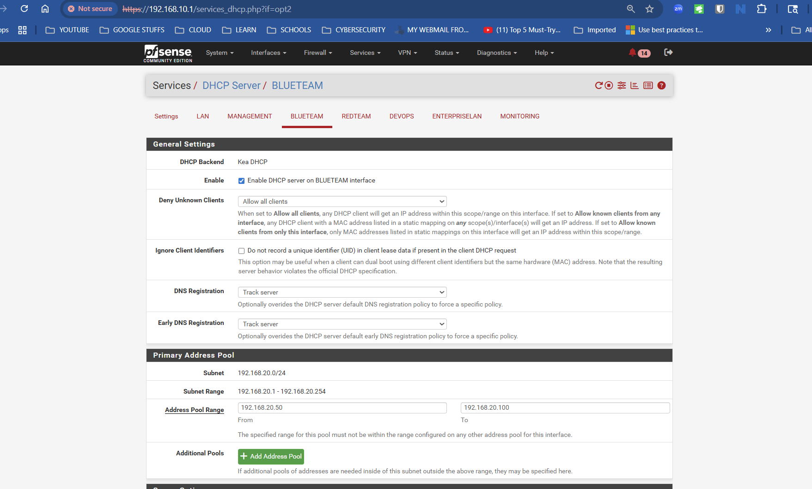
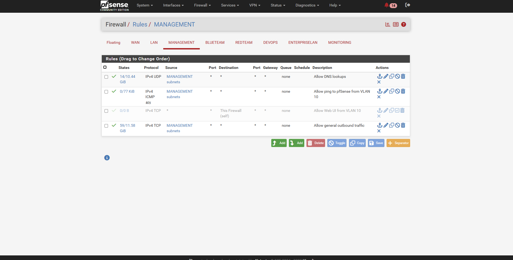
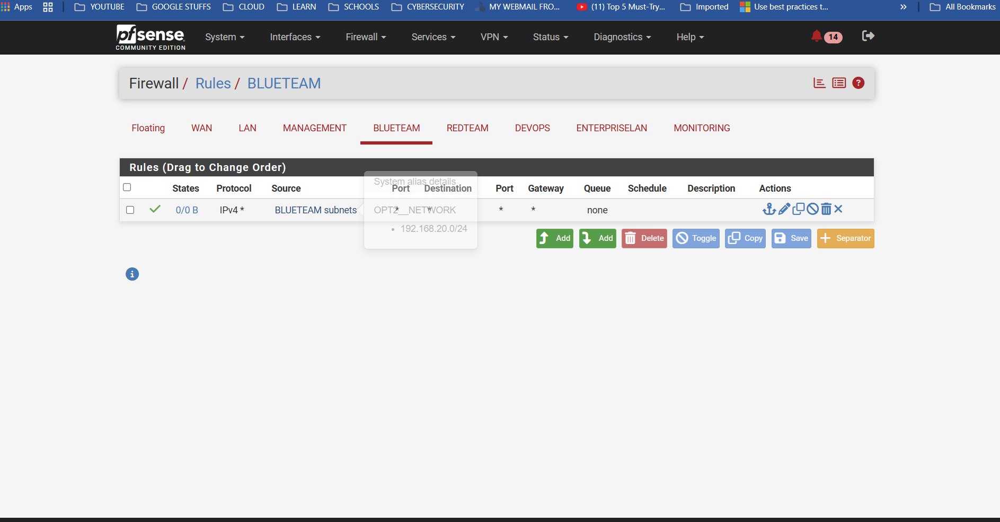
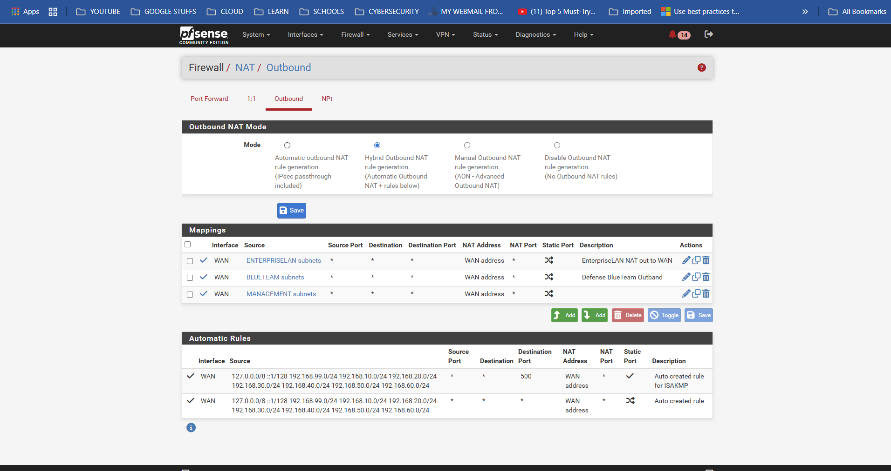
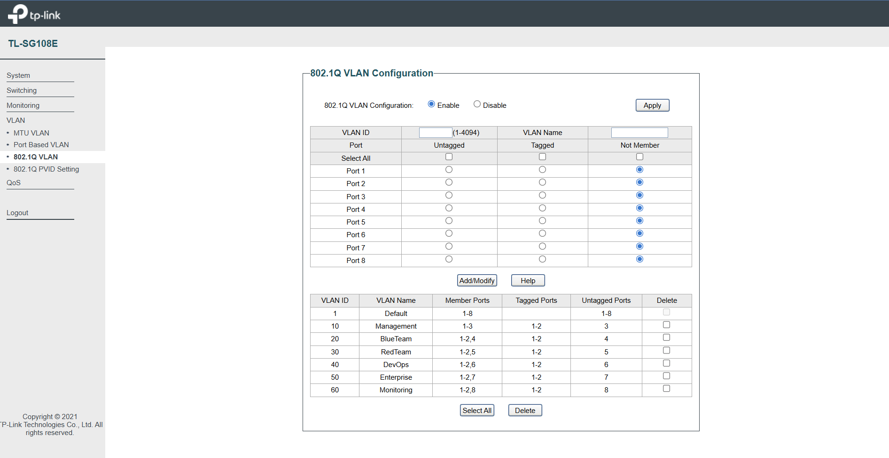

# Network Infrastructure & pfSense Configuration

##  Overview

This document details the complete network infrastructure setup using **pfSense** as the core firewall and routing platform, implementing enterprise-grade **VLAN segmentation** with a **TP-Link TL-SG108E managed switch**. The architecture provides isolated network segments for different security functions while maintaining centralized control and monitoring.

##  Hardware Architecture

### Core Components
- **pfSense Firewall**: Dedicated desktop machine with 2 NICs
- **TP-Link TL-SG108E**: 8-Port Gigabit Smart Managed Switch
- **Primary Laptop**: Administrative workstation (`192.168.10.3`)
- **Proxmox VE Host**: Bare-metal hypervisor on trunk Port 2 (`192.168.10.6`)
- **Vault Desktop**: Dedicated machine for HashiCorp Vault on Port 6, VLAN 40 (`192.168.40.2`, awaiting configuration)
- **Windows Server 2025 Host**: Dedicated hardware on Port 7, VLAN 50 — domain controller at `192.168.50.2` (connected via USB-to-Ethernet adapter)

### Physical Topology

```
Internet ↔ Home Router ↔ pfSense (WAN/LAN) ↔ Managed Switch ↔ VLAN Segments
                                    ↕
                            All Lab Infrastructure
```
## Network Architecture Diagram

### Visual Overview


*Complete pfSense network infrastructure showing physical topology, VLAN segmentation, switch port configuration, and security zones*

### Interactive Architecture Diagram
For a detailed interactive view with hover effects and clickable elements, see the [Interactive Network Architecture Diagram](../network-architecture.html).

        **Interactive Features:**
        -  **Hover Effects**: Mouse over elements for enhanced visibility
        -  **Clickable VLANs**: Click on VLAN segments for detailed information
        -  **Live Configuration Data**: Real-time display of IP ranges and port assignments
        -  **Color-Coded Zones**: Visual distinction between security domains

### Architecture Highlights
- **pfSense Firewall**: Enterprise-grade routing and security with 2 NICs
- ** Managed Switch**: TP-Link TL-SG108E with 8 ports supporting VLAN tagging
- **VLAN Segmentation**: 6 isolated network zones for different security functions
- **Security Model**: Default-deny firewall with explicit rules for each VLAN
- **Hybrid NAT**: Controlled outbound access for all network segments


## pfSense Configuration

### Interface Configuration

#### Base Interface Changes
- **Default LAN (ue0)**: Changed from `192.168.1.1` to `192.168.99.1`
- **Isolation Applied**: No DHCP, blocked traffic for security
- **VLAN Parent**: All VLANs created under interface `ue0`
- **WAN Interface**: Maintains connection to upstream router

#### Interface Assignment Summary
| Interface | Type | Purpose | IP Address |
|-----------|------|---------|------------|
| **WAN** | Physical | Internet connectivity | DHCP from ISP |
| **LAN (ue0)** | Physical | VLAN parent interface | `192.168.99.1` (isolated) |
| **VLAN 10** | Virtual | Management access | `192.168.10.1` |
| **VLAN 20** | Virtual | BlueTeam security | `192.168.20.1` |
| **VLAN 30** | Virtual | RedTeam operations | `192.168.30.1` |
| **VLAN 40** | Virtual | DevOps pipeline | `192.168.40.1` |
| **VLAN 50** | Virtual | EnterpriseLAN | `192.168.50.1` |
| **VLAN 60** | Virtual | Monitoring stack | `192.168.60.1` |

All six VLAN interfaces are **802.1Q tagged sub-interfaces of the single physical LAN NIC `ue0`**. This is the pfSense half of a *router-on-a-stick* design: one cable to the switch trunk carries every VLAN, and pfSense does the routing between them.


*Figure 1.1 — Interfaces → Assignments. Each VLAN (Management 10 … Monitoring 60) is a tagged sub-interface of the parent `ue0`, alongside WAN (`em0`) and the isolated LAN. This is the pfSense half of the 802.1Q trunk; the switch half appears in Figures 1.4–1.5.*

Each VLAN interface has a static gateway IP and **no upstream gateway** (it is a local network, not an internet uplink), so pfSense treats it as a routed LAN segment:


*Figure 1.2 — Example interface detail (Management, `ue0.10`): static IPv4 `192.168.10.1/24`, upstream gateway set to None because inter-VLAN routing is handled internally by pfSense. The same pattern is applied to VLANs 20–60.*

## VLAN & Subnet Architecture

### Design Philosophy
The network implements **VLAN-based segmentation** where each VLAN represents a separate logical security zone. This approach ensures:
- **Layer 2 isolation** between different environments
- **Granular firewall control** via pfSense rules
- **Enhanced monitoring** and policy enforcement
- **Clear separation** between Blue Team and Red Team activities

*Figure 1.3 — pfSense dashboard: all six VLAN interfaces up, each with its gateway IP (`192.168.10.1` … `192.168.60.1`), plus the WAN uplink. This is the live confirmation that every segment specified below is active and routing.*
### Complete VLAN Specification

| **VLAN Name** | **VLAN ID** | **Subnet** | **Gateway IP** | **Purpose & Use Case** |
|---------------|-------------|------------|----------------|------------------------|
| **Management** | `10` | `192.168.10.0/24` | `192.168.10.1` | Administrative access to pfSense Web UI and management systems. Restricted to trusted admin devices only. |
| **BlueTeam** | `20` | `192.168.20.0/24` | `192.168.20.1` | Security monitoring infrastructure including Wazuh SIEM, ELK stack, IDS sensors, and defense tools. |
| **RedTeam** | `30` | `192.168.30.0/24` | `192.168.30.1` | Isolated environment for attack simulation, penetration testing, and offensive security experiments. |
| **DevOps** | `40` | `192.168.40.0/24` | `192.168.40.1` | CI/CD infrastructure, build servers, deployment automation, and DevSecOps toolchain. |
| **EnterpriseLAN** | `50` | `192.168.50.0/24` | `192.168.50.1` | Simulated business services including internal DNS, web applications, and corporate server infrastructure. |
| **Monitoring** | `60` | `192.168.60.0/24` | `192.168.60.1` | Dedicated observability stack hosting Prometheus, Grafana, Loki, and out-of-band monitoring systems. |

### Network Segmentation Benefits
- **Enhanced Security**: Layer 2 isolation with pfSense firewall control
- **Clear Visibility**: Each team/function has dedicated network space
- **Safe Testing**: Attack simulations contained within RedTeam VLAN
- **Monitoring**: Centralized observability without network interference

## DHCP Configuration Strategy

### IP Address Allocation Plan
Each VLAN subnet uses a structured IP allocation to prevent conflicts and ensure predictable addressing:

- **Static Range**: `.2` through `.49` (48 addresses for servers/infrastructure)
- **DHCP Pool**: `.50` through `.100` (51 addresses for dynamic assignment)
- **Reserved**: `.101` through `.254` (154 addresses for future expansion)

### DHCP Scope Configuration

#### Example: Management VLAN (192.168.10.0/24)
- **Static Assignments**: `192.168.10.2` – `192.168.10.49`
- **DHCP Dynamic Pool**: `192.168.10.50` – `192.168.10.100`
- **Future Use**: `192.168.10.101` – `192.168.10.254`

*This pattern is replicated across all VLANs for consistency.*

### DHCP Implementation Evidence

#### Management VLAN DHCP Configuration


#### BlueTeam VLAN DHCP Configuration  



### Strategic Benefits
✅ **Predictable Infrastructure**: Critical systems use static IPs  
✅ **Conflict Prevention**: Clear separation between static and dynamic ranges  
✅ **Scalability**: Significant room for future growth  
✅ **Consistency**: Identical pattern across all VLANs  

## Firewall Rules & Access Control

### Security Model
pfSense implements a **default-deny** security model where all traffic is blocked unless explicitly allowed. Each VLAN has customized firewall rules based on its security requirements and operational needs.

### Management VLAN (VLAN 10) Rules

| Action | Protocol | Source | Destination | Purpose |
|--------|----------|--------|-------------|---------|
| **Allow** | ICMP | VLAN 10 Subnet | Any | Network troubleshooting and connectivity testing |
| **Allow** | TCP/UDP | VLAN 10 Subnet | This Firewall | Access to pfSense Web UI (HTTPS) |
| **Allow** | UDP | VLAN 10 Subnet | Any (Port 53) | DNS resolution services |
| **Allow** | Any | VLAN 10 Subnet | Any | Full internet access for administrative tasks |

#### Management VLAN Firewall Implementation


### Other VLANs Security Rules

For **BlueTeam, RedTeam, DevOps, EnterpriseLAN, and Monitoring** VLANs:

| Action | Protocol | Source | Destination | Purpose |
|--------|----------|--------|-------------|---------|
| **Allow** | Any | VLAN [X] Subnet | Any | Full internet access for operational requirements |

#### Additional VLANs Firewall Configuration



### Firewall Rule Strategy
- **Management VLAN**: Most permissive with administrative access
- **Operational VLANs**: Internet access with potential for future restrictions
- **Inter-VLAN Communication**: Controlled by specific rules as needed
- **Default Behavior**: All traffic denied unless explicitly permitted

## Active Directory Firewall Aliases

### Why aliases
A pfSense **alias** is a named list of hosts or ports that a firewall rule can reference by name. Instead of eight separate rules ("allow TCP 53 to the DC", "allow TCP 88 to the DC", ...) there is one rule that reads "allow `AD_TCP` to `SRV1_DC`". Rules become self-describing, and when a port needs adding or removing it is changed once in the alias rather than in every rule that uses it.

Active Directory is not a single service. A domain member relies on a bundle of protocols (DNS, Kerberos, LDAP, SMB, RPC, NTP) that all terminate on the domain controller. Blocking any one of them produces confusing half-working behaviour (can join but cannot log on, logs on but Group Policy fails, password changes error out). The aliases below group those protocols by role so that access can be granted precisely.

### Alias inventory

| Alias | Type | Contents | Purpose |
|-------|------|----------|---------|
| `SRV1_DC` | Host | `192.168.50.2` | Windows Server 2025 domain controller `dc01.ad.biira.online` (alias name predates the host rename SRV1→DC01) |
| `AD_TCP` | Ports | 53, 88, 135, 389, 445, 464, 636, 3268 | TCP ports a domain member needs on the DC |
| `AD_UDP` | Ports | 53, 88, 123, 389, 464 | UDP ports a domain member needs on the DC |
| `AD_RPC_DYNAMIC` | Ports | `49152:65535` | RPC dynamic high-port range (see note) |
| `MGMT_TCP` | Ports | 3389, 5985, 5986 | Remote administration only: RDP and WinRM |

### `AD_TCP`: domain-membership TCP ports

| Port | Protocol | What it does |
|------|----------|--------------|
| **53** | DNS | Clients look up SRV records such as `_ldap._tcp.ad.biira.online` to locate the DC. TCP carries large answers and zone transfers; UDP carries ordinary queries. |
| **88** | Kerberos | The core AD authentication protocol. Every logon and every access to a network resource obtains a Kerberos ticket from the DC. |
| **135** | RPC endpoint mapper | The "directory assistance" for Microsoft RPC. A client asks 135 which dynamic port a given service is listening on, then connects there. Required for domain join, Group Policy and remote management. |
| **389** | LDAP | Reading and writing the directory: user lookups, group membership, computer objects. |
| **445** | SMB | File sharing. Clients pull Group Policy objects and logon scripts from the DC's `SYSVOL` and `NETLOGON` shares. |
| **464** | Kerberos password change | Used when a user changes a password or a computer rotates its machine-account password (every 30 days by default). |
| **636** | LDAPS | LDAP over TLS. Not required by Windows itself, but Linux tooling, HashiCorp Vault's LDAP auth method and Wazuh integrations prefer it. Included so those work without a later rule change. |
| **3268** | Global Catalog | A read-only, forest-wide index of the directory. Logon uses it to resolve universal group membership; directory-aware applications search it. |

### `AD_UDP`: domain-membership UDP ports

| Port | Protocol | What it does |
|------|----------|--------------|
| **53** | DNS | Everyday name resolution. |
| **88** | Kerberos | Kerberos tries UDP first for small requests and falls back to TCP. |
| **123** | NTP | Domain members sync their clocks to the DC. Kerberos rejects tickets when clocks differ by more than 5 minutes, so this port is silently critical. |
| **389** | LDAP ping | A lightweight "are you a DC for my site?" probe that clients send while locating a domain controller. |
| **464** | Kerberos password change | UDP variant of the password-change service. |

### `AD_RPC_DYNAMIC`: why it is separate
After a client asks port 135 where a service lives, the DC answers with a random port in the **49152 to 65535** range and the client connects there. Domain join, Group Policy processing and AD replication all depend on this. Because the range is large it is kept in its own alias and granted only from tightly scoped sources (Management VLAN to `SRV1_DC`), never bundled into `AD_TCP` where it might be handed out more broadly.

### `MGMT_TCP`: why RDP and WinRM are not in `AD_TCP`
RDP (3389) and WinRM (5985 plain, 5986 TLS) are for *administering* the server, not for *being a member* of its domain. Keeping them separate means that granting a client VLAN "`AD_TCP` to `SRV1_DC`" for domain membership never accidentally grants remote console or automation access as well. `MGMT_TCP` is granted only from the Management VLAN (administrator laptop and the Ansible controller).

## Outbound NAT Configuration

### NAT Implementation Approach
To enable proper internet connectivity for all VLAN segments, pfSense uses **Hybrid Outbound NAT** mode, providing explicit control over network address translation while maintaining automatic rule generation for standard interfaces.

### Configuration Method
1. **Mode Selection**: **Firewall > NAT > Outbound**
2. **Mode Change**: Switched to **"Hybrid Outbound NAT rule generation"**
3. **Rule Creation**: Manual rules defined for each VLAN subnet

### NAT Rule Specification

| VLAN Name | Source Subnet | Translation Target | Status |
|-----------|---------------|-------------------|--------|
| **Management** | `192.168.10.0/24` | WAN Interface | Active |
| **BlueTeam** | `192.168.20.0/24` | WAN Interface | Active |
| **RedTeam** | `192.168.30.0/24` | WAN Interface | Active |
| **DevOps** | `192.168.40.0/24` | WAN Interface | Active |
| **EnterpriseLAN** | `192.168.50.0/24` | WAN Interface | Active |
| **Monitoring** | `192.168.60.0/24` | WAN Interface | Active |

#### Hybrid Outbound NAT Configuration


### Hybrid NAT Advantages
**Flexibility**: Manual control over VLAN-specific NAT behavior  
**Compatibility**: Retains pfSense default rules for other interfaces  
**Scalability**: Easy to modify or restrict specific VLANs  
**Visibility**: Clear understanding of NAT translations  

## Switch Port Configuration

### TP-Link TL-SG108E Port Mapping
The managed switch provides VLAN segmentation through strategic port assignments, supporting both trunk and access port configurations.

| **Port** | **Configuration** | **VLAN Membership** | **Purpose** |
|----------|-------------------|---------------------|-------------|
| **Port 1** | Trunk (Tagged) | **All VLANs**: 10,20,30,40,50,60 | pfSense `ue0` interface connection |
| **Port 2** | Trunk (Tagged) | **All VLANs**: 10,20,30,40,50,60 | Proxmox VE trunk uplink (`192.168.10.6`) for multi-VLAN VM hosting |
| **Port 3** | Access (Untagged) | **VLAN 10 Only** | Management VLAN direct access |
| **Port 4** | Access (Untagged) | **VLAN 20 Only** | BlueTeam VLAN direct access |
| **Port 5** | Access (Untagged) | **VLAN 30 Only** | RedTeam VLAN direct access |
| **Port 6** | Access (Untagged) | **VLAN 40 Only** | DevOps VLAN — dedicated HashiCorp Vault desktop (`192.168.40.2`, awaiting configuration) |
| **Port 7** | Access (Untagged) | **VLAN 50 Only** | EnterpriseLAN VLAN — Windows Server 2025 domain controller (`192.168.50.2`, via USB-to-Ethernet adapter) |
| **Port 8** | Access (Untagged) | **VLAN 60 Only** | Monitoring VLAN direct access |

#### Switch Port Configuration Evidence

The switch enforces the same VLAN scheme from the Layer 2 side. Two settings define it: **802.1Q VLAN membership** (which ports carry which VLANs, and whether tagged or untagged) and the **PVID** (the VLAN an *untagged* frame is placed into as it enters a port).


*Figure 1.4 — TP-Link 802.1Q VLAN table. Every VLAN (10–60) includes ports 1–2 as **tagged** (the trunk uplinks to pfSense and Proxmox) plus one **untagged** access port (10→3, 20→4, 30→5, 40→6, 50→7, 60→8). Tagged keeps the 802.1Q VLAN ID on the frame so a trunk can carry many VLANs; untagged strips it for a plain end device that knows nothing about VLANs.*


*Figure 1.5 — 802.1Q PVID settings. Each access port 3–8 carries the PVID of its VLAN (10, 20, 30, 40, 50, 60), so any untagged device plugged in lands in the correct segment automatically. Trunk ports 1–2 keep PVID 1 because they only ever carry tagged traffic. Figures 1.4 and 1.5 together are the switch-side proof of the port map in the table above, and they mirror the pfSense sub-interfaces in Figure 1.1.*

### Port Configuration Strategy
- **Trunk Ports (1-2)**: Carry all tagged VLAN traffic — Port 1 uplinks pfSense, Port 2 feeds the Proxmox VE VLAN-aware bridge
- **Access Ports (3-8)**: Provide direct, untagged access to specific VLANs
- **Device Placement**: End devices automatically assigned to appropriate VLAN
- **Scalability**: Additional devices easily added to any VLAN segment

## Security Implementation

### Network Security Measures
- **LAN Interface Isolation**: Original `ue0` interface secured with no DHCP or routing
- **Administrative Access Control**: All pfSense GUI access restricted to Management VLAN
- **Inter-VLAN Security**: No default communication between VLANs
- **Controlled Connectivity**: ICMP enabled only for troubleshooting purposes

### Access Control Summary
- **pfSense Management**: Only accessible via `http://192.168.10.1` on VLAN 10
- **VLAN Isolation**: Each VLAN operates independently unless rules permit interaction
- **Firewall Protection**: All traffic subject to pfSense security rules
- **Default Deny**: Implicit denial of all traffic not explicitly permitted

## Implementation Challenges & Solutions

### Key Issues Resolved

#### Issue 1: Lost Administrative Access
**Problem**: Disabling original LAN interface caused loss of pfSense access  
**Solution**: Assigned fallback IP and implemented blocking instead of disabling  
**Lesson**: Always maintain administrative access during network changes  

#### Issue 2: Windows Client Connectivity
**Problem**: Windows clients unable to ping across VLANs  
**Solution**: Enabled ICMP Echo in pfSense firewall rules  
**Resolution**: Network troubleshooting capabilities restored  

#### Issue 3: Internal vs External Connectivity
**Problem**: External connectivity worked (8.8.8.8) but internal failed  
**Root Cause**: Local firewall rules blocking internal VLAN communication  
**Fix**: Adjusted firewall rules for appropriate inter-VLAN access  

#### Issue 4: GUI Access Verification
**Problem**: Uncertainty about pfSense management access  
**Verification**: Confirmed GUI accessible via `http://192.168.10.1` on VLAN 10  
**Result**: Administrative access properly secured and functional  

## Implementation Verification

### Network Connectivity Tests
- **VLAN Gateway Access**: All VLANs can reach their respective gateways
- **Internet Connectivity**: Outbound NAT functional for all segments  
- **DNS Resolution**: Name resolution working across all VLANs
- **Administrative Access**: pfSense GUI accessible from Management VLAN

### Security Verification
- **VLAN Isolation**: Confirmed separation between network segments
- **Firewall Rules**: All configured rules operational and effective
- **Access Controls**: Administrative functions properly restricted
- **NAT Translation**: Proper address translation for internet access

## Next Phase Integration

### Prepared Infrastructure
The network foundation now supports:
- **Security Services**: SIEM deployment in BlueTeam VLAN
- **Monitoring Systems**: Observability stack in Monitoring VLAN
- **Automation Platforms**: Ansible controller in Management VLAN
- **Testing Environments**: Red Team tools in isolated RedTeam VLAN

### Expansion Capabilities
- Additional VLANs easily configured
- Scalable DHCP and firewall rule management
- Support for complex inter-VLAN communication requirements
- Ready for enterprise service deployment

---

*Network Infrastructure Status: Complete and Operational*  
*Next Phase: [Security Monitoring Stack Deployment](02-security-monitoring.md)*