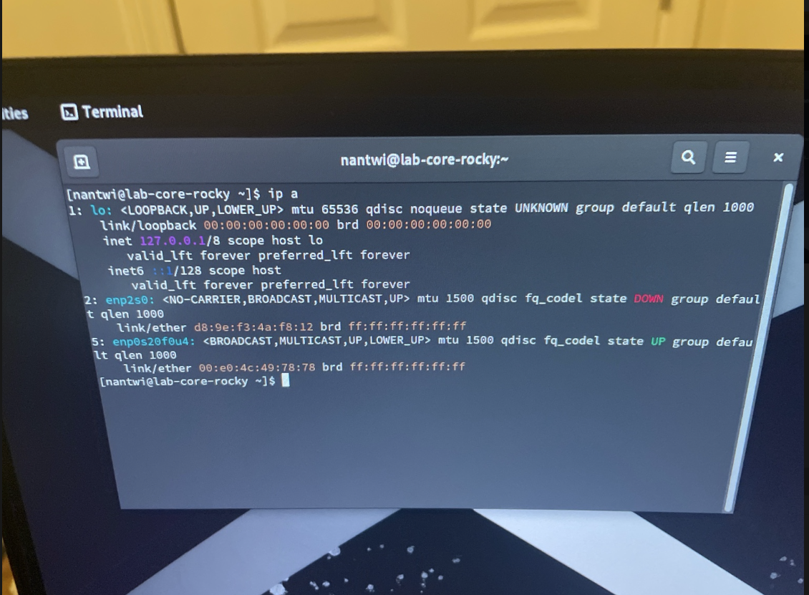
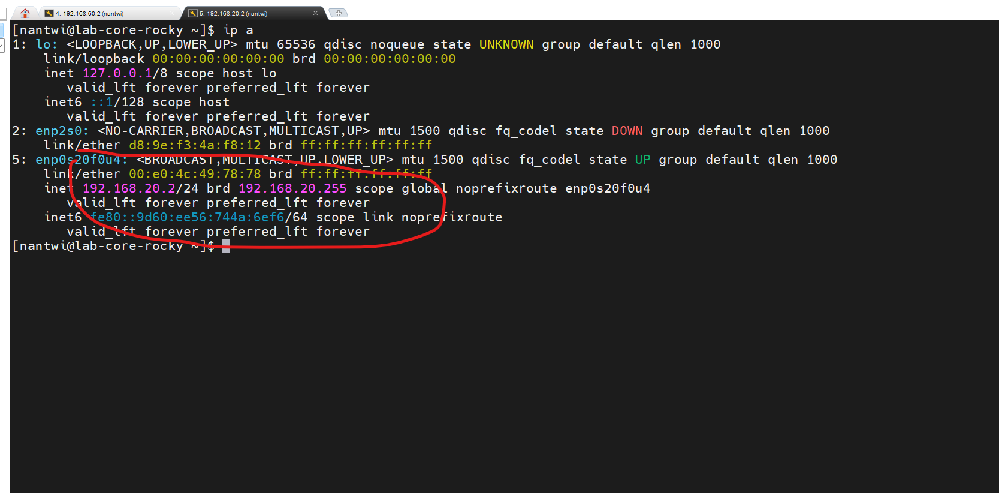
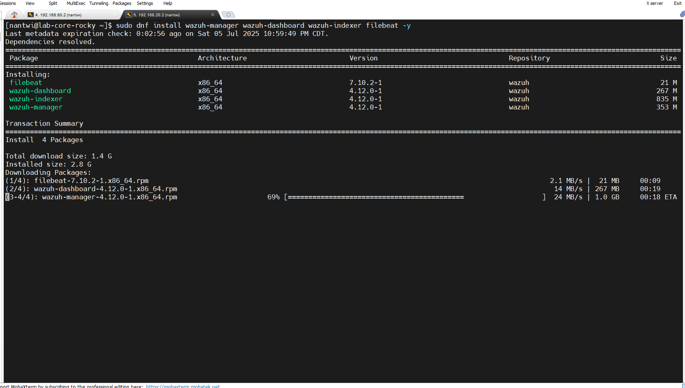
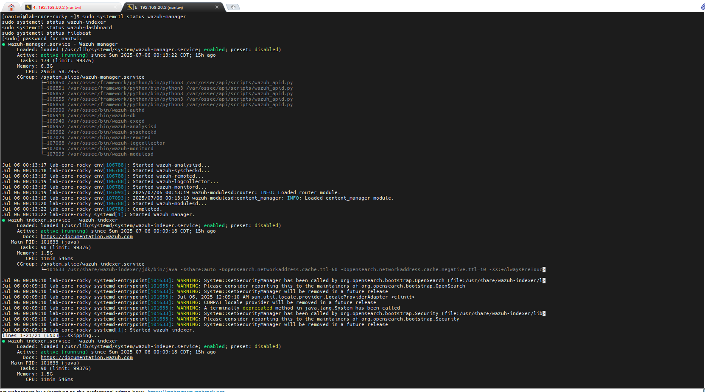
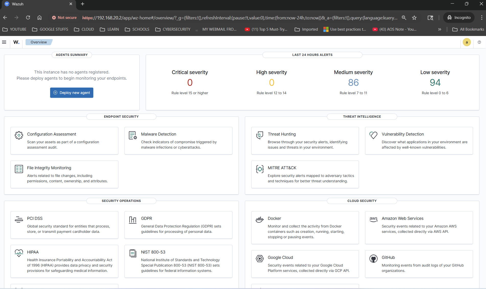

# Security Monitoring & Wazuh SIEM Deployment

## 📖 Overview

This document details the deployment and configuration of **Wazuh SIEM (Security Information and Event Management)** as the cornerstone of the Blue Team security monitoring infrastructure. The implementation establishes comprehensive security monitoring capabilities using an all-in-one Wazuh deployment on **Rocky Linux 9.6**, strategically positioned within the dedicated **BlueTeam VLAN**.

## 🎯 Deployment Objectives

### Primary Goals
- Deploy latest **Wazuh SIEM (version 4.12.0)** for comprehensive security monitoring
- Establish centralized log collection and analysis capabilities
- Create foundation for threat detection and incident response
- Implement security monitoring without impacting other network segments

### Strategic Placement
- **VLAN Assignment**: BlueTeam VLAN (VLAN 20 - `192.168.20.0/24`)
- **Network Isolation**: Separated from other lab functions
- **Security Focus**: Dedicated environment for defensive security operations

## 🖥️ Server Preparation & Network Configuration

### Hardware Specifications
| Component | Details |
|-----------|---------|
| **Hostname** | `lab-core-rocky` |
| **Operating System** | Rocky Linux 9.6 (Blue Onyx) |
| **Architecture** | x86_64 |
| **Network Interface** | `enp0s20f0u4` |
| **Switch Connection** | Port 4 (Untagged VLAN 20) |

### Network Configuration Process

#### Initial Interface State Assessment
After connecting the server to **Port 4** and booting Rocky Linux:

**Interface Status Check:**
```bash
ip a
```

**Observed State:**
- Interface `enp2s0`: **DOWN** (unused)
- Interface `enp0s20f0u4`: **UP** (active, no IP assigned)

#### Network Setup Evidence


### DHCP Verification & Testing

Before implementing static IP configuration, DHCP connectivity was verified to confirm proper VLAN assignment and network functionality.

#### DHCP Configuration Commands
```bash
# Create new network connection with DHCP
sudo nmcli con add type ethernet ifname enp0s20f0u4 con-name BlueTeam-DHCP ipv4.method auto

# Activate the connection
sudo nmcli con up BlueTeam-DHCP
```

#### DHCP Test Results
✅ **Dynamic IP Assignment**: `192.168.20.50/24` (within expected DHCP range)  
✅ **Gateway Connectivity**: Successfully pinged `192.168.20.1`  
✅ **VLAN Verification**: Confirmed placement in BlueTeam VLAN  

### Static IP Implementation

For production SIEM deployment, a **predictable static IP address** was required to ensure consistent access and monitoring capabilities.

#### Target Static Configuration
| Parameter | Value |
|-----------|-------|
| **IP Address** | `192.168.20.2/24` |
| **Gateway** | `192.168.20.1` |
| **DNS Servers** | `8.8.8.8` |
| **Connection Name** | `BlueTeam-Static` |

#### Static Configuration Commands
```bash
# Modify existing connection to static configuration
sudo nmcli con mod BlueTeam-DHCP \
  ipv4.method manual \
  ipv4.addresses 192.168.20.2/24 \
  ipv4.gateway 192.168.20.1 \
  ipv4.dns 8.8.8.8

# Restart connection to apply changes
sudo nmcli con down BlueTeam-DHCP
sudo nmcli con up BlueTeam-DHCP

# Rename connection for clarity
sudo nmcli con mod BlueTeam-DHCP connection.id BlueTeam-Static
```

#### Configuration Verification


#### Connectivity Validation
```bash
# Verify static IP assignment
ip a

# Test gateway connectivity
ping -c 4 192.168.20.1

# Verify internet connectivity
ping -c 4 8.8.8.8
```

**Results**: ✅ All connectivity tests successful - static configuration operational

## 📦 Wazuh SIEM Deployment Process

### Pre-Installation System Preparation

#### System Updates & Dependencies
```bash
# Update system packages
sudo dnf update -y

# Install required utilities
sudo dnf install -y curl wget unzip gnupg2
```

#### Clean Previous Installations
Since Wazuh had been previously attempted on this system, comprehensive cleanup was performed to avoid conflicts:

```bash
# Remove any existing Wazuh packages
sudo dnf remove -y wazuh-* filebeat opensearch-dashboard

# Clean configuration and data directories
sudo rm -rf /etc/wazuh-* /var/lib/wazuh-* /usr/share/wazuh-* /etc/filebeat /var/lib/filebeat
```

### Wazuh Installation Implementation

#### Installer Acquisition
```bash
# Download official Wazuh all-in-one installer
curl -sO https://packages.wazuh.com/4.12/wazuh-install.sh

# Make installer executable
chmod +x wazuh-install.sh
```

#### All-in-One Deployment
The Wazuh team's recommended deployment method was used for comprehensive SIEM functionality:

```bash
# Execute all-in-one installation
sudo ./wazuh-install.sh -a -i -o
```

**Installation Parameters:**
- `-a` : Install all components (Manager, Indexer, Dashboard, Filebeat)
- `-i` : Ignore OS compatibility check (Rocky Linux support)
- `-o` : Remove old installations if present

#### Installation Process


**Installation Duration**: Approximately 10-15 minutes  
**Components Installed**:
- **Wazuh Manager**: Core SIEM engine and rule processing
- **Wazuh Indexer**: OpenSearch-based data storage and indexing
- **Wazuh Dashboard**: Web-based management interface
- **Filebeat**: Log shipping and data forwarding

#### Installation Completion
Upon successful installation, the system provided:
- **Dashboard URL**: `https://192.168.20.2:443`
- **Admin Credentials**: Automatically generated secure password
- **SSL Certificates**: Automatically configured for HTTPS access

## 🔧 Post-Installation Configuration

### Firewall Configuration
Rocky Linux ships with `firewalld` enabled by default. Essential Wazuh ports were opened for proper operation:

```bash
# Open Wazuh Manager ports
sudo firewall-cmd --permanent --add-port=1514/tcp  # Agent communication
sudo firewall-cmd --permanent --add-port=1514/udp  # Agent communication
sudo firewall-cmd --permanent --add-port=1515/tcp  # Agent enrollment

# Open Dashboard port
sudo firewall-cmd --permanent --add-port=443/tcp   # HTTPS web interface

# Apply firewall changes
sudo firewall-cmd --reload
```

### Service Validation
Verification of all Wazuh components:

```bash
# Check Wazuh Manager status
sudo systemctl status wazuh-manager

# Check Wazuh Indexer status  
sudo systemctl status wazuh-indexer

# Check Wazuh Dashboard status
sudo systemctl status wazuh-dashboard

# Check Filebeat status
sudo systemctl status filebeat
```

#### Service Status Verification


**Service Status**: ✅ All services active and running properly

## 📊 Wazuh Dashboard Access & Verification

### SSH Access to Wazuh Server
Remote access to the Wazuh server instance for administration and troubleshooting:

**SSH Connection Details:**
```bash
# SSH into Wazuh server
ssh nantwi@192.168.20.2
```

| Parameter | Value |
|-----------|-------|
| **Hostname** | `lab-core-rocky` |
| **IP Address** | `192.168.20.2` |
| **SSH Port** | `22` (default) |
| **SSH Username** | `nantwi` |
| **VLAN** | BlueTeam (VLAN 20) |

### Dashboard Accessibility
The Wazuh dashboard became accessible immediately after installation:

**Access URL**: `https://192.168.20.2`  
**Protocol**: HTTPS with automatically generated SSL certificates  
**Authentication**: Admin credentials provided during installation  

#### Dashboard Interface


### Wazuh Version Confirmation
- **Wazuh Version**: 4.12.0 (Latest stable release at deployment time)
- **Deployment Type**: All-in-One configuration
- **Components**: Manager, Indexer, Dashboard, Filebeat all operational

### Initial Dashboard Features
- **Security Events**: Real-time security event monitoring
- **Agent Management**: Ready for endpoint agent deployment
- **Rule Management**: Pre-configured security rules and decoders
- **Compliance Dashboards**: Built-in compliance reporting
- **Threat Intelligence**: Integrated threat detection capabilities

## 🔐 Security Implementation

### Network Security
- **VLAN Isolation**: SIEM contained within BlueTeam VLAN (192.168.20.0/24)
- **Firewall Protection**: pfSense controls all inter-VLAN communication
- **SSL Encryption**: Automatic HTTPS certificate generation and implementation
- **Access Control**: Dashboard access restricted to authenticated users
- **Port Security**: Only necessary ports opened in firewall configuration

### Authentication & Access
- **Default Credentials**: Secure admin password automatically generated
- **HTTPS Enforcement**: All dashboard communication encrypted
- **Certificate Management**: SSL certificates automatically provisioned
- **Session Security**: Web-based authentication with session management

## 🎯 Operational Capabilities

### Current SIEM Functionality
✅ **Real-time Monitoring**: Active security event collection and analysis  
✅ **Log Management**: Centralized log aggregation and storage  
✅ **Rule Engine**: Pre-configured security detection rules operational  
✅ **Dashboard Interface**: Web-based management and monitoring  
✅ **Agent Framework**: Ready for endpoint agent deployment  

### Built-in Security Features
- **Intrusion Detection**: File integrity monitoring capabilities
- **Vulnerability Assessment**: Integrated vulnerability scanning
- **Compliance Reporting**: PCI DSS, GDPR, HIPAA compliance frameworks
- **Threat Intelligence**: Integration with external threat feeds
- **Incident Response**: Automated response and alerting capabilities

## 🚀 Integration with Lab Infrastructure

### Network Integration
- **VLAN Placement**: Strategic positioning in BlueTeam VLAN
- **Gateway Access**: Proper routing through pfSense (192.168.20.1)
- **Internet Connectivity**: Outbound access for threat intelligence updates
- **Inter-VLAN Security**: Controlled access from Management VLAN for administration

### Administrative Access
- **Management VLAN Access**: pfSense rules allow administrative connectivity
- **SSH Access**: Available for system administration and maintenance
- **Web Dashboard**: HTTPS access for security operations
- **Remote Monitoring**: Integration prepared for Tailscale mesh VPN

## 📈 Performance & Scalability

### System Resources
- **CPU Utilization**: Optimized for all-in-one deployment
- **Memory Usage**: Sufficient resources allocated for SIEM operations
- **Storage Capacity**: Adequate space for log retention and indexing
- **Network Performance**: Full gigabit connectivity through managed switch

### Scalability Considerations
- **Agent Capacity**: Supports hundreds of endpoint agents
- **Log Volume**: Configurable retention policies for storage management
- **Performance Tuning**: Options for optimizing based on log volume
- **High Availability**: Foundation prepared for future HA implementation

## 🔄 Deployment Validation

### Functional Testing
✅ **Service Status**: All Wazuh components operational  
✅ **Web Interface**: Dashboard accessible and responsive  
✅ **Network Connectivity**: Full connectivity to gateway and internet  
✅ **Firewall Rules**: Proper port access configured  
✅ **SSL Certificates**: HTTPS encryption functional  

### Security Verification
✅ **VLAN Isolation**: Confirmed placement in BlueTeam VLAN  
✅ **Access Controls**: Administrative access properly restricted  
✅ **Service Security**: All services running with appropriate permissions  
✅ **Network Security**: pfSense firewall rules effective  

## ⚠️ Implementation Notes

### Rocky Linux Compatibility
- **Official Support**: Rocky Linux not officially listed by Wazuh
- **Practical Reality**: Installation and operation fully stable
- **Compatibility Flag**: `-i` flag used to bypass OS check
- **Production Viability**: No functional limitations observed

### Installation Method
- **All-in-One Choice**: Selected for comprehensive functionality in single system
- **Alternative Options**: Distributed deployment available for larger environments
- **Resource Efficiency**: Single-server deployment optimal for lab environment
- **Future Migration**: Can expand to distributed architecture if needed

## 🛠️ Maintenance & Operations

### Regular Maintenance Tasks
- **System Updates**: Regular Rocky Linux security updates
- **Wazuh Updates**: Periodic SIEM platform updates
- **Rule Tuning**: Optimization of detection rules based on environment
- **Log Management**: Monitoring of storage usage and retention policies

### Monitoring & Alerting
- **Service Health**: Monitor all Wazuh component status
- **Resource Usage**: Track CPU, memory, and storage utilization
- **Network Connectivity**: Ensure consistent network access
- **Security Events**: Regular review of security alerts and incidents

## 🎯 Next Phase Integration

### Agent Deployment Planning
The SIEM infrastructure is now ready for:
- **Linux Agent Deployment**: Ubuntu servers and workstations
- **Windows Agent Integration**: Windows systems across lab environment
- **Network Device Monitoring**: Integration with pfSense and switch logs
- **Application Monitoring**: Custom log sources and application security

### Security Operations Expansion
Prepared foundation for:
- **Custom Rule Development**: Environment-specific detection rules
- **Threat Hunting**: Proactive security investigation capabilities
- **Incident Response**: Automated response and notification systems
- **Compliance Reporting**: Regulatory compliance monitoring and reporting

## ✅ Deployment Summary

### Successfully Implemented
- **Wazuh SIEM 4.12.0**: Latest version deployed and operational
- **All-in-One Configuration**: Complete SIEM stack on single system
- **BlueTeam VLAN Integration**: Properly segmented and secured
- **Network Connectivity**: Full access with appropriate security controls
- **Web Dashboard**: HTTPS-secured administrative interface

### Current Operational Status
| Component | Status | Accessibility |
|-----------|--------|---------------|
| **Wazuh Manager** | 🟢 Active | Internal network |
| **Wazuh Indexer** | 🟢 Active | Internal components |
| **Wazuh Dashboard** | 🟢 Active | `https://192.168.20.2` |
| **Filebeat** | 🟢 Active | Log shipping operational |

### Infrastructure Integration
- **Network Foundation**: Successfully integrated with pfSense VLAN architecture
- **Security Posture**: Enhanced with centralized security monitoring
- **Operational Readiness**: Prepared for agent deployment and rule customization
- **Administrative Access**: Secured administrative interface and SSH access

---

*Security Monitoring Status: ✅ Complete and Operational*  
*Next Phase: [Observability Stack Deployment](03-observability-stack.md)*