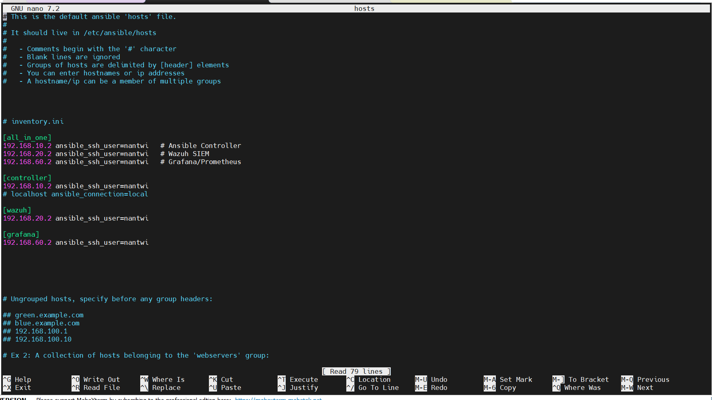

# Automation Platform & Ansible Controller Setup

## 📖 Overview

This document details the comprehensive setup and configuration of the **Ansible automation platform** using **VMware Workstation Pro** and **Ubuntu Desktop 24.04 LTS**. The automation controller is strategically deployed within the **Management VLAN** to provide centralized configuration management, orchestration, and infrastructure automation capabilities across the entire lab environment.

## 🎯 Deployment Objectives

### Primary Goals
- Establish centralized automation and configuration management platform
- Deploy Ansible controller with comprehensive lab coverage
- Configure SSH key-based authentication across all managed systems
- Create foundation for infrastructure as code practices
- Enable automated deployment and maintenance workflows

### Strategic Implementation
- **VLAN Assignment**: Management VLAN (VLAN 10 - `192.168.10.0/24`)
- **Platform Choice**: VMware Workstation Pro for isolation and flexibility
- **Operating System**: Ubuntu Desktop 24.04 LTS for GUI management capabilities
- **Network Architecture**: Bridged networking for direct VLAN access

## 🖥️ Virtualization Environment Setup

### Host System Configuration
| Component | Details |
|-----------|---------|
| **Host OS** | Windows 11 Professional |
| **Virtualization** | VMware Workstation Pro |
| **Network Adapters** | Intel Wi-Fi 6E AX211, Dell Gigabit Ethernet |
| **Target NIC** | Dell Gigabit Ethernet (for VLAN bridging) |
| **VM Platform** | VMware custom VM configuration |

### VMware Network Configuration

#### Virtual Network Editor Setup
The VMware Workstation Pro network configuration was customized to provide direct access to the Management VLAN:

**Network Configuration Process:**
1. **Opened**: VMware Workstation Pro → **Edit** → **Virtual Network Editor**
2. **Created**: New bridged network named `Mgmt VLAN`
3. **Bridge Target**: Explicitly bridged to **Dell Gigabit Ethernet** adapter
4. **DHCP Configuration**: Disabled VMware DHCP to prevent conflicts
5. **VM Assignment**: Assigned `Mgmt VLAN` (VMnet4) to controller VM

#### VMware Network Evidence


**Network Benefits:**
✅ **Direct VLAN Access**: VM communicates directly with Management VLAN  
✅ **No Host Interference**: Windows DHCP/networking doesn't interfere  
✅ **Native Switching**: Traffic handled by physical switch infrastructure  
✅ **Security Isolation**: VM properly isolated within VLAN boundaries  

## 🖥️ Virtual Machine Provisioning

### VM Specifications & Configuration
| Component | Specification |
|-----------|---------------|
| **VM Name** | `ansible-controller` |
| **Operating System** | Ubuntu Desktop 24.04.2 LTS |
| **CPU Allocation** | 2 vCPUs |
| **Memory** | 4GB RAM |
| **Storage** | 60GB (Thin provisioned) |
| **Network** | `Mgmt VLAN` (VMnet4) |
| **Username** | `nantwi` |

### Ubuntu Installation Process
**Installation Configuration:**
- **Hostname**: `ansible-controller`
- **Primary User**: `nantwi`
- **Installation Type**: Desktop environment with standard utilities
- **Security**: Standard Ubuntu security configuration
- **Network**: Automatic configuration via VMware bridged networking

**Post-Installation Verification:**
✅ **System Boot**: Ubuntu Desktop fully operational  
✅ **Network Detection**: Interface detected and available  
✅ **User Account**: Primary user account functional  
✅ **VMware Tools**: Integration tools installed and operational  

## 🌐 Network Configuration Implementation

### Initial Network Assessment
After VM deployment, the network configuration required optimization for production use:

**Default State:**
- **Interface**: `ens33` (VMware virtual ethernet)
- **Configuration**: DHCP-assigned IP (`192.168.10.50`)
- **Range**: Within Management VLAN DHCP scope (`.50` - `.100`)
- **Status**: Functional but not suitable for infrastructure controller

### Static IP Configuration Strategy

#### Target Configuration Requirements
For a production automation controller, predictable network addressing is essential:

| Parameter | Value | Justification |
|-----------|-------|---------------|
| **IP Address** | `192.168.10.2/24` | Reserved static range (`.2` - `.49`) |
| **Gateway** | `192.168.10.1` | pfSense Management VLAN gateway |
| **DNS Servers** | `8.8.8.8`, `1.1.1.1` | Reliable external DNS for package management |
| **Interface** | `ens33` | Primary VMware virtual ethernet |

#### Netplan Configuration Process

Ubuntu 24.04 uses Netplan for network configuration management. Two configuration files were present:
- `01-network-manager-all.yaml` (NetworkManager control)
- `50-cloud-init.yaml` (Cloud-init network configuration)

**Configuration File Selection:**
The `50-cloud-init.yaml` file was selected for modification as it already contained interface-specific configuration.

#### Initial Configuration Attempt
```yaml
# /etc/netplan/50-cloud-init.yaml - First attempt
network:
  version: 2
  ethernets:
    ens33:
      dhcp4: no
      addresses: [192.168.10.2/24]
      gateway4: 192.168.10.1
      nameservers:
        addresses: [8.8.8.8]
```

**Application Result:**
```bash
sudo netplan apply
# Warning: `gateway4` has been deprecated, use default routes instead.
```

#### Modern Configuration Implementation
The configuration was updated to use the current Netplan syntax:

```yaml
# /etc/netplan/50-cloud-init.yaml - Final configuration
network:
  version: 2
  ethernets:
    ens33:
      dhcp4: no
      addresses:
        - 192.168.10.2/24
      routes:
        - to: 0.0.0.0/0
          via: 192.168.10.1
      nameservers:
        addresses: [8.8.8.8, 1.1.1.1]
```

#### Configuration Application & Verification
```bash
# Apply network configuration
sudo netplan apply

# Fix file permissions warning
sudo chmod 600 /etc/netplan/*.yaml

# Verify IP assignment
ip addr show ens33

# Test connectivity
ping -c 4 192.168.10.1  # Gateway test
ping -c 4 8.8.8.8       # Internet connectivity test
```

#### Network Configuration Evidence


**Configuration Results:**
✅ **Static IP Assignment**: `192.168.10.2/24` successfully applied  
✅ **Gateway Connectivity**: pfSense gateway reachable  
✅ **DNS Resolution**: External name resolution functional  
✅ **Internet Access**: Package repositories accessible  

## 🔐 SSH Service Configuration

### SSH Server Installation & Configuration
Remote administrative access is essential for automation controller management:

```bash
# Install OpenSSH server
sudo apt install -y openssh-server

# Enable SSH service for automatic startup
sudo systemctl enable --now ssh

# Verify SSH service status
sudo systemctl status ssh
```

#### SSH Service Verification
```bash
# Test local SSH connectivity
ssh nantwi@localhost

# Verify SSH is listening on port 22
sudo ss -tlnp | grep :22
```

**SSH Configuration Results:**
✅ **Service Installation**: OpenSSH server installed and configured  
✅ **Automatic Startup**: Service enabled for boot-time activation  
✅ **Local Connectivity**: SSH accepting connections on port 22  
✅ **Authentication**: Both key-based and password authentication available  

## ⚙️ Ansible Installation & Configuration

### Ansible Installation Process
Ansible was installed using the official Personal Package Archive (PPA) to ensure the latest stable version:

```bash
# Update package repository
sudo apt-get update

# Install required dependencies
sudo apt-get install -y lsb-release software-properties-common gnupg

# Add official Ansible PPA
sudo apt-add-repository -y ppa:ansible/ansible

# Update package list with new repository
sudo apt-get update

# Install Ansible
sudo apt-get install -y ansible
```

#### Ansible Installation Verification
```bash
# Verify Ansible installation and version
ansible --version

# Check Ansible configuration
ansible-config dump --only-changed
```

#### Ansible Installation Evidence


**Installation Results:**
✅ **Latest Version**: Ansible installed from official PPA  
✅ **Complete Installation**: All required components and dependencies installed  
✅ **Configuration Files**: Default configuration files created  
✅ **Command Line Tools**: All Ansible utilities available and functional  

## 📋 Ansible Inventory Configuration

### Inventory Architecture Design
The Ansible inventory was designed to reflect the current lab infrastructure while providing flexibility for future expansion:

#### Current Lab Infrastructure Mapping
| System | IP Address | VLAN | Role | OS |
|--------|------------|------|------|-----|
| **Ansible Controller** | `192.168.10.2` | Management | Automation Controller | Ubuntu 24.04 |
| **Wazuh SIEM** | `192.168.20.2` | BlueTeam | Security Monitoring | Rocky Linux 9.6 |
| **Monitoring Server** | `192.168.60.2` | Monitoring | Observability Stack | Ubuntu 24.04 |

#### Inventory File Configuration
The `/etc/ansible/hosts` file was configured with logical groupings:

```ini
# /etc/ansible/hosts
[all_in_one]
192.168.20.2 ansible_ssh_user=nantwi
192.168.60.2 ansible_ssh_user=nantwi  
192.168.10.2 ansible_ssh_user=nantwi

[wazuh]
192.168.20.2 ansible_ssh_user=nantwi

[grafana]
192.168.60.2 ansible_ssh_user=nantwi

[controller]
192.168.10.2 ansible_ssh_user=nantwi
```

#### Inventory Structure Evidence



#### Group Configuration Strategy
- **`all_in_one`**: Comprehensive group containing all managed systems
- **`wazuh`**: Security monitoring infrastructure
- **`grafana`**: Observability and monitoring systems  
- **`controller`**: Ansible controller self-management

**Benefits:**
✅ **Logical Organization**: Clear grouping by function and purpose  
✅ **Flexibility**: Easy to target specific systems or all systems  
✅ **Scalability**: Simple to add new systems to appropriate groups  
✅ **Consistency**: Standardized user account (`nantwi`) across all systems  

## 🔑 SSH Key Management & Distribution

### SSH Key Generation
Passwordless SSH access is essential for automated configuration management. A new SSH key pair was generated using modern cryptography:

```bash
# Generate ED25519 SSH key pair
ssh-keygen -t ed25519 -C "ansible-controller@lab-infrastructure"

# Key generation parameters:
# - Algorithm: ED25519 (modern, secure, fast)
# - Location: ~/.ssh/id_ed25519 (default)
# - Passphrase: None (for automation purposes)
```

**Key Generation Benefits:**
- **Modern Cryptography**: ED25519 provides superior security and performance
- **Automation Ready**: No passphrase for unattended operations
- **Standard Location**: Default SSH key location for seamless integration

### SSH Key Distribution Process

#### Key Distribution to Managed Nodes
The public key was distributed to all systems in the inventory:

```bash
# Copy SSH key to Wazuh SIEM server
ssh-copy-id -i ~/.ssh/id_ed25519.pub nantwi@192.168.20.2

# Copy SSH key to Monitoring server  
ssh-copy-id -i ~/.ssh/id_ed25519.pub nantwi@192.168.60.2

# Copy SSH key to controller itself (for self-management)
ssh-copy-id -i ~/.ssh/id_ed25519.pub nantwi@192.168.10.2
```

#### SSH Key Distribution Evidence


### SSH Host Key Management

#### Controller Self-Access Configuration
The Ansible controller required SSH access to itself for self-management capabilities:

**Challenge**: Host key verification error when connecting to localhost  
**Solution**: Accept host key through interactive SSH connection  

```bash
# Accept host key for self-connection
ssh nantwi@192.168.10.2
# Responded 'yes' to host key verification prompt
```

**Result**: Controller's host key added to `~/.ssh/known_hosts` file

### SSH Authentication Verification

#### Passwordless Access Testing
```bash
# Test SSH access to all managed systems
ssh nantwi@192.168.20.2  # Wazuh server - Success
ssh nantwi@192.168.60.2  # Monitoring server - Success  
ssh nantwi@192.168.10.2  # Controller self-access - Success
```

**SSH Configuration Results:**
✅ **Key Distribution**: SSH public keys installed on all managed systems  
✅ **Passwordless Access**: No password prompts for any managed system  
✅ **Host Key Management**: All host keys properly accepted and stored  
✅ **Self-Management**: Controller can manage itself via SSH  

## 🔄 Ansible Connectivity Testing

### Ansible Ping Module Testing
The Ansible `ping` module verifies both SSH connectivity and Python availability on managed systems:

```bash
# Test connectivity to all systems
ansible all_in_one -m ping

# Test specific groups
ansible wazuh -m ping
ansible grafana -m ping
ansible controller -m ping
```

#### Ansible Connectivity Evidence


### Connectivity Test Results
All managed systems responded successfully with `pong`, confirming:
✅ **SSH Connectivity**: Passwordless SSH access functional  
✅ **Python Availability**: Python interpreter available on all systems  
✅ **Ansible Communication**: Ansible modules can execute on all targets  
✅ **Network Routing**: All inter-VLAN communication working properly  

### Group-Based Testing
Individual group testing confirmed granular control capabilities:
- **`ansible wazuh -m ping`**: ✅ Wazuh server responsive
- **`ansible grafana -m ping`**: ✅ Monitoring server responsive  
- **`ansible controller -m ping`**: ✅ Controller self-management functional

## 🛠️ Static IP Configuration Challenges & Solutions

### Netplan Configuration Issues Resolved

#### Issue 1: Deprecated Gateway Syntax
**Problem**: `gateway4` parameter produced deprecation warnings  
**Solution**: Migrated to modern `routes` syntax  
**Impact**: Clean configuration applying without warnings  

#### Issue 2: Netplan File Permissions
**Problem**: Netplan warned about world-readable configuration files  
**Solution**: Applied restrictive permissions with `chmod 600 /etc/netplan/*.yaml`  
**Security Benefit**: Configuration files protected from unauthorized access  

#### Issue 3: Connectivity Verification
**Problem**: Need to verify all connectivity types (gateway, internet, DNS)  
**Solution**: Comprehensive testing methodology implemented  
**Result**: Full connectivity confirmed across all network paths  

### Network Configuration Best Practices Applied
✅ **Modern Syntax**: Used current Netplan configuration standards  
✅ **Security**: Applied appropriate file permissions  
✅ **Verification**: Comprehensive connectivity testing  
✅ **Documentation**: All configuration changes documented  

## 📊 Automation Platform Status

### Current Operational Capabilities

#### Infrastructure Management
- **System Count**: 3 managed systems across 3 VLANs
- **SSH Access**: Passwordless access to all systems
- **Inventory Management**: Logical grouping by function
- **Cross-VLAN Control**: Management across network segments

#### Ansible Functionality
- **Ad-hoc Commands**: Execute commands across infrastructure
- **Playbook Execution**: Ready for complex automation workflows
- **Module Library**: Full Ansible module library available
- **Group Targeting**: Granular control over system groups

### Service Accessibility Summary
| Service | Access Method | Status | Notes |
|---------|---------------|--------|-------|
| **Ansible Controller** | Direct console access | 🟢 Active | Ubuntu Desktop GUI available |
| **SSH Management** | `ssh nantwi@192.168.10.2` | 🟢 Active | Remote administration |
| **Ansible CLI** | Command line tools | 🟢 Active | All Ansible utilities available |
| **Managed Systems** | Via Ansible automation | 🟢 Active | 3 systems under management |

## 🔐 Security Configuration

### Network Security Implementation
- **VLAN Isolation**: Controller properly isolated in Management VLAN
- **Firewall Controls**: pfSense manages all inter-VLAN communication
- **SSH Security**: Key-based authentication for all managed systems
- **Access Control**: Administrative functions restricted to Management VLAN

### Authentication Security
- **SSH Keys**: Modern ED25519 cryptography for authentication
- **No Password Auth**: Passwordless automation for security and efficiency
- **Host Key Verification**: Proper host key management and validation
- **User Consistency**: Standardized user account across all systems

## 🚀 Automation Capabilities

### Current Automation Scope
The Ansible controller is ready to manage:
- **Wazuh SIEM Server** (Rocky Linux 9.6) - Security monitoring infrastructure
- **Monitoring Server** (Ubuntu 24.04) - Grafana and Prometheus stack
- **Controller Self-Management** - Ansible controller maintenance and updates

### Ready for Implementation
- **Configuration Management**: Standardize configurations across systems
- **Software Deployment**: Automated application installation and updates
- **Security Hardening**: Apply security configurations consistently
- **Monitoring Setup**: Deploy monitoring agents and configurations
- **Backup Automation**: Implement automated backup procedures

### Planned Automation Workflows
- **System Updates**: Automated security and package updates
- **Service Deployment**: New service rollouts across infrastructure
- **Configuration Drift**: Detection and correction of configuration changes
- **Compliance Enforcement**: Automated compliance checking and remediation

## 🔄 Integration with Lab Infrastructure

### Network Integration Status
✅ **Management VLAN**: Properly integrated with Management VLAN (192.168.10.0/24)  
✅ **pfSense Routing**: All traffic properly routed through pfSense gateway  
✅ **Inter-VLAN Access**: Controlled access to other VLANs via firewall rules  
✅ **Internet Connectivity**: External access for package management and updates  

### Cross-VLAN Management
The automation controller can manage systems across all lab VLANs:
- **BlueTeam VLAN**: Wazuh SIEM server automation
- **Monitoring VLAN**: Grafana/Prometheus configuration management  
- **Management VLAN**: Controller self-management and other admin systems

### Infrastructure Automation Foundation
The platform provides the foundation for:
- **Infrastructure as Code**: Version-controlled infrastructure management
- **Compliance Automation**: Automated security and compliance enforcement
- **Deployment Pipelines**: Standardized deployment and update procedures
- **Disaster Recovery**: Automated backup and recovery procedures

## 📈 Operational Readiness

### Immediate Capabilities
The Ansible automation platform is immediately ready for:
- **Ad-hoc Command Execution**: Run commands across all managed systems
- **Inventory Management**: Add, remove, and organize managed systems
- **SSH Key Management**: Distribute and manage SSH keys across infrastructure
- **Basic Automation**: Simple automation tasks and system management

### Development Ready
The platform supports development of:
- **Custom Playbooks**: Infrastructure-specific automation workflows
- **Role Development**: Reusable automation components
- **Variable Management**: Configuration parameter management
- **Testing Frameworks**: Automation testing and validation

## ✅ Implementation Validation

### Technical Validation
✅ **Network Configuration**: Static IP properly configured and stable  
✅ **SSH Connectivity**: Passwordless access to all managed systems  
✅ **Ansible Functionality**: All Ansible tools operational and tested  
✅ **Inventory Management**: Systems properly organized and accessible  
✅ **Cross-VLAN Communication**: Inter-VLAN management capabilities verified  

### Security Validation  
✅ **SSH Key Security**: Modern cryptography and proper key management  
✅ **Network Isolation**: Proper VLAN isolation maintained  
✅ **Access Controls**: Administrative access appropriately restricted  
✅ **Authentication**: Secure, passwordless authentication implemented  

### Operational Validation
✅ **System Management**: All systems responsive to Ansible commands  
✅ **Group Targeting**: Granular control over system groups functional  
✅ **Remote Access**: SSH administrative access working properly  
✅ **Service Reliability**: All services survive system restart  

## 🎯 Future Expansion Planning

### Planned Automation Development
The next phase of automation development will include:

#### Playbook Development
- **System Hardening**: Security configuration enforcement
- **Monitoring Deployment**: Automated monitoring agent installation
- **Update Management**: Coordinated system updates across infrastructure
- **Backup Automation**: Automated backup and recovery procedures

#### Infrastructure as Code
- **Configuration Templates**: Standardized configuration management
- **Environment Provisioning**: Automated environment setup
- **Compliance Monitoring**: Automated compliance checking
- **Change Management**: Version-controlled infrastructure changes

### Scalability Preparation
The automation platform is architected to support:
- **Additional VLANs**: Easy addition of new network segments
- **More Managed Systems**: Scalable to dozens of managed systems
- **Complex Workflows**: Support for sophisticated automation workflows
- **Integration**: Connection with external automation tools and services

## 📋 Current Deployment Summary

### Successfully Implemented Components
| Component | Status | Configuration | Access Method |
|-----------|--------|---------------|---------------|
| **VMware Network** | 🟢 Operational | Bridged to Management VLAN | Direct VLAN access |
| **Ubuntu VM** | 🟢 Operational | 4GB RAM, 2 vCPU, 60GB disk | Console + SSH |
| **Static Network** | 🟢 Operational | `192.168.10.2/24` | Netplan configuration |
| **SSH Service** | 🟢 Operational | Port 22, key-based auth | `ssh nantwi@192.168.10.2` |
| **Ansible Platform** | 🟢 Operational | Latest version, PPA install | Command line tools |
| **SSH Keys** | 🟢 Distributed | ED25519, passwordless access | All managed systems |
| **Inventory** | 🟢 Configured | 3 systems, 4 groups | `/etc/ansible/hosts` |

### Infrastructure Integration Achievement
- **Cross-VLAN Management**: ✅ Automation controller managing 3 VLANs
- **Secure Communication**: ✅ SSH key-based authentication across all systems
- **Network Segmentation**: ✅ Proper VLAN isolation maintained
- **Centralized Control**: ✅ Single point of automation control
- **Scalable Architecture**: ✅ Ready for infrastructure expansion

---

*Automation Platform Status: ✅ Complete and Operational*  
*Next Phase: [Remote Access Implementation](05-remote-access.md)*