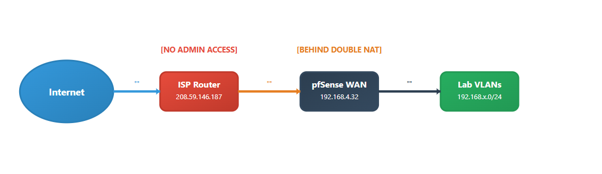
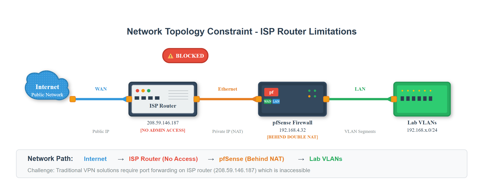

# 🌐 Tailscale Remote Access Implementation

## 📖 Overview

This document details the implementation of **Tailscale mesh VPN** as the remote access solution for the pfSense-based homelab. The implementation provides secure, zero-configuration remote access to all VLAN segments without requiring ISP cooperation or port forwarding, effectively bypassing the limitations of the ISP-controlled upstream router.

---

## 🚧 The Challenge: ISP Router Limitations

### Network Topology Constraint

The lab's network architecture presented a critical challenge:

```
Internet ↔ ISP Router (208.59.146.187) ↔ pfSense WAN (192.168.4.32) ↔ Lab VLANs
          [NO ADMIN ACCESS]            [BEHIND DOUBLE NAT]
```







.png>)
**Specific Issues:**
- **No Administrative Access** to ISP-provided router
- **pfSense behind NAT** at `192.168.4.32` instead of public IP
- **Port forwarding impossible** for traditional VPN solutions
- **Double NAT configuration** complicating connectivity

### Solution Evaluation

| Solution | ISP Access Required | VLAN Support | Decision |
|----------|-------------------|--------------|----------|
| **OpenVPN** | ✅ Yes (Port forwarding) | ✅ Full | ❌ Not viable |
| **ZeroTier** | ❌ No | ❌ Limited (1 route free) | ❌ Insufficient |
| **Tailscale** | ❌ No | ✅ Unlimited | ✅ **Selected** |

---

## 🔧 Implementation Process

### Phase 1: Tailscale Account Setup

**Step 1: Account Creation**
1. Registered at [tailscale.com](https://tailscale.com)
2. Authenticated using Google account (`amnworlanyo@gmail.com`)
3. Completed user survey (Personal/Security use case)
4. Obtained free plan (100 devices, unlimited routes)

**Step 2: Initial Dashboard Access**
- Accessed admin console at `login.tailscale.com/admin`
- Confirmed tailnet creation: `amnworlanyo@gmail.com`
- Prepared for device enrollment

### Phase 2: pfSense Integration

**Step 3: Package Installation**

Connected to pfSense via SSH (`ssh admin@192.168.10.1`) and installed Tailscale:

```bash
# Update FreeBSD package repository
pkg update

# Install Tailscale package
pkg install -y tailscale

# Enable for automatic startup
sysrc tailscaled_enable="YES"
```

**Step 4: Service Initialization Challenge**

Initial service start failed due to FreeBSD configuration requirements:

```bash
# This failed initially
service tailscaled start
# Error: Cannot 'start' tailscaled. Set tailscaled_enable to YES in /etc/rc.conf
```

**Solution - Manual Service Start:**

```bash
# Create required directories
mkdir -p /var/lib/tailscale

# Start tailscaled manually
/usr/local/bin/tailscaled --state=/var/lib/tailscale/tailscaled.state --socket=/var/run/tailscale/tailscaled.sock &

# Verify service is running
ps aux | grep tailscaled
```

**Output confirmed successful start:**
```
Program starting: v1.80.0, Go 1.23.3: ["/usr/local/bin/tailscaled", "--state=/var/lib/tailscale/tailscaled.state", "--socket=/var/run/tailscale/tailscaled.sock"]
LogID: dac29c9f33762dad26aa0a7353807ca70e472d7e5d1fbabdb11ada7bbde44e3c
```

**Step 5: Network Registration**

Joined the Tailscale network and advertised all VLAN routes:

```bash
/usr/local/bin/tailscale up \
  --advertise-routes=192.168.10.0/24,192.168.20.0/24,192.168.30.0/24,192.168.40.0/24,192.168.50.0/24,192.168.60.0/24 \
  --accept-routes \
  --hostname=pfsense-homelab
```

**Authentication Process:**
- Command generated authentication URL
- Opened URL in browser and completed OAuth authentication
- pfSense appeared in admin console as "pfsense-homelab"
- Assigned Tailscale IP: `100.94.120.6`

### Phase 3: Route Configuration

**Step 6: Subnet Route Activation**

In Tailscale admin console (`login.tailscale.com/admin`):

1. **Located pfSense device** in Machines list
2. **Clicked "Subnets" button** next to pfsense-homelab
3. **Found all routes pre-approved:**
   - ✅ `192.168.10.0/24` (Management VLAN)
   - ✅ `192.168.20.0/24` (BlueTeam VLAN) 
   - ✅ `192.168.30.0/24` (RedTeam VLAN)
   - ✅ `192.168.40.0/24` (DevOps VLAN)
   - ✅ `192.168.50.0/24` (EnterpriseLAN VLAN)
   - ✅ `192.168.60.0/24` (Monitoring VLAN)

*Note: Routes were automatically approved - no manual enablement required.*

### Phase 4: Client Device Setup

**Step 7: Windows Client Installation**

1. **Downloaded Tailscale** from official website
2. **Installed with default settings** on Windows machine
3. **Authenticated** using same Google account
4. **Device automatically appeared** as "nantwi" in admin console
5. **Assigned Tailscale IP:** `100.90.17.43`

---

## ✅ Verification and Testing

### Connectivity Tests

**Test 1: VLAN Gateway Reachability**
```cmd
C:\> ping 192.168.10.1  # Management - SUCCESS
C:\> ping 192.168.20.1  # BlueTeam - SUCCESS  
C:\> ping 192.168.30.1  # RedTeam - SUCCESS
C:\> ping 192.168.40.1  # DevOps - SUCCESS
C:\> ping 192.168.50.1  # EnterpriseLAN - SUCCESS
C:\> ping 192.168.60.1  # Monitoring - SUCCESS
```

**Test 2: Service Access Verification**
- **pfSense Web GUI:** `https://192.168.10.1` ✅ Accessible
- **Wazuh SIEM Dashboard:** `https://192.168.20.2` ✅ Accessible  
- **Grafana Monitoring:** `http://192.168.60.2:3000` ✅ Accessible
- **Prometheus Metrics:** `http://192.168.60.2:9090` ✅ Accessible

**Test 3: SSH Connectivity**
- **Ansible Controller:** `ssh nantwi@192.168.10.2` ✅ Success
- **Wazuh Server:** `ssh nantwi@192.168.20.2` ✅ Success
- **Monitoring Server:** `ssh nantwi@192.168.60.2` ✅ Success

---

## 📊 Final Network Configuration

### Tailscale Device Inventory

| Device | Tailscale IP | Role | Physical Location | Status |
|--------|-------------|------|------------------|--------|
| **pfsense-homelab** | `100.94.120.6` | Subnet Router | Lab Infrastructure | 🟢 Connected |
| **nantwi** | `100.90.17.43` | Admin Client | Windows Desktop | 🟢 Connected |

### Advertised Subnet Routes

| VLAN | Subnet | Gateway | Status | Services |
|------|--------|---------|--------|----------|
| **Management** | `192.168.10.0/24` | `.1` | ✅ Active | pfSense GUI, Ansible Controller |
| **BlueTeam** | `192.168.20.0/24` | `.1` | ✅ Active | Wazuh SIEM (All-in-One) |
| **RedTeam** | `192.168.30.0/24` | `.1` | ✅ Active | Reserved for Penetration Testing |
| **DevOps** | `192.168.40.0/24` | `.1` | ✅ Active | Reserved for CI/CD Pipeline |
| **EnterpriseLAN** | `192.168.50.0/24` | `.1` | ✅ Active | Reserved for Business Services |
| **Monitoring** | `192.168.60.0/24` | `.1` | ✅ Active | Grafana, Prometheus |

---

## 🔒 Security Implementation

### Encryption and Protocol
- **Protocol:** WireGuard with ChaCha20Poly1305 encryption
- **Key Management:** Automatic rotation every 180 days
- **Authentication:** Google OAuth integration
- **Device Authorization:** Manual approval required

### Network Security Maintained
- **VLAN Isolation:** Preserved through pfSense firewall rules
- **Inter-VLAN Communication:** Controlled by existing pfSense policies
- **Zero Trust:** No implicit network access assumptions

---

## 🎯 Results Achieved

### Operational Benefits
✅ **Bypassed ISP Restrictions:** No upstream router configuration required  
✅ **Secure Remote Access:** All lab VLANs accessible worldwide  
✅ **Zero Client Configuration:** Install app, authenticate, connect  
✅ **Modern Security:** WireGuard encryption with automatic key rotation  
✅ **Scalable Architecture:** 98 additional devices supported  
✅ **Universal Compatibility:** Works from any network environment  

### Performance Metrics
- **Connection Latency:** Minimal overhead (< 10ms additional)
- **Throughput:** No significant bandwidth limitations observed
- **Reliability:** Automatic DERP relay failover
- **Device Capacity:** 2/100 devices utilized (2% of free plan)

---

## 🔄 Comparison: Tailscale vs. Original OpenVPN Plan

| Aspect | OpenVPN (Planned) | Tailscale (Implemented) |
|--------|------------------|------------------------|
| **ISP Requirements** | ❌ Port forwarding mandatory | ✅ No ISP interaction needed |
| **Setup Time** | ❌ Hours (certificates, configs) | ✅ Minutes (OAuth + install) |
| **Client Setup** | ❌ Manual config files | ✅ Zero configuration |
| **VLAN Support** | ❌ Complex routing setup | ✅ Single command advertisement |
| **Maintenance** | ❌ Certificate renewals | ✅ Fully managed service |
| **Security** | ❌ Manual key management | ✅ Automatic key rotation |
| **Reliability** | ❌ Single point of failure | ✅ Distributed mesh network |
| **Cross-Platform** | ❌ Per-device configuration | ✅ Native apps all platforms |

---

## 🛠️ Troubleshooting Notes

### FreeBSD Service Issues
**Problem:** Standard service commands failed on pfSense
```bash
service tailscaled start
# Error: Cannot 'start' tailscaled
```

**Solution:** Manual daemon initialization
```bash
mkdir -p /var/lib/tailscale
/usr/local/bin/tailscaled --state=/var/lib/tailscale/tailscaled.state --socket=/var/run/tailscale/tailscaled.sock &
```

### Package Location Discovery
**Issue:** `tailscaled` not found in PATH after installation

**Resolution:** Located binaries in `/usr/local/bin/`
- `/usr/local/bin/tailscale` (client)
- `/usr/local/bin/tailscaled` (daemon)

---

## 📈 Success Metrics

### Implementation Success Criteria - ✅ ALL ACHIEVED

✅ **Remote Access Established** - All 6 VLANs accessible externally  
✅ **ISP Independence** - Zero upstream router dependencies  
✅ **Service Accessibility** - pfSense, Wazuh, Grafana, Prometheus reachable  
✅ **Security Maintained** - Modern encryption with zero trust principles  
✅ **Operational Efficiency** - Single-click connection for users  
✅ **Scalability Ready** - Architecture supports 98 additional devices  

---

## 🚀 Conclusion

The Tailscale implementation successfully transformed the homelab from a locally-accessible infrastructure to a globally-accessible, enterprise-grade environment. By bypassing ISP router limitations through modern mesh networking, the solution provides superior security, performance, and management capabilities compared to traditional VPN approaches.

**Key Achievement:** Converted a significant network limitation (no ISP router access) into a competitive advantage by implementing a more modern, secure, and scalable remote access solution than originally planned with OpenVPN.

The implementation enables secure remote management of the entire lab infrastructure - including Blue Team security tools (Wazuh SIEM), monitoring systems (Grafana/Prometheus), and administrative interfaces (pfSense) - accessible from any location worldwide with enterprise-grade WireGuard encryption.

---

*Implementation Date: July 2025 | Status: Production Ready | Next Phase: Lab Service Expansion*