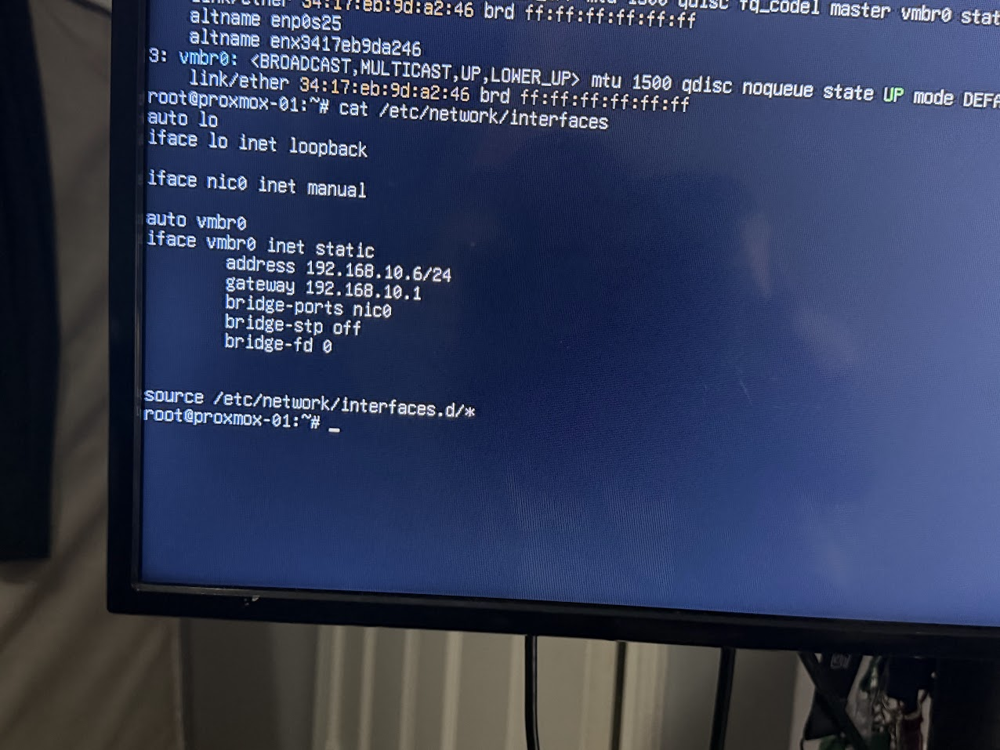
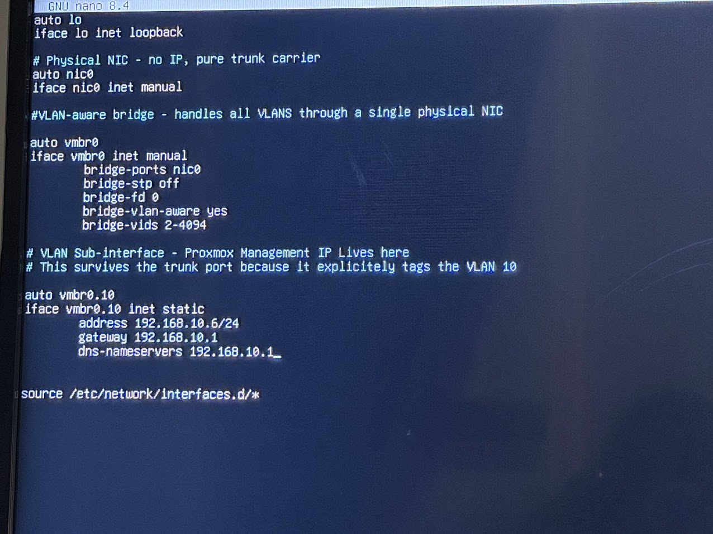
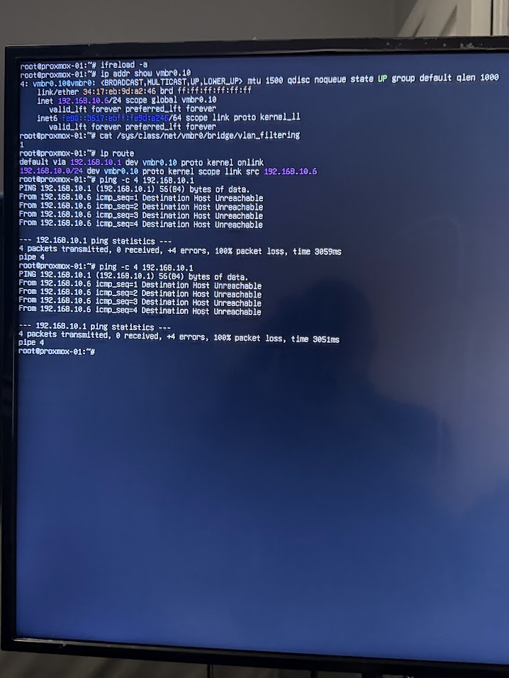
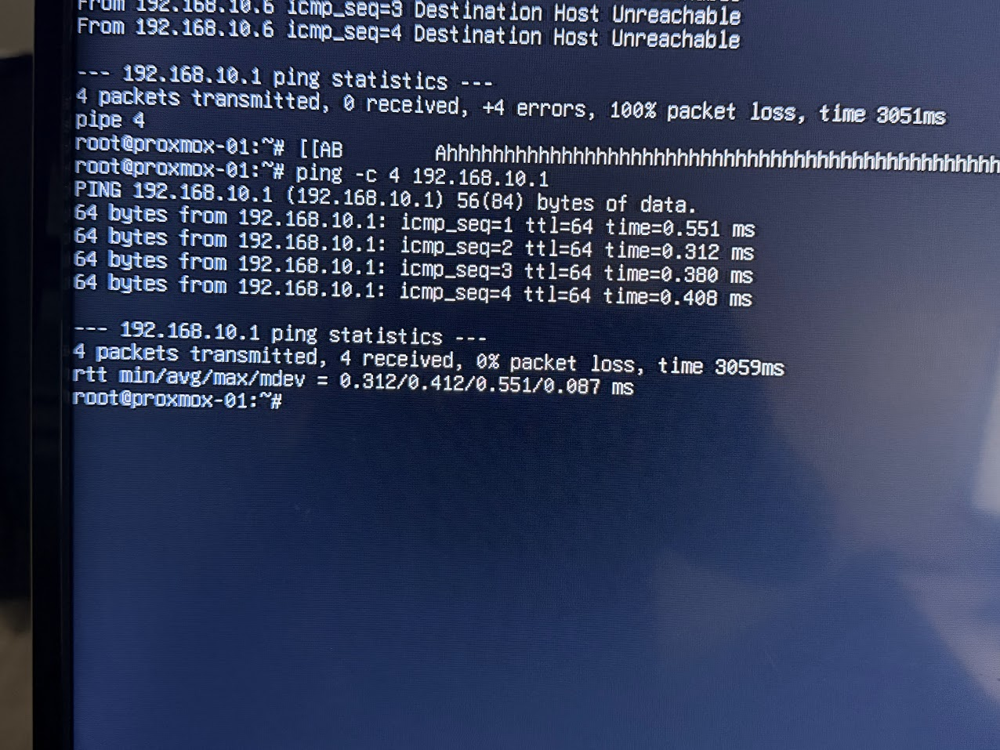
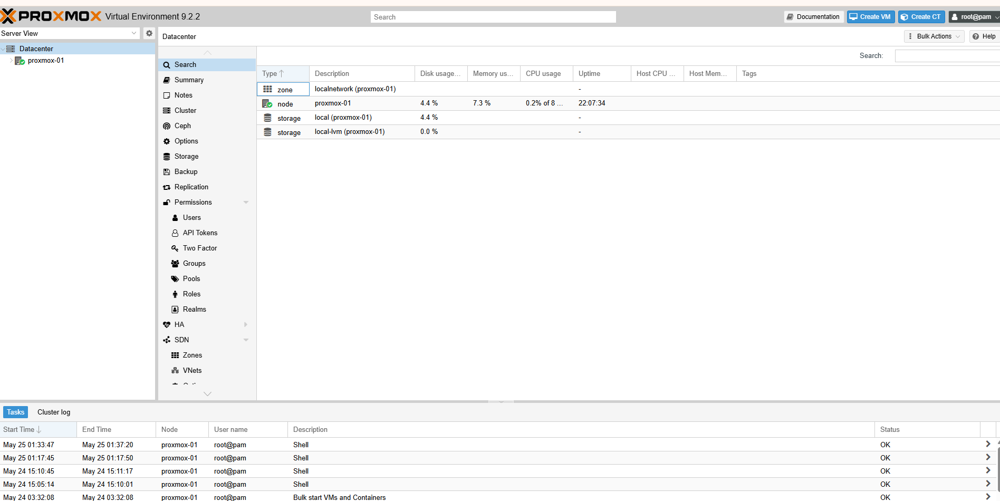

# Proxmox VE Hypervisor Deployment

## Overview

This document covers the deployment of a Proxmox VE hypervisor node into the existing lab infrastructure, including VLAN-aware networking configuration, trunk port migration, and integration with the Management VLAN.

A dedicated desktop machine was added to the lab as a bare-metal hypervisor running Proxmox VE. The node is assigned to the Management VLAN at `192.168.10.6` and connected to a trunk port on the TP-Link TL-SG108E switch, giving it simultaneous access to all six lab VLANs through a single NIC.

This enables virtual machines hosted on Proxmox to be placed on any lab VLAN by setting a VLAN tag at the VM network interface level, without requiring separate physical connections per VLAN.

---

## Node Specifications

| Property | Value |
|----------|-------|
| Hostname | proxmox-01 |
| IP Address | 192.168.10.6 |
| VLAN | 10 (Management) |
| Platform | Proxmox VE |
| NIC | Single NIC (nic0) |
| Switch Port | Port 2 (Trunk, all VLANs tagged) |
| Web UI | https://192.168.10.6:8006 |

---

## Network Architecture

### Why a Trunk Port

A single NIC carrying multiple VLANs requires an 802.1Q trunk port on the switch side and a VLAN-aware bridge on the host side. Without this, a hypervisor is limited to the single VLAN assigned to its switch port.

With a trunk port and a VLAN-aware Linux bridge:

- The physical NIC carries all VLAN traffic simultaneously, tagged
- The bridge decodes the 802.1Q tags and routes traffic to the correct VM
- Each VM is assigned to a VLAN by setting a VLAN Tag field at the virtual NIC level
- pfSense handles DHCP and routing for each VLAN as it already does for all other lab hosts

### Switch Port Assignment

| Port | Type | Connected To |
|------|------|-------------|
| Port 1 | Trunk, all VLANs tagged | pfSense ue0 interface |
| Port 2 | Trunk, all VLANs tagged | Proxmox VE (nic0) |
| Port 3 | Access, VLAN 10 | Secondary unmanaged switch |
| Ports 4–8 | Access, individual VLANs | Reserved per VLAN |

Port 3 feeds a secondary unmanaged switch that extends VLAN 10 connectivity to additional management-tier devices including Windows Server 2022 and the primary laptop.

---

## Network Configuration

### /etc/network/interfaces

```bash
auto lo
iface lo inet loopback

# Physical NIC - no IP, pure trunk carrier
auto nic0
iface nic0 inet manual

# VLAN-aware bridge - handles all VLANs through single physical NIC
auto vmbr0
iface vmbr0 inet manual
        bridge-ports nic0
        bridge-stp off
        bridge-fd 0
        bridge-vlan-aware yes
        bridge-vids 2-4094

# VLAN 10 sub-interface - Proxmox management IP lives here
auto vmbr0.10
iface vmbr0.10 inet static
        address 192.168.10.6/24
        gateway 192.168.10.1
        dns-nameservers 192.168.10.1

source /etc/network/interfaces.d/*
```

### Interface Roles

| Interface | Role | IP |
|-----------|------|----|
| nic0 | Physical NIC, trunk carrier | None |
| vmbr0 | VLAN-aware Linux bridge | None |
| vmbr0.10 | VLAN 10 management sub-interface | 192.168.10.6/24 |

### Key Configuration Details

`bridge-vlan-aware yes` enables 802.1Q processing on the bridge. Without this, tagged frames arriving from the trunk port are not decoded and the host loses connectivity when moved to a trunk port.

`bridge-vids 2-4094` instructs the bridge to accept any VLAN tag in that range, covering all six lab VLANs and any future additions.

The management IP is placed on `vmbr0.10` rather than directly on `vmbr0`. On a trunk port, VLAN 10 traffic arrives tagged, the sub-interface explicitly handles VLAN 10 tagged frames, ensuring the management IP remains reachable after the trunk migration.

---

## Deployment Procedure

### Pre-requisites

- Proxmox VE ISO flashed to USB (available at proxmox.com/downloads)
- Static IP allocation confirmed: 192.168.10.6
- SSH access available during configuration
- Machine connected to a VLAN 10 access port for initial installation

### Installation

During the Proxmox installer, configure the network as follows:

```
Management Interface:  [select physical NIC]
Hostname:              proxmox-01.homelab.local
IP Address:            192.168.10.6
Netmask:               255.255.255.0
Gateway:               192.168.10.1
DNS:                   192.168.10.1
```

Connect the machine to a VLAN 10 access port for the initial installation. The trunk migration is performed after installation is complete.

### Trunk Port Migration

The trunk migration must follow this sequence exactly. Reversing the order causes immediate loss of access before the fix is in place.

**Step 1, Verify the current NIC name**

```bash
ip link show
```


*Output of ip link show, the physical NIC is identified as nic0 with alternate names enp0s25 and enx3417eb9da246*

Note the physical NIC name. On this node it is `nic0`. On other hardware it may differ, use whatever appears here, not an assumed name.

**Step 2, Back up the existing config**

```bash
cp /etc/network/interfaces /etc/network/interfaces.backup
```

**Step 3, Review the default post-install config**

```bash
cat /etc/network/interfaces
```

The default config assigns the management IP directly to `vmbr0` with no VLAN awareness. This works on an access port but will fail on a trunk port because tagged frames cannot be decoded.

**Step 4, Edit the interfaces file**

```bash
nano /etc/network/interfaces
```


*The updated interfaces file, vmbr0 is now VLAN-aware and the management IP has moved to vmbr0.10*

Replace the contents with the configuration shown in the Network Configuration section above.

**Step 5, Apply the configuration**

```bash
ifreload -a
```

Proxmox uses `ifupdown2` which allows network changes to be applied without a reboot.

**Step 6, Verify before moving the cable**

```bash
# Management IP must be present on vmbr0.10
ip addr show vmbr0.10

# Must return 1 to confirm VLAN filtering is active
cat /sys/class/net/vmbr0/bridge/vlan_filtering

# Default route must point to pfSense via vmbr0.10
ip route
```


*Verification output, vmbr0.10 holds 192.168.10.6/24, vlan_filtering returns 1, default route is correct*

At this stage a ping to `192.168.10.1` returns `Destination Host Unreachable`. This is expected, the node is now sending tagged frames but is still on an access port that only accepts untagged frames. This confirms the config is working correctly and is ready for the trunk port.

**Step 7, Move the cable**

Move the Ethernet cable from Port 3 (access) to Port 2 (trunk) on the TP-Link switch. Wait ten seconds, then verify:

```bash
ping -c 4 192.168.10.1
```


*4 packets transmitted, 4 received, 0% packet loss, Proxmox is live on the trunk port*

**Step 8, Confirm internet access**

```bash
ping -c 4 8.8.8.8
```

**Step 9, Confirm web UI**

From any device on the Management VLAN:

```
https://192.168.10.6:8006
```


*Proxmox web UI, the no-subscription notice is standard on the free community edition and does not affect functionality*

---

## Creating VMs Across VLANs

With `vmbr0` VLAN-aware and on a trunk port, placing a VM on any lab VLAN requires only the VLAN Tag field in the VM network configuration.

In the Proxmox web UI when creating or editing a VM, set:

| Field | Value |
|-------|-------|
| Bridge | vmbr0 |
| VLAN Tag | Target VLAN ID |

Examples:

| VM | Bridge | VLAN Tag | Expected IP Range |
|----|--------|----------|-------------------|
| Kali Linux (RedTeam) | vmbr0 | 30 | 192.168.30.50–100 |
| Security tooling (BlueTeam) | vmbr0 | 20 | 192.168.20.50–100 |
| CI/CD runner (DevOps) | vmbr0 | 40 | 192.168.40.50–100 |
| Monitoring agent | vmbr0 | 60 | 192.168.60.50–100 |

pfSense automatically issues DHCP leases from the correct pool for each VLAN. No additional pfSense configuration is required beyond what is already in place.

---

## Ansible Integration

Add Proxmox to the Ansible inventory from the controller node (192.168.10.2):

```bash
# Distribute the Ansible SSH key
ssh-copy-id -i ~/.ssh/ansible-homelab-key.pub root@192.168.10.6

# Add to inventory
echo "192.168.10.6   # Proxmox Hypervisor proxmox-01 - $(date)" >> /etc/ansible/hosts

# Verify connectivity
ansible 192.168.10.6 -m ping
```

---

## Post-Deployment Verification Checklist

- [ ] Web UI accessible at https://192.168.10.6:8006
- [ ] `ip addr show vmbr0.10` shows 192.168.10.6/24
- [ ] `cat /sys/class/net/vmbr0/bridge/vlan_filtering` returns 1
- [ ] Ping to 192.168.10.1 succeeds
- [ ] Ping to 8.8.8.8 succeeds
- [ ] Ansible ping from controller (192.168.10.2) succeeds
- [ ] Test VM on VLAN 30 receives a 192.168.30.x address via DHCP

---

## Troubleshooting

**Lost connectivity immediately after ifreload**

A syntax error in `/etc/network/interfaces` or the wrong NIC name was used. Restore the backup:

```bash
cp /etc/network/interfaces.backup /etc/network/interfaces
ifreload -a
```

**Ping to pfSense fails after ifreload but before moving the cable**

This is expected behaviour. The node is sending tagged frames to an access port. Proceed to move the cable to Port 2.

**Ping to pfSense fails after moving the cable**

Confirm Port 2 on the TP-Link switch is configured as a trunk port with all VLANs tagged. Access the switch web UI and verify the VLAN configuration for Port 2 matches Port 1.

**Web UI unreachable but SSH works**

```bash
systemctl restart pveproxy
```

---

## Related Documentation

- [01-network-infrastructure.md](01-network-infrastructure.md), pfSense and switch VLAN configuration
- [04-automation-platform.md](04-automation-platform.md), Ansible controller setup
- [06-ansible-service-account.md](06-ansible-service-account.md), Service account configuration for new nodes
- [09-bootstrap-procedures.md](09-bootstrap-procedures.md), Standardised bootstrap procedures
