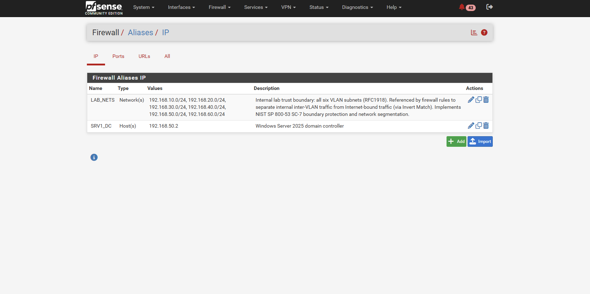
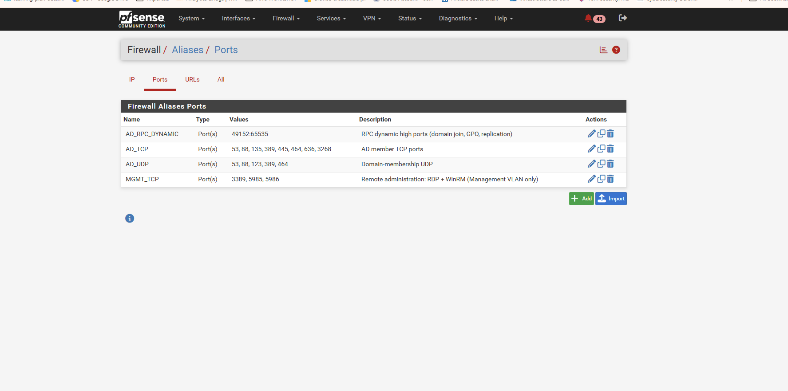
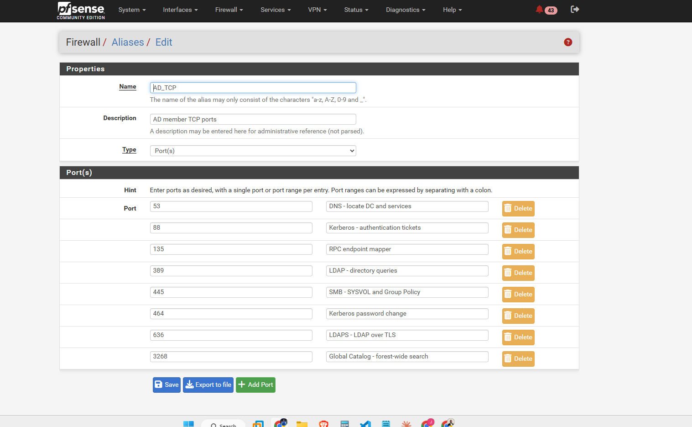
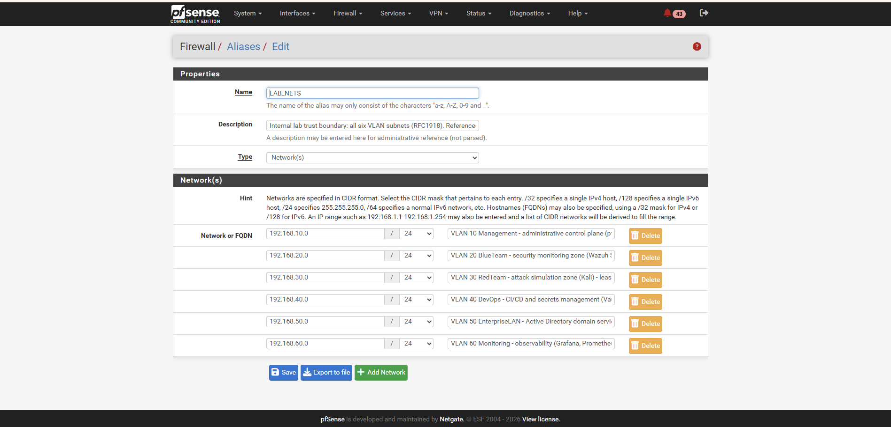

# Domain Controller Network Access: Aliases and Firewall Rules

**Scope**: How the lab's pfSense firewall controls access to the Windows Server 2025 domain controller `dc01.ad.biira.online` (`192.168.50.2`, VLAN 50 EnterpriseLAN). Written for readers who have not worked with Active Directory or pfSense before.

**Status**: Aliases created 2026-08-15. Rule restructuring in progress (see section 6).

---

## 1. The problem this solves

A domain controller (DC) is the machine that runs Active Directory (AD). Every other Windows machine that "joins the domain" relies on the DC for four things:

1. **Finding out where the DC is** (DNS)
2. **Proving who you are** when you log on (Kerberos)
3. **Reading the directory**: users, groups, computers, policies (LDAP)
4. **Downloading policy and scripts** that the DC pushes to members (SMB)

None of these is a single port. Together they form a bundle of roughly a dozen ports across TCP and UDP. If the firewall blocks even one of them, the result is not a clean failure but a confusing half-working state: a machine can join the domain but nobody can log on, or logon works but Group Policy silently fails, or password changes error out with a message that mentions nothing about the network.

The lab runs pfSense as a firewall between every VLAN. Its policy is meant to be **default deny**: nothing crosses between VLANs unless a rule allows it. So before any machine outside VLAN 50 can be a domain member, the firewall needs precise rules that open exactly the AD bundle to exactly the DC, and nothing else.

---

## 2. What a pfSense alias is, and why we use them

A firewall rule in pfSense has the shape *"allow PROTOCOL from SOURCE to DESTINATION on PORT"*. Without aliases, opening the AD bundle would mean writing one rule per port: "allow TCP 53 to 192.168.50.2", "allow TCP 88 to 192.168.50.2", and so on, roughly thirteen rules per source VLAN. Nobody can read that list and tell what it is for.

An **alias** is a named list. It can hold hosts (IP addresses) or ports. A rule can then reference the list by name. The thirteen rules collapse into three that read like English:

- allow TCP from Management to `SRV1_DC` on `AD_TCP`
- allow UDP from Management to `SRV1_DC` on `AD_UDP`
- allow TCP from Management to `SRV1_DC` on `AD_RPC_DYNAMIC`

Two further benefits:

- **One place to change**. If Microsoft ever requires an extra port, it is added to the alias once and every rule that uses the alias picks it up.
- **Intent is visible**. Six months from now, "allow `AD_TCP` to `SRV1_DC`" still explains itself. "allow TCP 3268 to 192.168.50.2" does not.

Aliases are created at **Firewall > Aliases** and referenced by name in the source, destination, and port fields of rules.

---

## 3. The five aliases

| Alias | Type | Contents | One-line purpose |
|-------|------|----------|------------------|
| `SRV1_DC` | Host | `192.168.50.2` | The domain controller itself |
| `AD_TCP` | Ports | 53, 88, 135, 389, 445, 464, 636, 3268 | TCP ports a domain member needs on the DC |
| `AD_UDP` | Ports | 53, 88, 123, 389, 464 | UDP ports a domain member needs on the DC |
| `AD_RPC_DYNAMIC` | Ports | 49152:65535 | RPC "high ports" negotiated at runtime |
| `MGMT_TCP` | Ports | 3389, 5985, 5986 | Remote administration only (RDP, WinRM) |
| `LAB_NETS` | Networks | `192.168.10.0/24` … `192.168.60.0/24` | All six internal VLAN subnets: the lab trust boundary |

The split is deliberate. `AD_TCP` + `AD_UDP` + `AD_RPC_DYNAMIC` together are **"what it takes to be a member of the domain"**. `MGMT_TCP` is **"what it takes to administer the server"**. Keeping them apart means a client VLAN can be granted domain membership without also being granted remote console access to the DC.

#### Evidence: the aliases as built

*Figure 11.1: Firewall → Aliases → IP. The two host/network aliases: `SRV1_DC` (the domain controller at `192.168.50.2`) and `LAB_NETS` (the internal trust boundary, with its NIST SC-7 description visible).*

*Figure 11.2: Firewall → Aliases → Ports. The four port groups: `AD_TCP`, `AD_UDP`, `AD_RPC_DYNAMIC` (the domain-membership bundle) and `MGMT_TCP` (administration, kept separate on purpose).*

### 3.1 `SRV1_DC` (host)

The single IP of the DC. Using an alias rather than the raw address means that if the DC is ever re-addressed, or a second DC is added, only the alias changes. Rules keep working. (The alias name `SRV1_DC` dates from when the host was named `SRV1`; the host was renamed to `DC01` on 2026-08-30, but the alias keeps its original name because it references the IP, not the hostname, so rules and evidence stay stable.)

### 3.2 `AD_TCP` (domain-membership TCP ports)

| Port | Protocol | What actually happens on this port |
|------|----------|-------------------------------------|
| **53** | DNS | AD publishes special records called SRV records, for example `_ldap._tcp.ad.biira.online` and `_kerberos._tcp.ad.biira.online`. A machine that wants to join or log on first asks DNS "who is the DC for this domain?" and those records answer. Small queries use UDP; large answers and zone transfers use TCP. Both are needed. |
| **88** | Kerberos | The authentication protocol AD is built on. When a user logs on, the machine sends the credentials to the DC on port 88 and receives a **ticket**. That ticket is then presented to any other service (file shares, printers, other servers) to prove identity without sending the password again. Block 88 and nobody can log on with a domain account. |
| **135** | RPC endpoint mapper | Microsoft RPC (Remote Procedure Call) is how many Windows services talk to each other. Rather than each service having a fixed port, a client asks port 135 "which port is service X listening on right now?" and gets an answer in the 49152 to 65535 range (see `AD_RPC_DYNAMIC`). Domain join, Group Policy, and remote management all start with a call to 135. |
| **389** | LDAP | Lightweight Directory Access Protocol. This is the port used to *read and write the directory itself*: look up a user, check group membership, find a computer object, read policy links. |
| **445** | SMB | Server Message Block, the Windows file-sharing protocol. The DC hosts two special shares, `SYSVOL` and `NETLOGON`. Group Policy objects and logon scripts live there and every domain member downloads them over SMB at logon and every 90 minutes thereafter. |
| **464** | Kerberos password change | A separate Kerberos service used only when a password changes: a user pressing Ctrl+Alt+Del > Change password, or a domain-joined computer rotating its own machine-account password (every 30 days by default). Without it, password changes fail while everything else works. |
| **636** | LDAPS | LDAP wrapped in TLS. Windows itself does not require it (Windows LDAP traffic is signed and sealed by Kerberos), but almost every non-Windows system that talks to AD prefers it: Linux SSSD, HashiCorp Vault's LDAP authentication method, Wazuh's AD integration, Grafana LDAP login. It is included now so those integrations do not need a firewall change later. |
| **3268** | Global Catalog | A read-only copy of *every* object in the whole AD forest, held on designated DCs. Logon uses it to resolve universal group membership; applications use it to search across domains. In a single-domain lab it mostly duplicates 389, but Windows still queries it and logon can stall if it is blocked. |

*Figure 11.3: The `AD_TCP` alias as configured, each port carrying an inline description of its role. Documenting intent at the point of configuration (not only in this file) is what makes the alias self-explaining to the next person who opens it.*

### 3.3 `AD_UDP` (domain-membership UDP ports)

| Port | Protocol | What actually happens on this port |
|------|----------|-------------------------------------|
| **53** | DNS | The everyday small name lookups. Most DNS traffic is UDP. |
| **88** | Kerberos | Kerberos tries UDP first for small requests and falls back to TCP when the reply is too large (which is common once a user is in many groups). |
| **123** | NTP | Network Time Protocol. Domain members synchronise their clocks to the DC. This matters more than it looks: Kerberos rejects any ticket whose timestamp is more than 5 minutes off. A machine with a drifting clock and blocked NTP will one day simply stop being able to log on, with no obvious reason. |
| **389** | LDAP ping | Not a normal LDAP query. This is a lightweight UDP probe a machine sends while locating a domain controller: "are you a DC for `ad.biira.online`, and are you in my site?" It is part of the DC discovery process alongside the DNS SRV lookup. |
| **464** | Kerberos password change | UDP variant of the password-change service. |

### 3.4 `AD_RPC_DYNAMIC` (RPC high ports)

After a client asks port 135 where a service lives, the DC replies with a port somewhere in **49152 to 65535** and the client connects to that. Which port is chosen changes every time. Domain join, Group Policy processing, and replication between DCs all rely on this.

Because the range is large, it lives in its own alias rather than inside `AD_TCP`. That way it can be granted only from tightly scoped sources (the Management VLAN to `SRV1_DC`) and never accidentally handed out to a broader set of hosts along with the rest of the bundle. It is written as `49152:65535`; in pfSense a colon means "range".

### 3.5 `MGMT_TCP` (remote administration)

| Port | Protocol | What it is for |
|------|----------|----------------|
| **3389** | RDP | Remote Desktop: a full graphical console session on the server. |
| **5985** | WinRM over HTTP | Windows Remote Management, the channel Ansible uses to run tasks on Windows. When authentication is Kerberos or NTLM the payload is encrypted by the authentication protocol even though the outer channel is HTTP. |
| **5986** | WinRM over HTTPS | The same channel wrapped in TLS. Required for Basic or CredSSP authentication and the more defensible choice on a domain controller. Needs a certificate on the server. Both 5985 and 5986 are opened so that moving from one to the other later does not need a firewall change. |

These are administration ports. They belong to the Management VLAN (the administrator laptop and the Ansible controller) and to nobody else. That is why they are not inside `AD_TCP`.

---

## 4. How pfSense evaluates rules (the mental model)

Understanding this is what turns the rule tabs from a list into something you can reason about.

1. **Rules are attached to the interface where traffic enters.** The MANAGEMENT tab governs packets sent *by* machines on VLAN 10. The ENTERPRISELAN tab governs packets sent *by* machines on VLAN 50 (so it controls what the DC itself may initiate, not who may reach it). To control who may reach the DC, the rules go on the tabs of the *source* VLANs.
2. **Top to bottom, first match wins.** pfSense reads the tab from the top and applies the first rule that matches the packet. Everything below that rule is irrelevant for that packet.
3. **Implicit deny at the bottom.** If no rule matches, the packet is dropped. There is no rule for this; it is the default.
4. **Stateful.** Once a connection is allowed in one direction, the replies are allowed automatically. A rule that permits Management to reach the DC on 88 does not need a matching rule on the DC's tab for the answer.
5. **The States column is your evidence.** It shows how many live connections have matched each rule and how much data. A rule with `0/0 B` under a broad rule is dead: nothing ever reaches it.

A rule whose source is `*` and destination is `*` matches every packet. Placed anywhere in a tab, it makes every rule below it dead and turns the interface into "allow everything". That is the situation the MANAGEMENT tab was in on 2026-08-15 (row 4, "All", 139 states, 3.5 GiB).

---

## 5. Who should be able to reach the DC

| Source | Reason | Grant |
|--------|--------|-------|
| VLAN 10 Management (admin laptop, future domain-joined Windows clients) | Domain membership + administration | `AD_TCP`, `AD_UDP`, `AD_RPC_DYNAMIC`, `MGMT_TCP` |
| VLAN 10 Ansible controller | WinRM automation | Covered by `MGMT_TCP` |
| VLAN 50 machines (same subnet as the DC) | Layer 2 neighbours; traffic never crosses pfSense | No rule needed |
| VLAN 20 BlueTeam (Wazuh) | Only if Wazuh integrates with AD later | Nothing today; later `AD_TCP` (for LDAPS 636) if needed |
| VLAN 40 DevOps (Vault) | Vault LDAP auth backend, later | Nothing today; later 636 only |
| VLAN 60 Monitoring (Grafana) | Grafana LDAP login, later | Nothing today; later 636 only |
| VLAN 30 RedTeam (Kali) | Adversary simulation | **Nothing.** RedTeam reaching the DC is a deliberate future exercise, opened on purpose and closed afterwards, never a standing rule |

---

## 6. Target rule layout

### 6.1 MANAGEMENT tab (VLAN 10)

The Management VLAN is the administrative network and is *intended* to be the most permissive. The change is not to lock it down but to make its permissiveness explicit, ordered, and safe:

| # | Action | Proto | Source | Destination | Port | Purpose |
|---|--------|-------|--------|-------------|------|---------|
| 1 | Allow | TCP | MANAGEMENT subnets | This Firewall | 443, 80, 22 | pfSense web UI + SSH. **Lock-out protection: must exist and be enabled before any broad rule is removed.** |
| 2 | Allow | TCP/UDP | MANAGEMENT subnets | This Firewall | 53 | DNS via pfSense resolver |
| 3 | Allow | UDP | MANAGEMENT subnets | This Firewall | 123 | NTP from pfSense |
| 4 | Allow | ICMP | MANAGEMENT subnets | any | | Ping for troubleshooting |
| 5 | Allow | TCP | MANAGEMENT subnets | `SRV1_DC` | `AD_TCP` | Domain membership |
| 6 | Allow | UDP | MANAGEMENT subnets | `SRV1_DC` | `AD_UDP` | Domain membership |
| 7 | Allow | TCP | MANAGEMENT subnets | `SRV1_DC` | `AD_RPC_DYNAMIC` | Domain join, GPO |
| 8 | Allow | TCP | MANAGEMENT subnets | `SRV1_DC` | `MGMT_TCP` | RDP + WinRM (Ansible) |
| 9 | Allow | any | MANAGEMENT subnets | `LAB_NETS` | | Admin reach into all lab VLANs (explicit, so it can be tightened per-service later) |
| 10 | Allow | any | MANAGEMENT subnets | **not** `LAB_NETS` | | Internet |
| | *implicit deny* | | | | | Everything else |

`LAB_NETS` is a sixth alias, type Network, containing the six lab subnets `192.168.10.0/24` through `192.168.60.0/24`. Rule 10 uses pfSense's "invert match" checkbox on the destination so that it means "anywhere except the lab".

*Figure 11.4: The `LAB_NETS` alias: all six VLAN subnets, each labelled with its security zone. This single object is what lets one firewall rule mean "the whole internal lab", and its inverse mean "the Internet". It is the machine-readable form of the trust boundary described in section 8.*

Rules 5 to 8 are technically covered by rule 9 today. They are written anyway because (a) they document intent, and (b) when rule 9 is later tightened to per-service grants, DC access keeps working without anyone remembering to add it.

### 6.2 ENTERPRISELAN tab (VLAN 50, what the DC may initiate)

| # | Action | Proto | Source | Destination | Port | Purpose |
|---|--------|-------|--------|-------------|------|---------|
| 1 | Allow | TCP/UDP | `SRV1_DC` | This Firewall | 53 | DNS forwarder (DC01 forwards non-AD names to pfSense) |
| 2 | Allow | UDP | `SRV1_DC` | This Firewall | 123 | Time source for the DC |
| 3 | Allow | ICMP | ENTERPRISELAN subnets | any | | Troubleshooting |
| 4 | Allow | TCP | `SRV1_DC` | not `LAB_NETS` | 80, 443 | Windows Update, certificate revocation checks |
| 5 | Allow | TCP | `SRV1_DC` | Wazuh manager | 1514, 1515 | Wazuh agent (once the agent is installed) |
| | *implicit deny* | | | | | The DC does not initiate anything else, and never toward RedTeam |

### 6.3 Other VLAN tabs (BlueTeam, RedTeam, DevOps, Monitoring)

Each currently has an "allow any to any" rule that grants full inter-VLAN reach. Target pattern per tab:

| # | Action | Source | Destination | Purpose |
|---|--------|--------|-------------|---------|
| 1 | Allow | VLAN subnets | This Firewall 53, 123 | DNS + NTP |
| 2 | Allow | VLAN subnets | not `LAB_NETS` | Internet |
| 3 | Allow (only where justified) | VLAN subnets | specific service | e.g. Wazuh agents to `192.168.20.2` 1514/1515 from every VLAN; Prometheus scrape targets |
| 4 | Allow (only where justified) | VLAN subnets | `SRV1_DC` on 636 | LDAPS for Vault / Grafana / Wazuh integration, when built |
| | *implicit deny* | | | Including all traffic toward the DC from RedTeam |

The exact per-tab rules are captured as each tab is restructured.

---

## 7. Order of operations when restructuring (safety)

1. Create the `LAB_NETS` alias.
2. On MANAGEMENT, **add rule 1 (web UI/SSH to This Firewall) first and confirm it is enabled and above the "All" rule.** Reload the pfSense page from the laptop to prove access still works.
3. Add rules 2 to 8 above the "All" rule.
4. Add rules 9 and 10 directly above the "All" rule.
5. Reload the pfSense page again, and from the laptop test: RDP to DC01, `nslookup ad.biira.online 192.168.50.2`, ping to `192.168.20.2` and `192.168.60.2`, and any internet site.
6. Only now **disable** (not delete) the "All" rule. Test the same list again. If anything breaks, re-enable "All" and investigate; disabling instead of deleting makes the rollback one click.
7. Delete the dead rules below (Monitoring, DNS lookups, ping, general outbound) and the old "RDP to Windows Server 2022" rule, all of which are now superseded by explicit rules above.
8. After a day of normal use with no problems, delete the disabled "All" rule.
9. Repeat the pattern tab by tab for ENTERPRISELAN, then the remaining VLANs.

---

## 8. Standards and framework alignment

This lab is a learning environment, not a production system under audit, but every design choice here is deliberately made the way a regulated enterprise would make it. Mapping the choices to recognised frameworks serves two purposes: it makes the reasoning defensible, and it builds the habit of thinking in controls rather than in one-off settings.

### 8.1 The design decisions and the controls they satisfy

| Decision in this lab | Framework control | What the control asks for |
|----------------------|-------------------|----------------------------|
| Default-deny between all VLANs; traffic allowed only by explicit rule | **NIST SP 800-53 SC-7(5)**, **CIS Control 4.4** | Deny network traffic by default, allow by exception |
| VLAN segmentation into security zones (Management, BlueTeam, RedTeam, DevOps, EnterpriseLAN, Monitoring) | **NIST SP 800-53 SC-7**, **NIST CSF 2.0 PR.IR-01**, **CIS Control 12.2** | Monitor and control communications at key internal boundaries; protect network integrity through segregation |
| `LAB_NETS` alias defining the internal trust boundary | **NIST SP 800-53 SC-7 (Boundary Protection)** | Define and enforce the boundary between internal and external |
| Explicit inter-VLAN rules controlling which zone may reach which service | **NIST SP 800-53 AC-4 (Information Flow Enforcement)** | Control the flow of information between connected systems |
| RedTeam (VLAN 30) has no standing path to the AD estate; access is opened per-exercise and closed | **NIST SP 800-207 (Zero Trust)** microsegmentation; **AC-4** | No implicit trust based on network location; least-privilege flow |
| DC access granted only on the specific AD ports, not "any" | **NIST SP 800-53 CM-7 (Least Functionality)**, **CIS Control 4.8** | Allow only required ports, protocols, and services |
| RDP/WinRM (`MGMT_TCP`) separated from domain-membership ports and limited to the Management VLAN | **NIST SP 800-53 AC-6 (Least Privilege)**, **AC-17 (Remote Access)** | Restrict administrative access to authorised sources only |
| Aliases with descriptions; rules describe intent; this document | **NIST SP 800-53 CM-2/CM-6 (Baseline & Config Settings)**, **CIS Control 12.4** | Maintain documented, current network configuration and diagrams |
| Change sequence that adds a lock-out-protection rule first and disables (not deletes) before removing | **NIST SP 800-53 CM-3 (Change Control)** | Manage configuration changes with rollback |

### 8.2 Why this framing matters

- **Portability of thinking.** "Allow only the AD ports to the DC" is a setting. "CM-7 Least Functionality" is a principle that applies to a firewall, a server role, a cloud security group, and an application. Learning the principle behind each setting is what turns lab work into transferable expertise.
- **Auditability.** A reviewer (or a future you) can trace any rule back to the control it implements and the reason it exists, rather than guessing.
- **Interview and portfolio value.** Being able to say "this segmentation implements NIST 800-53 SC-7 and CIS Control 12" is the language security teams actually use.

### 8.3 Frameworks referenced

- **NIST SP 800-53 Rev 5**, the U.S. federal control catalogue; the SC (System & Communications Protection), AC (Access Control), and CM (Configuration Management) families are the ones this firewall work touches.
- **NIST Cybersecurity Framework (CSF) 2.0**, the higher-level outcomes model; PR (Protect) is the relevant function.
- **NIST SP 800-207**, Zero Trust Architecture; the source of the microsegmentation and "never trust network location" ideas.
- **CIS Controls v8**, a prioritised, prescriptive control set; Controls 4 (Secure Configuration) and 12 (Network Infrastructure Management) are the relevant ones.

These are references for a learning lab, not a claim of formal compliance. Real compliance requires evidence, testing, and assessment beyond the scope of a homelab.

## 9. Glossary

- **Alias**: a named list of hosts, networks, or ports that firewall rules reference by name.
- **Domain controller (DC)**: the server that runs Active Directory and answers logon, directory, and policy requests.
- **Kerberos**: AD's authentication protocol; issues tickets that prove identity.
- **LDAP / LDAPS**: the protocol for reading and writing the directory; LDAPS is the TLS-encrypted version.
- **RPC / endpoint mapper**: Microsoft's remote-call mechanism; port 135 tells clients which dynamic port to use.
- **SRV record**: a DNS record type that says "the service X for domain Y is on host Z, port P". AD uses them so clients can find DCs.
- **SYSVOL / NETLOGON**: shares on the DC holding Group Policy and logon scripts.
- **State**: pfSense's record of an allowed connection; replies are permitted automatically.
- **Implicit deny**: the unwritten last rule on every interface, dropping anything not explicitly allowed.
