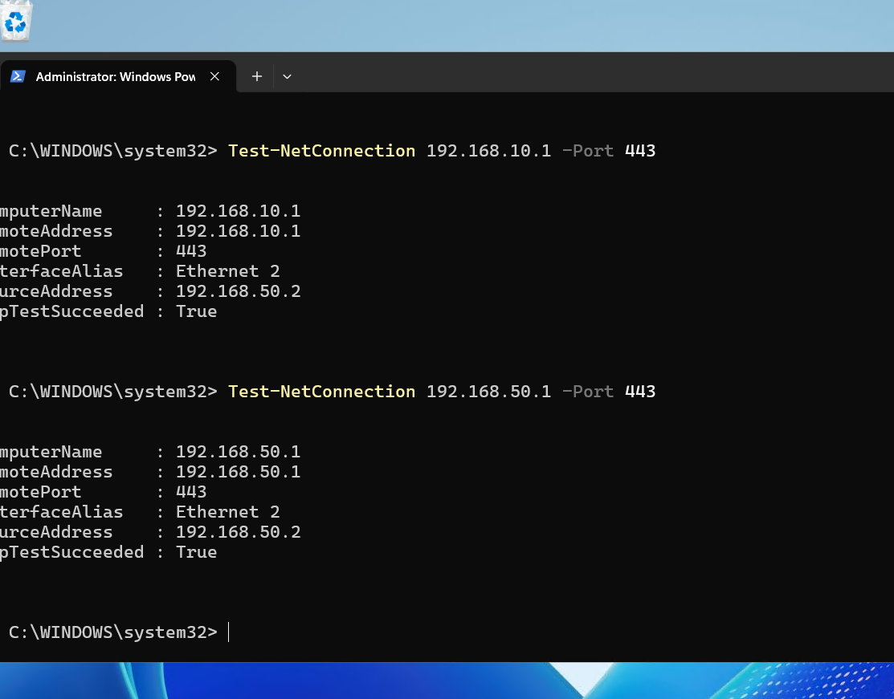
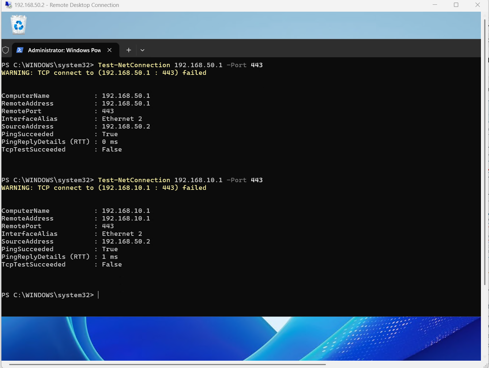
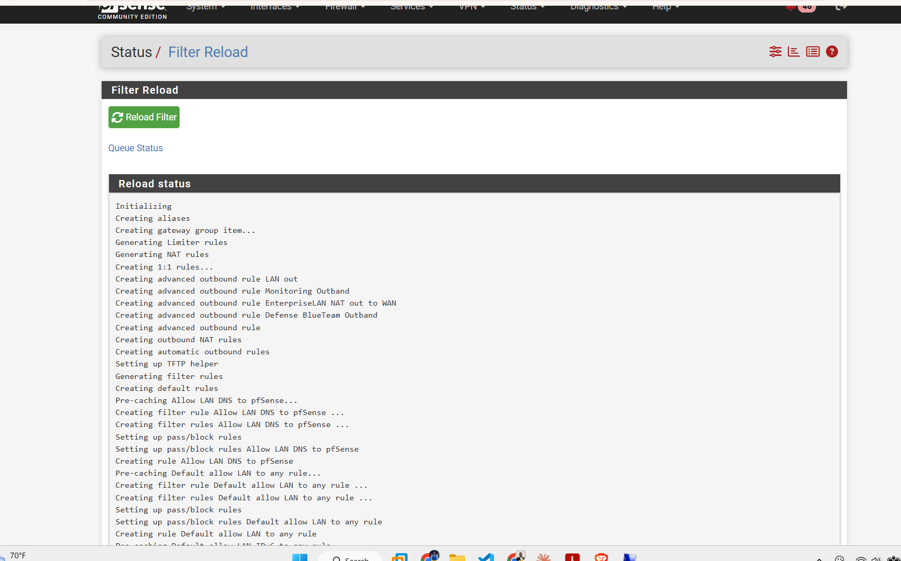

# Firewall Rulebase Governance and Rule Register

**Purpose**: The audit-facing record of the pfSense firewall rulebase. It states the principles the rulebase is built on, records every rule with its business justification and the control it satisfies, and logs every change. It is written so that an auditor (or a new engineer) can understand *why* each rule exists without asking anyone.

**Why this document exists**: A firewall configuration on its own is not auditable. Auditors ask three questions of every rule: *why does it exist, who approved it, and is it still needed?* This register answers all three in one place. The discipline mirrors **PCI-DSS Requirement 1** (documented ruleset with justification and periodic review), applied here to a NIST 800-53 / CIS Controls context.

**Status**: Living document. Updated every time a rule is added, changed, or removed.

---

## 1. Rulebase principles

| # | Principle | What it means in practice | Framework |
|---|-----------|---------------------------|-----------|
| 1 | Deny by default | Nothing passes unless a rule allows it. Every interface ends in an implicit deny. | NIST SC-7(5), CIS 4.4 |
| 2 | Least privilege | Every rule is the narrowest possible: specific source, destination, service. No `any → any`. | NIST CM-7, AC-6, CIS 4.8 |
| 3 | Documented justification | Every rule has a recorded business reason, owner, and date (this register). | NIST CM-2/CM-6, PCI-DSS 1.1 |
| 4 | Correct ordering | Rules are ordered so specific precedes broad; no shadowed or redundant rules. | NIST CM-6 |
| 5 | Logging & accountability | Denies and sensitive allows are logged to the SIEM (Wazuh). | NIST AU-2/AU-3 |
| 6 | Change control | Changes are proposed, approved, dated, reversible (disable before delete). | NIST CM-3 |
| 7 | Periodic recertification | The rulebase is reviewed on a fixed cadence; stale rules removed. | NIST CA-7, PCI-DSS 1.1.7 |
| 8 | Boundary enforcement | Rules enforce the VLAN/zone boundaries defined by segmentation. | NIST SC-7, CIS 12 |

---

## 2. Rule register

Each rule carries a stable **Rule ID** (`<TAB>-<NN>`) that does not change even if the rule's position moves. "Log" = whether the rule logs matches to the SIEM. "Status" = Built or Planned.

### 2.1 MANAGEMENT interface (VLAN 10, source = admin/control plane)

| Rule ID | Source | Destination | Service | Action | Log | Justification | Control | Status |
|---------|--------|-------------|---------|--------|-----|---------------|---------|--------|
| MGMT-01 | MANAGEMENT net | This Firewall | `PFSENSE_MGMT` (443,80,22) | Pass | Yes | Anti-lockout: guarantee admin access to pfSense from the management plane before broad rules are removed. Admin access is logged for accountability. | AC-17, CM-3, AU-2 | Built |
| MGMT-02 | MANAGEMENT net | This Firewall | TCP/UDP 53 | Pass | No | DNS resolution via the pfSense resolver for management hosts. | SC-7 | Built |
| MGMT-03 | MANAGEMENT net | This Firewall | UDP 123 | Pass | No | Time sync (NTP) from pfSense; correct time is required for logging and Kerberos. | AU-8 | Built |
| MGMT-04 | MANAGEMENT net | any | ICMP echo-request | Pass | No | Diagnostic reachability (ping) for troubleshooting. Echo-request only (least privilege); replies return via stateful inspection. | CA-7 | Built |
| MGMT-05 | MANAGEMENT net | `SRV1_DC` | `AD_TCP` | Pass | No | Domain membership (TCP) for management-plane Windows hosts joining `ad.biira.online`. | AC-4 | Built |
| MGMT-06 | MANAGEMENT net | `SRV1_DC` | `AD_UDP` | Pass | No | Domain membership (UDP). | AC-4 | Built |
| MGMT-07 | MANAGEMENT net | `SRV1_DC` | `AD_RPC_DYNAMIC` | Pass | No | RPC high ports for domain join, Group Policy, replication. | AC-4 | Built |
| MGMT-08 | MANAGEMENT net | `SRV1_DC` | `MGMT_TCP` | Pass | Yes | Administrative access (RDP, WinRM/Ansible) to the DC. Logged as privileged access. | AC-6, AC-17, AU-2 | Built |
| MGMT-09 | MANAGEMENT net | `LAB_NETS` | any | Pass | No | Administrative reach into all lab VLANs from the management plane (explicit; to be tightened per-service over time). | AC-6 | Planned |
| MGMT-10 | MANAGEMENT net | NOT `LAB_NETS` | any | Pass | No | Internet access for the management plane (destination inverted = anywhere except the lab). | SC-7 | Planned |
| *(implicit)* | any | any | any | Deny | — | Default deny. Anything not explicitly allowed is dropped. | SC-7(5) | Built-in |

### 2.2 ENTERPRISELAN interface (VLAN 50, source = the domain controller's segment)

This tab governs what VLAN-50 hosts (currently only `DC01`) may *initiate*. Inbound access to the DC is governed by the source VLANs' tabs (e.g. VLAN 10 via MGMT-05–08) and replies are stateful, so here we permit only what the DC legitimately originates and deny lateral movement into other VLANs.

| Rule ID | Source | Destination | Service | Action | Log | Justification | Control | Status |
|---------|--------|-------------|---------|--------|-----|---------------|---------|--------|
| ENT-01 | ENTERPRISELAN net | This Firewall | TCP/UDP 53 | Pass | No | DNS resolution/forwarding via pfSense. | SC-7 | Built |
| ENT-02 | ENTERPRISELAN net | This Firewall | UDP 123 | Pass | No | NTP time sync; correct time underpins Kerberos and logging. | AU-8 | Built |
| ENT-03 | ENTERPRISELAN net | any | ICMP echo-request | Pass | No | Diagnostic reachability (outbound ping). | CA-7 | Built |
| ENT-04 | ENTERPRISELAN net | NOT `LAB_NETS` | any | Pass | No | Internet access (updates, activation, CRL, public DNS). Excludes all lab VLANs. | SC-7 | Built |
| *(implicit)* | any | any | any | Deny | — | Default deny. VLAN 50 cannot initiate into other VLANs or reach pfSense admin. | SC-7(5), AC-4 | Built-in |

The `any→any` rule that previously governed this interface was deleted 2026-08-30 after validation.

Remaining tabs (BLUETEAM, REDTEAM, DEVOPS, MONITORING) are registered here as they are built. Their target layouts are in `docs/11-domain-controller-firewall.md` section 6.

---

## 3. Change control log

Every change to the rulebase is recorded here: what changed, when, who made it, whether it was tested, and how it can be rolled back.

| Date | Rule(s) | Change | By | Tested | Rollback |
|------|---------|--------|----|--------|----------|
| 2026-08-15 | Aliases | Created `SRV1_DC`, `AD_TCP`, `AD_UDP`, `AD_RPC_DYNAMIC`, `MGMT_TCP`, `LAB_NETS` | Noble Antwi | Verified in Aliases UI | Delete aliases (no rules depend yet) |
| 2026-08-15 | MGMT-01 | Added anti-lockout rule at top of MANAGEMENT | Noble Antwi | Reload pfSense UI from laptop, confirmed access | Disable rule; broad "All" rule still present |
| 2026-08-15 | MGMT-02 | Added DNS-to-pfSense rule below MGMT-01 | Noble Antwi | UI reachable after apply | Disable rule |
| 2026-08-15 | MGMT-03 | Added NTP-to-pfSense rule | Noble Antwi | UI reachable after apply | Disable rule |
| 2026-08-15 | MGMT-04 | Added ICMP rule; corrected subtype echo-reply → echo-request (least privilege, outbound ping) | Noble Antwi | Rule applied | Disable rule |
| 2026-08-15 | MGMT-05 to 08 | Added the four DC-access rules (AD_TCP, AD_UDP, AD_RPC_DYNAMIC, MGMT_TCP) to SRV1_DC; MGMT-08 logging enabled | Noble Antwi | Aliases resolve as links; applied | Disable rules; DC still reachable via broad "All" until it is removed |
| 2026-08-30 | ENT-01 to 04 | Built ENTERPRISELAN outbound rules (DNS/NTP to pfSense, ICMP, internet via `!LAB_NETS`); deleted the prior `any→any` | Noble Antwi | Isolation test flipped True→False after a manual filter reload (see 3.1 and incident below) | Re-add a temporary `any→any` on ENTERPRISELAN |
| 2026-08-30 | (incident) | **Stale filter reload** — GUI rule changes were saved but the kernel kept enforcing the old ruleset, so isolation tests kept passing. Root-caused by systematic elimination (floating rules empty, anti-lockout disabled, packet-filtering enabled, `any→any` deleted — none had effect). Resolved via **Status → Filter Reload → Reload Filter**, which loaded the current ruleset. | Noble Antwi | Both isolation tests then returned False | N/A (diagnostic) |

### 3.1 Control validation tests

Evidence that a control does what its policy claims. Each test is repeatable, and its result is recorded before and after the change that is meant to affect it.

| Date | Control | Test | From → To | Expected | Result |
|------|---------|------|-----------|----------|--------|
| 2026-08-15 | Management-plane isolation (baseline) | pfSense web UI load | Admin laptop (VLAN 10) → pfSense admin | Reachable | **True** |
| 2026-08-15 | Management-plane isolation (baseline) | `Test-NetConnection 192.168.50.1 -Port 443` | DC01 (VLAN 50) → pfSense admin `443` | Reachable now (VLAN 50 not yet tightened) | **True** (baseline) |
| 2026-08-30 | Management-plane isolation (enforced) | `Test-NetConnection 192.168.50.1 -Port 443` | DC01 (VLAN 50) → pfSense admin `443` | Blocked after ENTERPRISELAN tightened | **False** ✓ |
| 2026-08-30 | Management-plane isolation (cross-VLAN) | `Test-NetConnection 192.168.10.1 -Port 443` | DC01 (VLAN 50) → Management gateway admin `443` | Blocked | **False** ✓ |

The change from **True to False** — while `dcdiag`, DNS and internet still pass — is the proof that VLAN 50 is contained: it can use the gateway's DNS/NTP and reach the internet, but cannot reach the pfSense admin UI on any interface, nor pivot into other VLANs. (Ping still succeeds, because ENT-03 permits ICMP — showing the rule is surgical, not a blanket block.)

*Figure 13.5 — Before: both `Test-NetConnection … 443` return True. The DC could reach the pfSense admin UI on its own VLAN and cross-VLAN.*

*Figure 13.6 — After: both return False while Ping stays True. VLAN 50 is denied admin access on every interface, yet the DC's own services keep working.*

**Operational note — the stale filter reload.** The isolation test kept returning True even after the rules were correct, because pfSense had not loaded the new ruleset into the kernel: the GUI and the running filter were out of sync. Systematic elimination (floating rules, anti-lockout, packet-filtering, deleting the rule) confirmed no rule change was taking effect. It was resolved with **Status → Filter Reload → Reload Filter**. **Lesson:** after tightening rules, if behaviour does not change, verify the filter actually reloaded — a stuck reload silently enforces the old rules and can make a control look broken when it is merely not loaded.

*Figure 13.7 — Status → Filter Reload. Manually reloading compiled and loaded the current ruleset, after which the isolation control took effect.*

---

## 4. Review and recertification

- **Cadence**: the full rulebase is reviewed every **6 months** (PCI-DSS 1.1.7 discipline), or after any significant architecture change (new VLAN, new server role).
- **What a review checks**: each rule still has a valid justification; no shadowed/redundant/stale rules; least-privilege still holds; logging still appropriate; the register matches the live config.
- **Evidence**: review dates and outcomes are appended to the change control log.
- **Next review due**: 2027-02-15.

---

## 5. How to read a rule in this register (worked example: MGMT-01)

> **MGMT-01** — *Source* MANAGEMENT net, *Destination* This Firewall, *Service* `PFSENSE_MGMT` (443/80/22), *Action* Pass, *Log* Yes.

- It only matches traffic **from** the management VLAN **to** pfSense itself, and only on the admin service ports. A host on any other VLAN, or aimed at any other destination, does not match it.
- It is logged because administrative access to the firewall is privileged activity that must be attributable.
- Its justification (anti-lockout) explains *why* it must be the first rule: if a later change removes the broad "allow" rule, this one guarantees the administrator can still reach pfSense to fix any mistake.
- Its controls (AC-17 remote access, CM-3 change control, AU-2 auditable events) are the standards language an auditor maps it to.

That is the level of "why" every rule in this register carries.

---

## 6. Known hardening opportunities (consciously accepted for now)

Recording a known weakness, the reason it is accepted, and the planned fix is itself a control (NIST CA-5, Plan of Action and Milestones). It shows a risk was identified and decided on deliberately, not missed.

| ID | Observation | Risk | Current decision | Planned hardening | Trigger |
|----|-------------|------|------------------|-------------------|---------|
| H-01 | MGMT-08 (RDP/WinRM to the DC) uses source = **MANAGEMENT subnet**, not specific hosts. Any device on VLAN 10 can *reach* the DC admin ports (network-location trust). | A rogue/compromised device placed on VLAN 10 could reach admin services. Mitigated by: (a) the DC still requires valid credentials + Remote Desktop Users membership to log in; (b) VLAN 10 is physically/administratively controlled. | **Accepted** while the lab has a single controlled admin laptop. | Create an `ADMIN_HOSTS` alias (specific admin/PAW IPs) and change MGMT-08 source to it; add MFA on the DC; move admin to a PAW. | When a second machine joins VLAN 10, or the PAW is built (see `docs/12`). |

| H-02 | The **TAILSCALE** interface has broad rules: any tailnet device → pfSense admin; SSH to any destination; and `192.168.0.0/16` → any (reach every VLAN). Remote access therefore bypasses the internal VLAN segmentation. | A compromised or shared tailnet device would have full lab reach, including the RedTeam VLAN. | **Accepted** — Tailscale is WireGuard-authenticated and the tailnet holds only 4 owner-controlled devices (pfSense subnet router `noble-homelab`; admin laptop `noble-host` `100.118.195.0`; `lab-devops-svc01`; `iphone182`). It is the sole remote-admin path, so tightening it hastily risks lockout. | Scope the pfSense-admin rule to the admin device (`noble-host`); optionally exclude RedTeam (VLAN 30) from Tailscale reach; prefer Tailscale ACLs (admin console) for device-level control. Physical VLAN-10 access (MGMT-01) is the fallback. | When convenient, and **before adding any non-owner device** to the tailnet. |

This register grows as other rules or segments are found to have similar location-based trust that could later be tightened to host- or identity-based trust (the Zero Trust direction, NIST SP 800-207).
