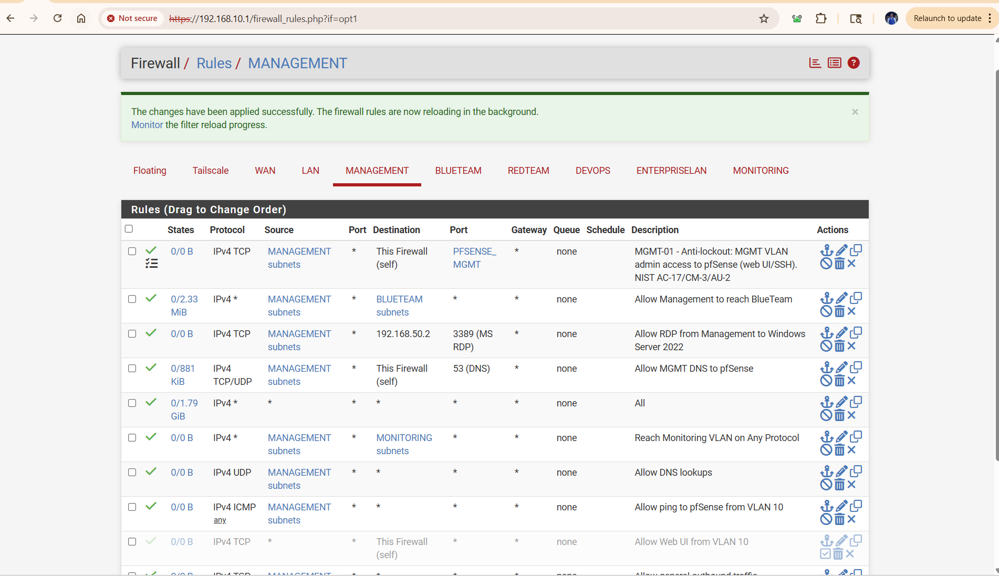
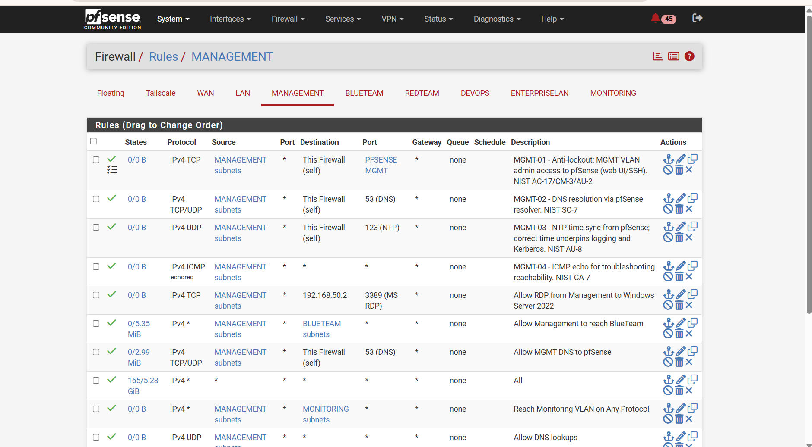
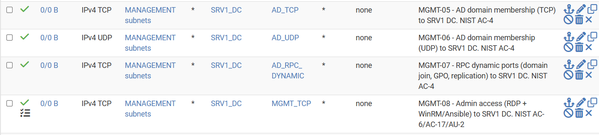
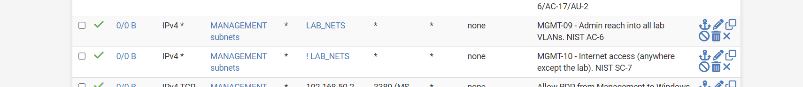
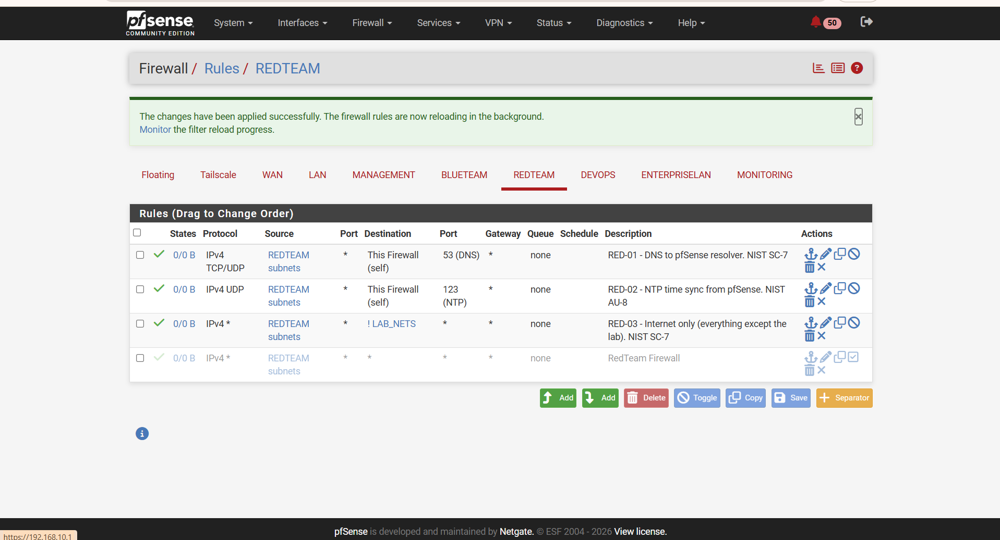
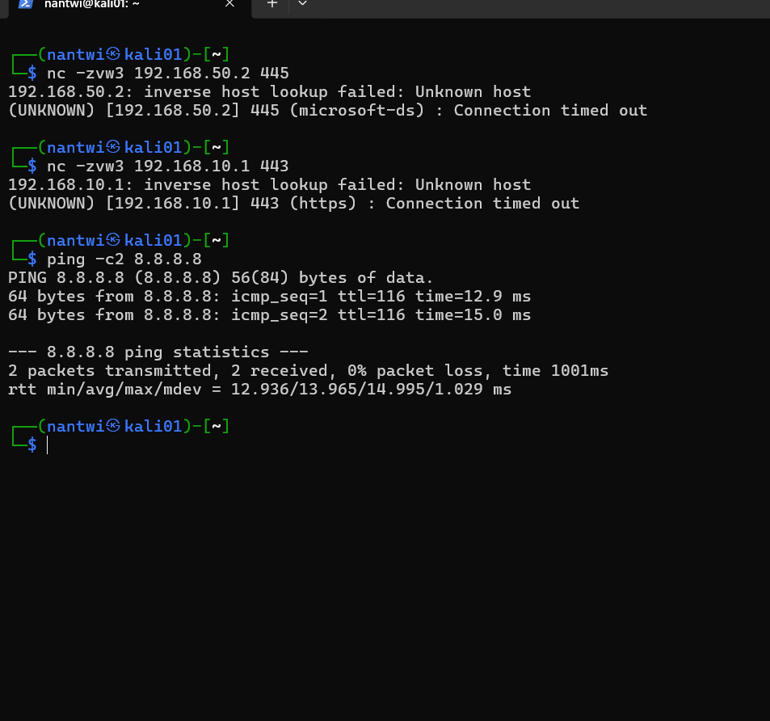
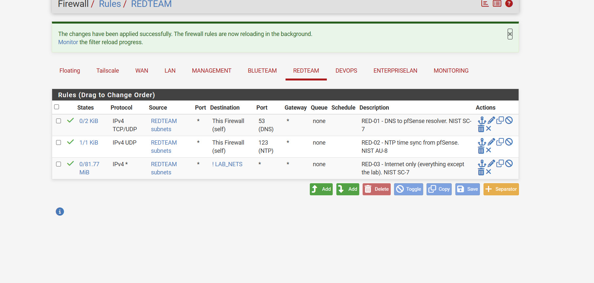
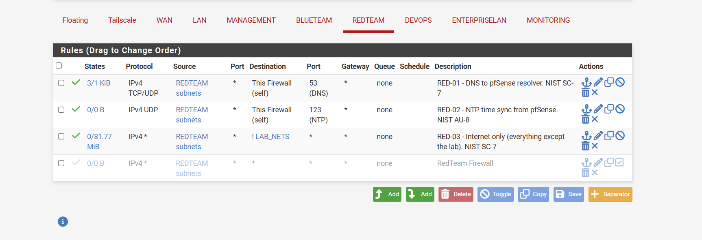

# Firewall Rulebase Governance and Rule Register

**Purpose**: The audit-facing record of the pfSense firewall rulebase. It states the principles the rulebase is built on, records every rule with its business justification and the control it satisfies, and logs every change. It is written so that an auditor (or a new engineer) can understand *why* each rule exists without asking anyone.

**Why this document exists**: A firewall configuration on its own is not auditable. Auditors ask three questions of every rule: *why does it exist, who approved it, and is it still needed?* This register answers all three in one place. The discipline mirrors **PCI-DSS Requirement 1** (documented ruleset with justification and periodic review), applied here to a NIST 800-53 / CIS Controls context.

**Status**: Living document. Updated every time a rule is added, changed, or removed.

---

## 1. Rulebase principles

| # | Principle | What it means in practice | Framework |
|---|-----------|---------------------------|-----------|
| 1 | Deny by default | Nothing passes unless a rule allows it. Every interface ends in an implicit deny. | NIST SC-7(5), CIS 4.4 |
| 2 | Least privilege | Every rule is the narrowest possible: specific source, destination, service. No `any → any`. | NIST CM-7, AC-6, CIS 4.8 |
| 3 | Documented justification | Every rule has a recorded business reason, owner, and date (this register). | NIST CM-2/CM-6, PCI-DSS 1.1 |
| 4 | Correct ordering | Rules are ordered so specific precedes broad; no shadowed or redundant rules. | NIST CM-6 |
| 5 | Logging & accountability | Denies and sensitive allows are logged to the SIEM (Wazuh). | NIST AU-2/AU-3 |
| 6 | Change control | Changes are proposed, approved, dated, reversible (disable before delete). | NIST CM-3 |
| 7 | Periodic recertification | The rulebase is reviewed on a fixed cadence; stale rules removed. | NIST CA-7, PCI-DSS 1.1.7 |
| 8 | Boundary enforcement | Rules enforce the VLAN/zone boundaries defined by segmentation. | NIST SC-7, CIS 12 |

---

## 2. Rule register

Each rule carries a stable **Rule ID** (`<TAB>-<NN>`) that does not change even if the rule's position moves. "Log" = whether the rule logs matches to the SIEM. "Status" = Built or Planned.

### 2.1 MANAGEMENT interface (VLAN 10, source = admin/control plane)

| Rule ID | Source | Destination | Service | Action | Log | Justification | Control | Status |
|---------|--------|-------------|---------|--------|-----|---------------|---------|--------|
| MGMT-01 | MANAGEMENT net | This Firewall | `PFSENSE_MGMT` (443,80,22) | Pass | Yes | Anti-lockout: guarantee admin access to pfSense from the management plane before broad rules are removed. Admin access is logged for accountability. | AC-17, CM-3, AU-2 | Built |
| MGMT-02 | MANAGEMENT net | This Firewall | TCP/UDP 53 | Pass | No | DNS resolution via the pfSense resolver for management hosts. | SC-7 | Built |
| MGMT-03 | MANAGEMENT net | This Firewall | UDP 123 | Pass | No | Time sync (NTP) from pfSense; correct time is required for logging and Kerberos. | AU-8 | Built |
| MGMT-04 | MANAGEMENT net | any | ICMP echo-request | Pass | No | Diagnostic reachability (ping) for troubleshooting. Echo-request only (least privilege); replies return via stateful inspection. | CA-7 | Built |
| MGMT-05 | MANAGEMENT net | `SRV1_DC` | `AD_TCP` | Pass | No | Domain membership (TCP) for management-plane Windows hosts joining `ad.biira.online`. | AC-4 | Built |
| MGMT-06 | MANAGEMENT net | `SRV1_DC` | `AD_UDP` | Pass | No | Domain membership (UDP). | AC-4 | Built |
| MGMT-07 | MANAGEMENT net | `SRV1_DC` | `AD_RPC_DYNAMIC` | Pass | No | RPC high ports for domain join, Group Policy, replication. | AC-4 | Built |
| MGMT-08 | MANAGEMENT net | `SRV1_DC` | `MGMT_TCP` | Pass | Yes | Administrative access (RDP, WinRM/Ansible) to the DC. Logged as privileged access. | AC-6, AC-17, AU-2 | Built |
| MGMT-09 | MANAGEMENT net | `LAB_NETS` | any | Pass | No | Administrative reach into all lab VLANs from the management plane (explicit; to be tightened per-service over time). | AC-6 | Built |
| MGMT-10 | MANAGEMENT net | NOT `LAB_NETS` | any | Pass | No | Internet access for the management plane (destination inverted = anywhere except the lab). | SC-7 | Built |
| MGMT-11 | MANAGEMENT net | `SIEM01_HOST` | `SIEM_ADMIN` (22, 443) | Pass | Yes | SSH and dashboard access to SIEM01 for administration. Logged, because administrative access to the host holding the security evidence must be attributable. | AC-17, AU-2 | Built |
| *(implicit)* | any | any | any | Deny | - | Default deny. Anything not explicitly allowed is dropped. | SC-7(5) | Built-in |

*Figure 13.1: The MANAGEMENT tab partway through the build. The broad `All` rule is still present near the bottom, which is why the specific rules above it could be added safely: nothing was cut off while the ruleset was incomplete.*

*Figure 13.2: The same tab after MGMT-01 to 04 were in place. Several legacy rules with informal descriptions are still visible; they were replaced by identified rules rather than edited, so the register and the live config could be reconciled line by line.*

*Figure 13.3: MGMT-05 to 08, the four rules that give the management plane access to the domain controller. Each uses an alias rather than a literal address or port list, so the rule reads as its intent and a change to the alias updates every rule at once.*

*Figure 13.4: MGMT-09 and MGMT-10, the pair that closes the interface. MGMT-09 permits administrative reach into the lab VLANs; MGMT-10 uses an inverted destination, "not `LAB_NETS`", to grant internet access without granting anything internal. One inverted rule replaces a fragile stack of blocks.*

### 2.2 ENTERPRISELAN interface (VLAN 50, source = the domain controller's segment)

This tab governs what VLAN-50 hosts (currently only `DC01`) may *initiate*. Inbound access to the DC is governed by the source VLANs' tabs (e.g. VLAN 10 via MGMT-05–08) and replies are stateful, so here we permit only what the DC legitimately originates and deny lateral movement into other VLANs.

| Rule ID | Source | Destination | Service | Action | Log | Justification | Control | Status |
|---------|--------|-------------|---------|--------|-----|---------------|---------|--------|
| ENT-01 | ENTERPRISELAN net | This Firewall | TCP/UDP 53 | Pass | No | DNS resolution/forwarding via pfSense. | SC-7 | Built |
| ENT-02 | ENTERPRISELAN net | This Firewall | UDP 123 | Pass | No | NTP time sync; correct time underpins Kerberos and logging. | AU-8 | Built |
| ENT-03 | ENTERPRISELAN net | any | ICMP echo-request | Pass | No | Diagnostic reachability (outbound ping). | CA-7 | Built |
| ENT-04 | ENTERPRISELAN net | NOT `LAB_NETS` | any | Pass | No | Internet access (updates, activation, CRL, public DNS). Excludes all lab VLANs. | SC-7 | Built |
| *(implicit)* | any | any | any | Deny | - | Default deny. VLAN 50 cannot initiate into other VLANs or reach pfSense admin. | SC-7(5), AC-4 | Built-in |

The `any→any` rule that previously governed this interface was deleted 2026-08-30 after validation.

### 2.3 REDTEAM interface (VLAN 30, the attack segment)

VLAN 30 is treated as **untrusted**. The baseline contains it from the entire internal lab: the attack box may function (name resolution, time, internet for tooling) but has **no standing path to the domain controller, any other VLAN, or the pfSense admin interface**. Access to a target for an actual exercise is granted as a temporary, specific rule and removed afterwards, so a compromised or careless attack box cannot roam the network.

| Rule ID | Source | Destination | Service | Action | Log | Justification | Control | Status |
|---------|--------|-------------|---------|--------|-----|---------------|---------|--------|
| RED-01 | REDTEAM net | This Firewall | TCP/UDP 53 | Pass | No | Name resolution so the attack host functions. | SC-7 | Built |
| RED-02 | REDTEAM net | This Firewall | UDP 123 | Pass | No | Time sync; accurate timestamps for exercise evidence. | AU-8 | Built |
| RED-03 | REDTEAM net | NOT `LAB_NETS` | any | Pass | No | Internet only, for tooling and updates. Excludes every lab VLAN. | SC-7 | Built |
| *(implicit)* | any | any | any | Deny | , | Default deny. No path to DC01, other VLANs, or pfSense admin. | SC-7(5), AC-4 | Built-in |

**Deliberate omission:** unlike MANAGEMENT and ENTERPRISELAN, there is **no ICMP-to-any rule** here. An outbound ping rule would let the attack box sweep the internal VLANs for live hosts, which is exactly the reconnaissance step to deny. ICMP to the internet still works through RED-03. The absence of a rule is itself the control.

*Figure 13.8: The REDTEAM tab. RED-01 to RED-03 are active; the legacy `RedTeam Firewall` any-to-any rule is disabled (greyed) pending deletion. No rule permits VLAN 30 to reach any lab subnet.*

**Validation status: VALIDATED 2026-09-04.** KALI01 (`192.168.30.2`) was built on VLAN 30 and the containment test was run from it. The attack box resolves names, syncs time and reaches the internet, and cannot reach the domain controller or the firewall's management plane. Full results in section 3.1. The legacy any-to-any rule was deleted the same day, so the interface now carries only RED-01 to RED-03.

**Why the denials are timeouts rather than refusals.** Both blocked tests returned `Connection timed out`, not `Connection refused`. pfSense drops the packet silently instead of returning a TCP reset or an ICMP unreachable. An attacker on this segment therefore learns nothing from the attempt: a dropped probe is indistinguishable from a host that does not exist, whereas a reset would confirm that something is there and a filter is in front of it. Silent drop is the pfSense default and is retained deliberately.

Remaining tabs (BLUETEAM, DEVOPS, MONITORING) are registered here as they are built. Their target layouts are in `docs/11-domain-controller-firewall.md` section 6.

---

## 3. Change control log

Every change to the rulebase is recorded here: what changed, when, who made it, whether it was tested, and how it can be rolled back.

| Date | Rule(s) | Change | By | Tested | Rollback |
|------|---------|--------|----|--------|----------|
| 2026-08-15 | Aliases | Created `SRV1_DC`, `AD_TCP`, `AD_UDP`, `AD_RPC_DYNAMIC`, `MGMT_TCP`, `LAB_NETS` | Noble Antwi | Verified in Aliases UI | Delete aliases (no rules depend yet) |
| 2026-08-15 | MGMT-01 | Added anti-lockout rule at top of MANAGEMENT | Noble Antwi | Reload pfSense UI from laptop, confirmed access | Disable rule; broad "All" rule still present |
| 2026-08-15 | MGMT-02 | Added DNS-to-pfSense rule below MGMT-01 | Noble Antwi | UI reachable after apply | Disable rule |
| 2026-08-15 | MGMT-03 | Added NTP-to-pfSense rule | Noble Antwi | UI reachable after apply | Disable rule |
| 2026-08-15 | MGMT-04 | Added ICMP rule; corrected subtype echo-reply → echo-request (least privilege, outbound ping) | Noble Antwi | Rule applied | Disable rule |
| 2026-08-15 | MGMT-05 to 08 | Added the four DC-access rules (AD_TCP, AD_UDP, AD_RPC_DYNAMIC, MGMT_TCP) to SRV1_DC; MGMT-08 logging enabled | Noble Antwi | Aliases resolve as links; applied | Disable rules; DC still reachable via broad "All" until it is removed |
| 2026-08-30 | ENT-01 to 04 | Built ENTERPRISELAN outbound rules (DNS/NTP to pfSense, ICMP, internet via `!LAB_NETS`); deleted the prior `any→any` | Noble Antwi | Isolation test flipped True→False after a manual filter reload (see 3.1 and incident below) | Re-add a temporary `any→any` on ENTERPRISELAN |
| 2026-09-03 | RED-01 to 03 | Built REDTEAM baseline (DNS/NTP to pfSense, internet via `!LAB_NETS`); no ICMP-to-any by design; legacy any-to-any disabled pending deletion | Noble Antwi | Not yet: no host on VLAN 30 (Kali not built). Test deferred, see 2.3 | Re-enable the legacy any-to-any rule |
| 2026-09-04 | RED-01 to 03 | Validated the REDTEAM baseline against a live host (KALI01, `192.168.30.2`). No rule changes required; the baseline behaved as designed on first test | Noble Antwi | Yes, three tests, see 3.1 | N/A (no change made) |
| 2026-09-04 | (legacy) | Deleted the disabled `RedTeam Firewall` any-to-any rule now that containment is proven. A disabled permit-all left in place is ambiguous to a reviewer | Noble Antwi | Post-deletion tests unchanged | Re-create an `any→any` pass on REDTEAM |
| 2026-09-04 | (service) | Bound the **DNS Resolver** to the REDTEAM interface (Services → DNS Resolver → Network Interfaces). RED-01 was passing traffic, but unbound was not listening on that interface, so queries timed out | Noble Antwi | `nslookup kali.org 192.168.30.1` returns an answer | Deselect REDTEAM in the resolver's interface list |
| 2026-09-04 | (service) | Bound the **NTP server** explicitly to the internal interfaces and **excluded WAN**. It had been running on the wildcard, which also exposed it on the WAN address | Noble Antwi | `nmap -sU -p123 --script ntp-info 192.168.30.1` returns stratum 2; KALI01 clock synchronised | Clear the interface selection to return to the wildcard |
| 2026-08-30 | (incident) | **Stale filter reload**, GUI rule changes were saved but the kernel kept enforcing the old ruleset, so isolation tests kept passing. Root-caused by systematic elimination (floating rules empty, anti-lockout disabled, packet-filtering enabled, `any→any` deleted, none had effect). Resolved via **Status → Filter Reload → Reload Filter**, which loaded the current ruleset. | Noble Antwi | Both isolation tests then returned False | N/A (diagnostic) |

### 3.1 Control validation tests

Evidence that a control does what its policy claims. Each test is repeatable, and its result is recorded before and after the change that is meant to affect it.

| Date | Control | Test | From → To | Expected | Result |
|------|---------|------|-----------|----------|--------|
| 2026-08-15 | Management-plane isolation (baseline) | pfSense web UI load | Admin laptop (VLAN 10) → pfSense admin | Reachable | **True** |
| 2026-08-15 | Management-plane isolation (baseline) | `Test-NetConnection 192.168.50.1 -Port 443` | DC01 (VLAN 50) → pfSense admin `443` | Reachable now (VLAN 50 not yet tightened) | **True** (baseline) |
| 2026-08-30 | Management-plane isolation (enforced) | `Test-NetConnection 192.168.50.1 -Port 443` | DC01 (VLAN 50) → pfSense admin `443` | Blocked after ENTERPRISELAN tightened | **False** ✓ |
| 2026-08-30 | Management-plane isolation (cross-VLAN) | `Test-NetConnection 192.168.10.1 -Port 443` | DC01 (VLAN 50) → Management gateway admin `443` | Blocked | **False** ✓ |
| 2026-09-04 | RedTeam containment (lateral movement) | `nc -zvw3 192.168.50.2 445` | KALI01 (VLAN 30) → DC01 SMB `445` | Blocked | **Connection timed out** ✓ |
| 2026-09-04 | RedTeam containment (management plane) | `nc -zvw3 192.168.10.1 443` | KALI01 (VLAN 30) → Management gateway admin `443` | Blocked | **Connection timed out** ✓ |
| 2026-09-04 | RedTeam usability (RED-03) | `ping -c2 8.8.8.8` | KALI01 (VLAN 30) → internet | Reachable | **0% packet loss** ✓ |
| 2026-09-04 | RedTeam usability (RED-01) | `nslookup kali.org 192.168.30.1` | KALI01 (VLAN 30) → pfSense resolver | Resolves | **Answer returned** ✓ |
| 2026-09-04 | RedTeam usability (RED-02) | `timedatectl` after pointing at `192.168.30.1` | KALI01 (VLAN 30) → pfSense NTP | Synchronised | **System clock synchronized: yes** ✓ |

The change from **True to False**, while `dcdiag`, DNS and internet still pass, is the proof that VLAN 50 is contained: it can use the gateway's DNS/NTP and reach the internet, but cannot reach the pfSense admin UI on any interface, nor pivot into other VLANs. (Ping still succeeds, because ENT-03 permits ICMP, showing the rule is surgical, not a blanket block.)

*Figure 13.5: Before: both `Test-NetConnection … 443` return True. The DC could reach the pfSense admin UI on its own VLAN and cross-VLAN.*

*Figure 13.6: After: both return False while Ping stays True. VLAN 50 is denied admin access on every interface, yet the DC's own services keep working.*

**Operational note, the stale filter reload.** The isolation test kept returning True even after the rules were correct, because pfSense had not loaded the new ruleset into the kernel: the GUI and the running filter were out of sync. Systematic elimination (floating rules, anti-lockout, packet-filtering, deleting the rule) confirmed no rule change was taking effect. It was resolved with **Status → Filter Reload → Reload Filter**. **Lesson:** after tightening rules, if behaviour does not change, verify the filter actually reloaded, a stuck reload silently enforces the old rules and can make a control look broken when it is merely not loaded.

*Figure 13.7: Status → Filter Reload. Manually reloading compiled and loaded the current ruleset, after which the isolation control took effect.*

*Figure 13.9: The containment test run from KALI01 on VLAN 30. SMB to DC01 and HTTPS to the management gateway both time out; the internet remains reachable at 0% packet loss. Full build context in `docs/15`.*

*Figure 13.10: The REDTEAM interface after the legacy any-to-any rule was deleted. Three rules, each carrying its identifier, justification and control mapping. Compare Figure 13.8, where the disabled permit-all was still present.*

**RedTeam containment, validated against a live attack host.** The five tests dated 2026-09-04 were run from KALI01 once it was built on VLAN 30. They are deliberately paired: two prove the segment is contained, three prove it is still usable. A containment control that also breaks the host is not a control anyone will keep, so the evidence has to show both halves. The attack box can resolve names, hold accurate time and reach the internet for tooling, while SMB to the domain controller and HTTPS to the firewall's management address both fail.

**On the test path.** These results measure the rulebase itself. KALI01 runs no VPN client, so its only route is `default via 192.168.30.1`, and every probe was evaluated on the REDTEAM interface. This matters because the administrator's own workstation reaches KALI01 over the Tailscale overlay, a path that does not traverse the per-interface rules at all (see section 6, H-02). The distinction is worth stating plainly: an overlay that terminates inside the perimeter can make a segment look reachable in ways the documented rulebase never authorised. Tests of a segmentation control must originate from a host inside that segment, not from an administrator's machine sitting on an overlay.

**A second instance of the config-versus-running-state gap.** DNS from VLAN 30 timed out even though RED-01 was demonstrably passing traffic: the rule showed live state entries in the pfSense **States** column. That single observation located the fault. If the firewall had been dropping the queries there would have been no states at all, so the packets were being delivered and nothing was answering. The DNS Resolver was simply not bound to the REDTEAM interface, which had been created after the resolver was first configured. This is the same failure family as the stale filter reload above: the saved configuration was correct, but the running system was not doing what the configuration described. **Lesson: when validating a control, read the state counters before changing any rules. They separate "the firewall blocked it" from "the firewall passed it and the service was not there", which are opposite problems with opposite fixes.**

*Figure 13.11: `RED-01` showing **3/1 KiB** in the States column while DNS queries from VLAN 30 were timing out. A blocked packet never creates a state entry, so these states prove the firewall passed the traffic and the fault lay beyond it, in a service that was not listening. `RED-02` at `0/0 B` is the contrast. The greyed row is the legacy any-to-any rule, since deleted.*

---

## 4. Review and recertification

- **Cadence**: the full rulebase is reviewed every **6 months** (PCI-DSS 1.1.7 discipline), or after any significant architecture change (new VLAN, new server role).
- **What a review checks**: each rule still has a valid justification; no shadowed/redundant/stale rules; least-privilege still holds; logging still appropriate; the register matches the live config.
- **Evidence**: review dates and outcomes are appended to the change control log.
- **Next review due**: 2027-02-15.

---

## 5. How to read a rule in this register (worked example: MGMT-01)

> **MGMT-01**, *Source* MANAGEMENT net, *Destination* This Firewall, *Service* `PFSENSE_MGMT` (443/80/22), *Action* Pass, *Log* Yes.

- It only matches traffic **from** the management VLAN **to** pfSense itself, and only on the admin service ports. A host on any other VLAN, or aimed at any other destination, does not match it.
- It is logged because administrative access to the firewall is privileged activity that must be attributable.
- Its justification (anti-lockout) explains *why* it must be the first rule: if a later change removes the broad "allow" rule, this one guarantees the administrator can still reach pfSense to fix any mistake.
- Its controls (AC-17 remote access, CM-3 change control, AU-2 auditable events) are the standards language an auditor maps it to.

That is the level of "why" every rule in this register carries.

---

## 6. Known hardening opportunities (consciously accepted for now)

Recording a known weakness, the reason it is accepted, and the planned fix is itself a control (NIST CA-5, Plan of Action and Milestones). It shows a risk was identified and decided on deliberately, not missed.

| ID | Observation | Risk | Current decision | Planned hardening | Trigger |
|----|-------------|------|------------------|-------------------|---------|
| H-01 | MGMT-08 (RDP/WinRM to the DC) uses source = **MANAGEMENT subnet**, not specific hosts. Any device on VLAN 10 can *reach* the DC admin ports (network-location trust). | A rogue/compromised device placed on VLAN 10 could reach admin services. Mitigated by: (a) the DC still requires valid credentials + Remote Desktop Users membership to log in; (b) VLAN 10 is physically/administratively controlled. | **Accepted** while the lab has a single controlled admin laptop. | Create an `ADMIN_HOSTS` alias (specific admin/PAW IPs) and change MGMT-08 source to it; add MFA on the DC; move admin to a PAW. | When a second machine joins VLAN 10, or the PAW is built (see `docs/12`). |
| H-02 | The **TAILSCALE** interface has broad rules: any tailnet device → pfSense admin; SSH to any destination; and `192.168.0.0/16` → any (reach every VLAN). Remote access therefore bypasses the internal VLAN segmentation. | A compromised or shared tailnet device would have full lab reach, including the RedTeam VLAN. | **Accepted**, Tailscale is WireGuard-authenticated and the tailnet holds only 4 owner-controlled devices (pfSense subnet router `noble-homelab`; admin laptop `noble-host` `100.118.195.0`; `lab-devops-svc01`; `iphone182`). It is the sole remote-admin path, so tightening it hastily risks lockout. | Scope the pfSense-admin rule to the admin device (`noble-host`); optionally exclude RedTeam (VLAN 30) from Tailscale reach; prefer Tailscale ACLs (admin console) for device-level control. Physical VLAN-10 access (MGMT-01) is the fallback. | When convenient, and **before adding any non-owner device** to the tailnet. |

**H-02 was demonstrated, not merely theorised, on 2026-09-04.** While the containment tests were proving that VLAN 30 cannot reach VLAN 50 or the management plane, an SSH session from the administrator's laptop to KALI01 on `192.168.30.2` was open and working. Both facts are true at once, and they are not contradictory: the SSH traffic arrived through the Tailscale subnet router rather than across a VLAN boundary, so pfSense never evaluated it against the REDTEAM interface rules. The documented rulebase governs the segment; it does not govern the overlay that terminates inside it.

This is the single most useful finding of the exercise. A rulebase can be individually correct on every interface and still not describe the reachability of the environment, because an authenticated overlay reaches past it. The honest statement of the control is therefore narrower than it first appears: *VLAN 30 is contained from the lab's routed paths, and remote-administration reachability is governed separately by Tailscale device membership.* Closing the gap means either scoping the Tailscale rules per the planned hardening above, or moving that control into Tailscale ACLs where device identity, rather than network location, is the deciding factor. The second is the Zero Trust answer (NIST SP 800-207) and is the intended direction.

This register grows as other rules or segments are found to have similar location-based trust that could later be tightened to host- or identity-based trust (the Zero Trust direction, NIST SP 800-207).
