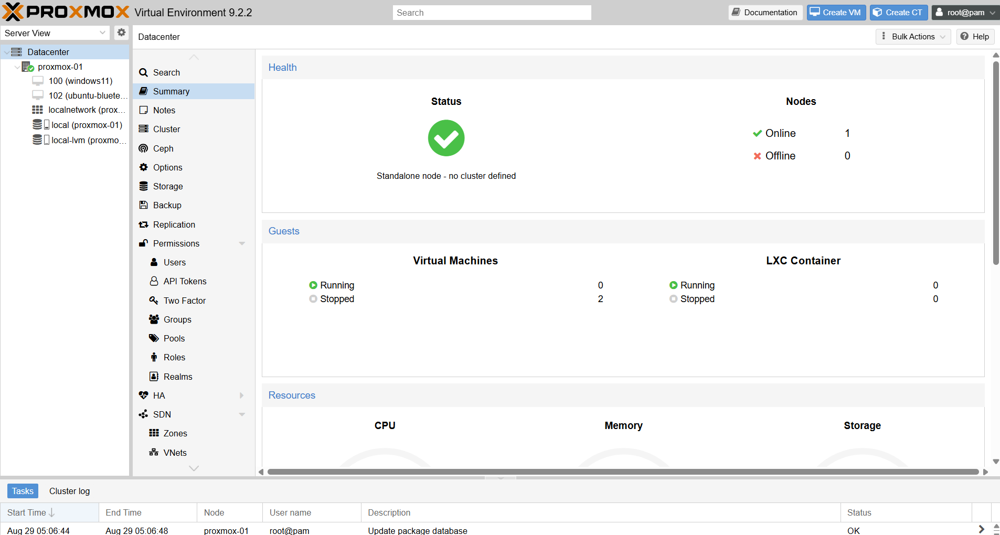
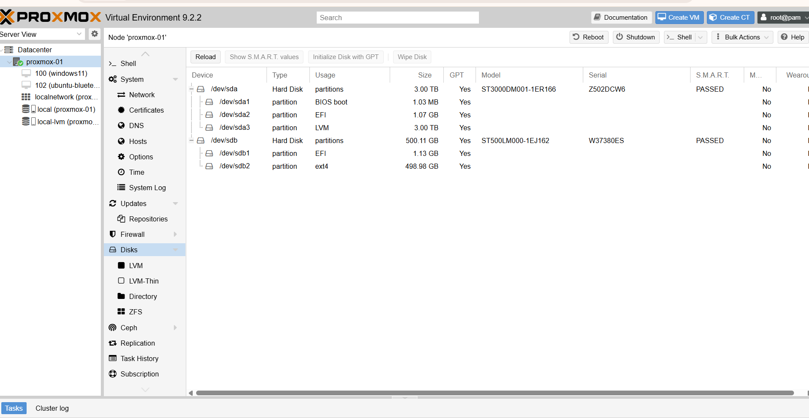
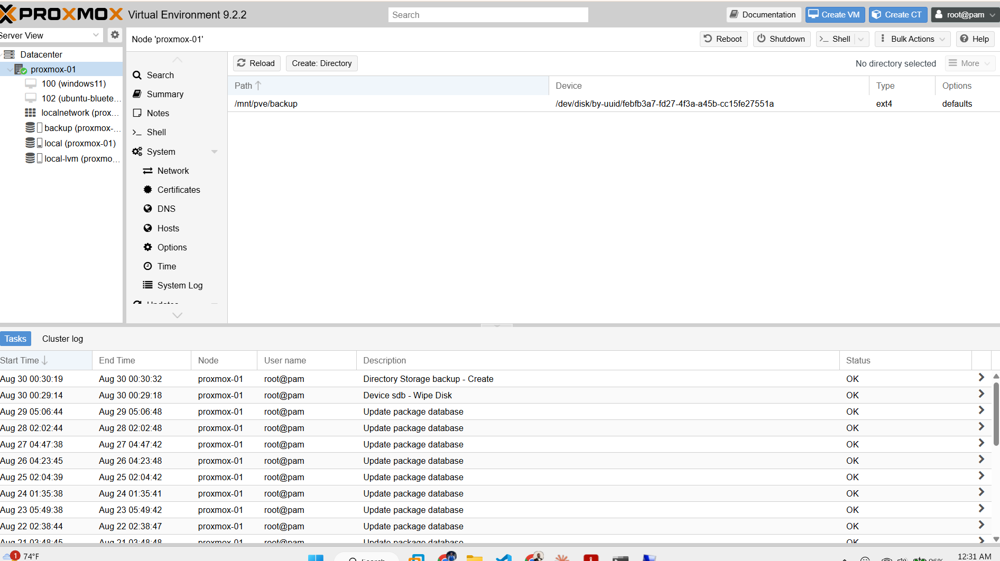
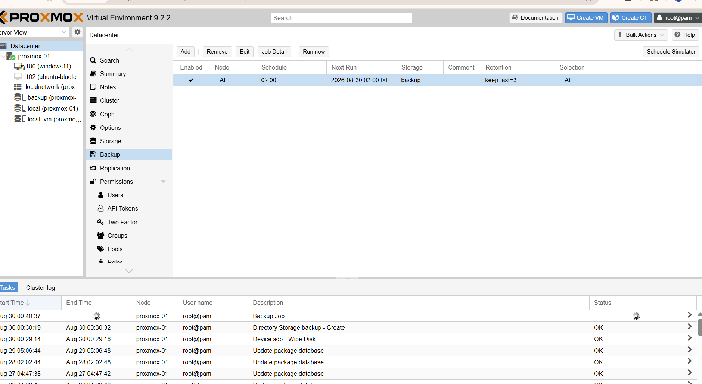
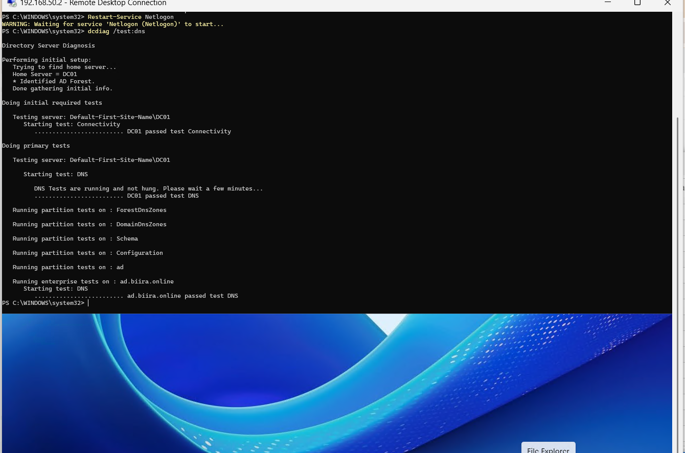

# Proxmox: Storage, Backup, Capacity, and Naming

**Purpose**: Documents the virtualisation host's storage layout, the backup and recovery strategy, the capacity plan for the planned estate, and the lab-wide machine naming convention. Written so that a reviewer can see not just *what* was configured but *why*, and which controls it satisfies.

**Host**: `proxmox-01` (`192.168.10.6`), Proxmox VE 9.2.2, standalone node.

**Status**: Backup configured and verified 2026-08-30.

---

## 1. Host overview

| Resource | Value |
|----------|-------|
| CPU | 8 cores/threads |
| RAM | ~32 GiB |
| Storage | 2 physical disks, 2.67 TiB total |
| Cluster | Standalone (no cluster) |

RAM is the binding constraint for how many guests run at once; CPU and storage are abundant.

*Figure 14.1: Datacenter summary: a healthy standalone node (`proxmox-01`), no cluster, with the current guests. This is the top-level health and inventory view.*

---

## 2. Storage layout

| Disk | Size | Role |
|------|------|------|
| `/dev/sda` | 3 TB | Proxmox OS + primary guest storage (`local`, `local-lvm`) |
| `/dev/sdb` | 500 GB | **Backup target** (`backup`, ext4 Directory storage) |

`sda` holds the two default install storages: `local` (ISO images, templates, backups directory) and `local-lvm` (VM/CT disk images). `sdb` was previously an OS disk (leftover EFI + ext4 partitions); it was wiped and repurposed as a dedicated backup store.

*Figure 14.2: The two physical disks: `/dev/sda` (3 TB, Proxmox OS + LVM guest storage) and `/dev/sdb` (500 GB), before `sdb` was repurposed. Both report SMART "PASSED".*

### Why backups go on a separate disk
Keeping backups on a *different physical disk* from the running VMs means a failure or corruption of the primary disk does not take the backups with it. This is a basic tenet of recoverable design: the backup must survive the thing it is protecting against.

---

## 3. Backup and recovery strategy

### The principle
A running VM is not a backup of itself. Snapshots help with quick rollback, but a real backup is an independent, retained copy that survives disk loss, a bad change, or a corrupted guest. Two recent physical-machine failures in this lab (a server NIC, and the Wazuh host losing power) made the point concretely: **anything not backed up is one hardware fault away from a rebuild.**

### What was configured (2026-08-30)
1. **Wiped `/dev/sdb`** and created a **Directory storage** named `backup` (ext4, mounted at `/mnt/pve/backup`), content type *VZDump backup file*.

*Figure 14.3: The `backup` Directory storage mounted at `/mnt/pve/backup` on the ext4 `sdb` disk. This is the dedicated backup target, separate from the disk that holds the running guests.*

2. **Scheduled backup job**:

| Setting | Value | Reason |
|---------|-------|--------|
| Schedule | Daily 02:00 | Off-hours, low activity |
| Selection | **All guests** | Auto-includes future VMs/CTs; no rule to forget |
| Mode | Snapshot | Backs up running guests with minimal disruption |
| Compression | ZSTD | Fast with good ratio |
| Retention | Keep last 3 | Recent restore points without filling the disk |
| Target | `backup` (separate disk) | Survives primary-disk loss |

3. **Verified** with an on-demand run: task completed `TASK OK`, backup files present under `backup` → Backups for both existing guests.

*Figure 14.4: The backup job: enabled, all nodes, daily 02:00, target `backup`, retention keep-last=3, selection All. The running task at the bottom is the verification run.*

### What it protects, and what it does not
- **Protects**: all Proxmox VMs and containers (current and future). A lost or broken guest becomes a **restore**, not a rebuild.
- **Does not protect**: physical machines (e.g., the pfSense box, and a future physical DC02). Those need their own backup approach (for a Windows DC, the AD database is also protected by having a *second* DC, plus Windows Server Backup / system state).

### Recovery
To restore a guest: Proxmox UI → `backup` storage → Backups → select the backup → Restore. Test restores periodically; a backup never verified by a restore is only a hope.

### Future upgrade
**Proxmox Backup Server (PBS)** adds deduplication and incremental backups (far less space, faster). Not needed for a single node now; a Directory target is sufficient. Revisit if backup volume grows.

---

## 4. Capacity plan

RAM is the limit (~32 GiB). The rule that keeps the lab within budget:

> **Linux services run as LXC containers; Windows runs as full VMs.**

LXC containers share the host kernel, a fraction of the RAM and disk of a VM. Windows cannot be a container, so it uses full VMs.

| Guest | Type | Planned RAM |
|-------|------|-------------|
| DC01 / DC02 (if virtual) | VM | 2–4 GB |
| CA01 | VM | 2–4 GB |
| WKS01 / WKS02 | VM | 4 GB each |
| ANS01 (Ansible) | **LXC** | ~1 GB |
| SIEM01 (Wazuh) | **LXC/VM** | ~4 GB |
| MON01 (Grafana/Prometheus) | **LXC** | ~2 GB |
| Kali | VM | ~3 GB |

All-running total is roughly 28 GB, within 32 GB, and guests can be powered on **on demand** rather than all at once. Verdict: the host comfortably carries the planned estate.

---

## 5. Machine naming convention

A consistent, role-based scheme: **`<ROLE><NN>`**, uppercase, no separators. The name states the role, so any machine is identifiable from its name alone without consulting an inventory. This is the basis of the asset register that NIST CM-8 (System Component Inventory) expects.

Adopted 2026-08-30 for servers. **Extended 2026-09-04** to cover the categories the original scheme left undefined: network devices, the hypervisor, and utility hosts. Those gaps were the actual source of the inconsistency, since machines with no defined category kept whatever name they were installed with.

### 5.1 The scheme

| Category | Role prefix | Examples |
|----------|-------------|----------|
| Domain controllers | `DC` | `DC01`, `DC02` |
| Certificate Authority | `CA` | `CA01` |
| File / SQL servers | `FS`, `SQL` | `FS01`, `SQL01` |
| Workstations | `WKS` | `WKS01`, `WKS02` |
| SIEM / log collection | `SIEM` | `SIEM01` |
| Metrics and dashboards | `MON` | `MON01` |
| Secrets management | `VAULT` | `VAULT01` |
| Automation controller | `ANS` | `ANS01` |
| Attack / offensive | `KALI` | `KALI01` |
| Privileged access workstation | `PAW` | `PAW01` |
| Firewall / router | `FW` | `FW01` |
| Switches | `SW` | `SW01`, `SW02` |
| Hypervisor host | `PVE` | `PVE01` |
| Utility / training host | `LAB` | `LAB01` |

Two conventions worth stating explicitly, because they are the ones that get broken:

- **The number is per role, not global.** The second domain controller is `DC02`, not `DC10`, regardless of how many other machines exist.
- **A machine is named for what it does, not what it runs.** A Wazuh server is `SIEM01` whether it runs Rocky Linux or Ubuntu. Naming after the operating system or the hardware is what produced names like `nbl-core-ub01`, which tell a reader nothing about the machine's purpose.

### 5.2 Inventory and rename status

| Current name | Target | Role | Status |
|--------------|--------|------|--------|
| `DC01` | `DC01` | Domain controller | Correct |
| `kali01` | `KALI01` | Attack box | Correct |
| `nbl-core-ub01` | `SIEM01` | Wazuh (after repurposing, see 5.3) | Pending rebuild |
| `lab-devops-svc01` | `VAULT01` | HashiCorp Vault | Pending |
| `proxmox-01` | `PVE01` | Hypervisor | Pending |
| pfSense (default) | `FW01` | Firewall | Pending |
| TL-SG108E | `SW01` | Managed switch | Pending |
| Secondary switch | `SW02` | Switch | Pending |
| TCM Ubuntu `192.168.10.4` | `LAB01` | Training host | Pending |
| VM 100 `windows11` | `WKS01` | Workstation | Pending |
| VM 102 `ubuntu-blueteam` | `MON01` | Metrics and dashboards | Pending rebuild |

### 5.3 Role swap: monitoring hardware becomes the SIEM

The Wazuh host failed on 2026-08-29 and the monitoring host is physical while the estate's spare capacity is virtual. Rather than rebuild like for like, the two roles swap:

| | Before | After |
|---|--------|-------|
| Physical `nbl-core-ub01` | Grafana + Prometheus, VLAN 60 | **`SIEM01`**, Wazuh, VLAN 20 |
| Proxmox guest | none | **`MON01`**, Grafana + Prometheus, VLAN 60 |

The reasoning is resource shape rather than preference. Wazuh's all-in-one deployment includes the Indexer, an OpenSearch instance whose memory floor is around 8 GB, and it holds data that must survive. Grafana and Prometheus run comfortably in about 2 GB and their state is a configuration file and a metrics database that can be restored from backup. Putting the memory-hungry, data-bearing service on dedicated hardware and the light, reproducible one on the hypervisor uses both better. The operating system stays Ubuntu 24.04 on both, which also means Wazuh moves from Rocky Linux 9.6 to Ubuntu.

### 5.4 Rename history

**`SRV1` to `DC01`, 2026-08-30.** Change-controlled: `dcdiag /test:dns` was clean before and after, the IP `192.168.50.2` and the domain `ad.biira.online` were unaffected, and Netlogon was restarted to re-register the DC's SRV records under the new name. The firewall alias retains its original name `SRV1_DC`, because it resolves an IP rather than a hostname and renaming it would invalidate the change-control history and the screenshots that reference it.

**A note on the hypervisor rename.** `proxmox-01` to `PVE01` is the only rename here carrying real risk. Every guest configuration lives under `/etc/pve/nodes/<nodename>/qemu-server/`, so the rename involves moving a directory inside the cluster filesystem. Performed incorrectly, guests vanish from the interface. It is recoverable, but it should be done last, after a verified backup, and never at the same time as other changes.

*Figure 14.5: `dcdiag /test:dns` on `DC01` after the rename and Netlogon restart: Connectivity, DNS, all partition tests, and the enterprise `ad.biira.online` DNS test all pass. Evidence the rename left Active Directory healthy.*

---

## 6. Standards alignment

| What we did | Control |
|-------------|---------|
| Independent, retained, scheduled backups | **NIST SP 800-53 CP-9** (System Backup) |
| Documented restore procedure; periodic restore testing | **NIST CP-10** (System Recovery) / **CP-4** (Contingency testing) |
| Backups on separate disk from primary | Recoverability / defence against single-disk loss |
| Role-based naming for identifiable assets | **NIST CM-8** (System Component Inventory) |
| This document itself | **NIST CM-2/CM-6** (Baseline / documented configuration) |

These are lab-appropriate implementations, not a claim of formal compliance.
