# KALI01: Building and Containing the Attack Host

**Purpose**: Documents the build of the lab's offensive host, the network configuration that places it on the isolated RedTeam segment, and the evidence that the segment's containment controls work against a live host. Written so a reviewer can see how an intentionally hostile machine is introduced into an environment without weakening it.

**Host**: `KALI01`, Proxmox VM `103` on node `proxmox-01`, Kali Linux 2026.2 (Xfce), `192.168.30.2/24` on VLAN 30 (RedTeam).

**Status**: Built and validated 2026-09-04. Containment proven, see `docs/13-firewall-rulebase-governance.md` section 3.1.

---

## 1. Why the lab needs an attack host, and why it is treated as untrusted

A security lab that only contains defensive tooling can demonstrate that controls exist. It cannot demonstrate that they work. `KALI01` exists so that every control in this environment is tested by something behaving the way a real adversary behaves, rather than by inspection of a configuration file.

That purpose creates its own risk. The machine is deliberately loaded with credential-attack, exploitation and reconnaissance tooling, and it is the machine most likely to be running unfamiliar code from the internet. It is therefore the least trusted host in the lab, and it is placed on the segment with the most restrictive rulebase. The design principle is straightforward: the attack box must be **usable** enough to run exercises, and **contained** enough that it cannot reach anything except on purpose.

This is the same posture a real organisation applies to a penetration testing jump host, a malware detonation environment, or a security research subnet. Access to a target is granted for a specific exercise and removed afterwards, rather than existing as a standing permission.

| Design choice | Reason | Control |
|---------------|--------|---------|
| Own VLAN (30), no standing route into the lab | Compromise of the attack box does not become compromise of the lab | NIST SC-7, AC-4 |
| Virtual, not physical | Snapshot before an exercise, roll back after; no residue between engagements | NIST CP-10 |
| No ICMP-to-any rule | Denies internal host discovery from the segment | NIST SC-7(5) |
| Internet permitted | Tooling, updates and payload retrieval must work or the host is useless | Usability of the control |

---

## 2. Virtual machine specification

| Setting | Value | Reason |
|---------|-------|--------|
| VM ID / Name | `103` / `KALI01` | Role-based naming, `docs/14` section 5 |
| Guest OS | Kali Linux 2026.2, Xfce desktop | Xfce is light enough for a VM; GNOME and KDE buy nothing here |
| Disk | `local-lvm:vm-103-disk-0`, 60 GB, `discard=on`, `iothread=1` | Discard returns freed blocks to the thin pool |
| Network | `virtio`, bridge `vmbr0`, **VLAN tag 30** | Places the guest directly on the RedTeam segment |
| Boot order | `scsi0` first | Set after installation; see section 3 |

The VLAN tag on the virtual NIC is what puts this machine on the RedTeam segment. Proxmox tags the frame, the VLAN-aware bridge passes it to the trunk, and pfSense receives it on the REDTEAM interface. No configuration inside the guest can move it to another VLAN, which is precisely why the tag belongs at the hypervisor rather than in the guest.

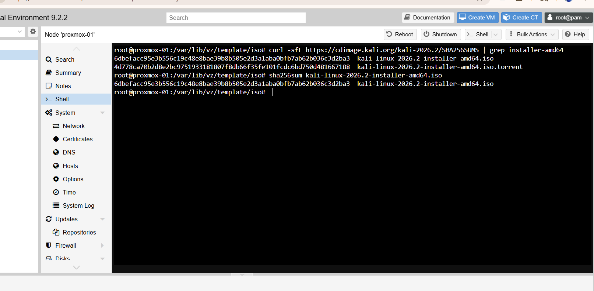
*Figure 15.1: SHA256 verification of the downloaded Kali ISO against the published checksum before installation. Verifying the integrity of software before it is introduced to the environment is a control in its own right (NIST SI-7), and it matters most for the machine that will run offensive tooling.*

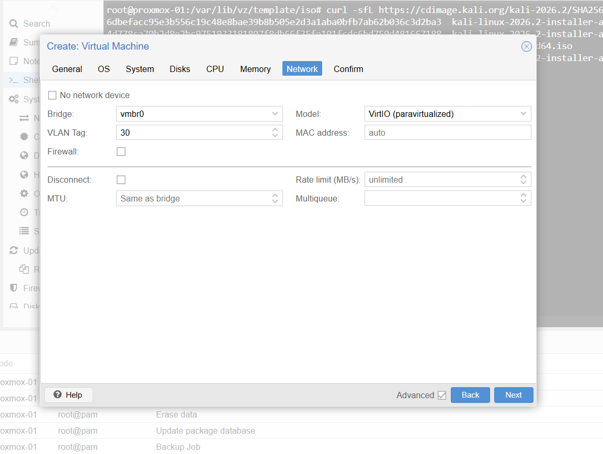
*Figure 15.2: The guest's network device: `virtio` on bridge `vmbr0` with **VLAN Tag 30**. The tag is applied by the hypervisor, so the segment assignment cannot be changed from inside the guest.*

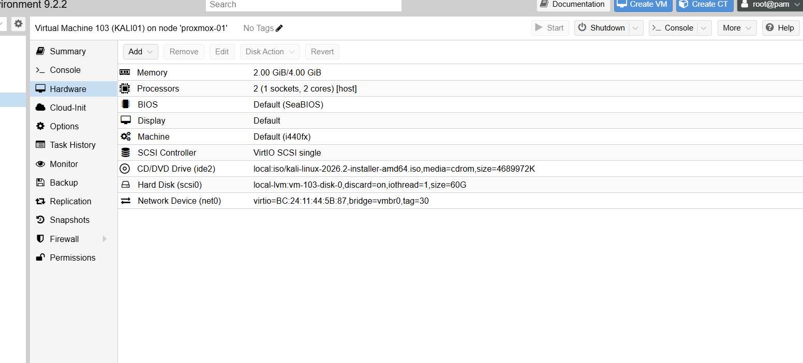
*Figure 15.3: The full hardware profile for VM 103, including the 60 GB disk on `local-lvm` with discard enabled.*

---

## 3. Installation, and a failure worth recording

The first installation completed successfully and then would not boot. The VM stopped at:

```
SeaBIOS (version rel-1.17.0-0-gb52ca86e094d-prebuilt.qemu.org)
Booting from Hard Disk...
```

and went no further.

**Cause.** The Debian installer asks two separate questions about the boot loader. The first, "Install the GRUB boot loader to your primary drive?", defaults to **Yes**. The second asks *which device* to install it to, and **has no default**. Pressing Enter at the second prompt selects nothing, the installer moves on, and GRUB is never written to the disk's master boot record. The install is otherwise complete and correct, so nothing appears to have gone wrong until the machine is asked to boot.

**Fix.** Answer the device prompt explicitly with **`/dev/sda`**, the disk, not `/dev/sda1`, the partition. The boot record lives at the start of the disk. GRUB written into a partition is somewhere the BIOS will never look.

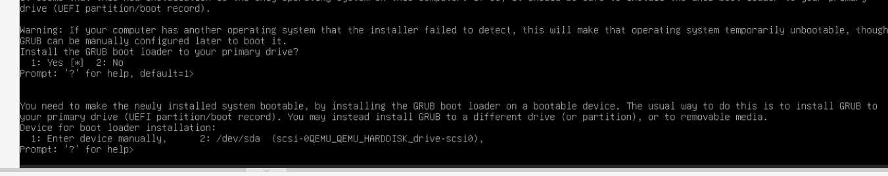
*Figure 15.4: The two prompts, on one screen. The first has `default=1` (Yes). The second, `Device for boot loader installation`, shows only `Prompt: '?' for help>` with **no default value**. Pressing Enter here selects nothing and the installer continues, producing an installation that reports success and cannot boot.*

**Recovery options.** Either reinstall (chosen here, since nothing of value existed yet) or boot the installer ISO, choose **Advanced options → Rescue mode**, select `/dev/sda1` as the root filesystem, and run **Reinstall GRUB boot loader** against `/dev/sda`.

This is recorded because the symptom is misleading. "Booting from Hard Disk..." followed by silence suggests a damaged disk or a boot-order problem, and both were checked first. The actual cause was an unanswered prompt several screens earlier in an installation that reported success.

**Post-installation:** detach the ISO (`Hardware → CD/DVD Drive → Do not use any media`) before the first reboot, then set the boot order to `scsi0` first. Boot-order changes in Proxmox are *pending* changes and require a full stop and start, not a guest reboot.

---

## 4. Network configuration

The guest initially took a DHCP lease of `192.168.30.50`, which was itself a useful result: it confirmed the VLAN tag, the trunk and the pfSense DHCP scope on VLAN 30 were all working before any manual configuration was attempted.

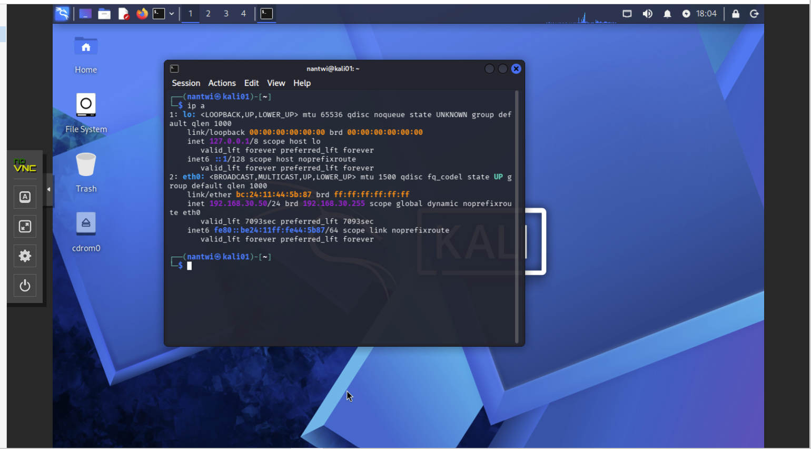
*Figure 15.5: KALI01 booted from disk, proving GRUB reached the MBR on the second installation. `eth0` holds `192.168.30.50/24` with a finite `valid_lft`, a DHCP lease from pfSense. End-to-end VLAN 30 connectivity is confirmed before any manual network configuration.*

A static address was then assigned, because a host that appears in firewall rules, test evidence and log correlation must have a stable identity.

```bash
sudo nmcli con mod "Wired connection 1" \
  ipv4.method manual \
  ipv4.addresses 192.168.30.2/24 \
  ipv4.gateway 192.168.30.1 \
  ipv4.dns 192.168.30.1 \
  ipv6.method disabled
sudo nmcli con up "Wired connection 1"
```

| Setting | Value |
|---------|-------|
| Address | `192.168.30.2/24` |
| Gateway | `192.168.30.1` (pfSense REDTEAM interface) |
| DNS | `192.168.30.1` |
| IPv6 | Disabled |

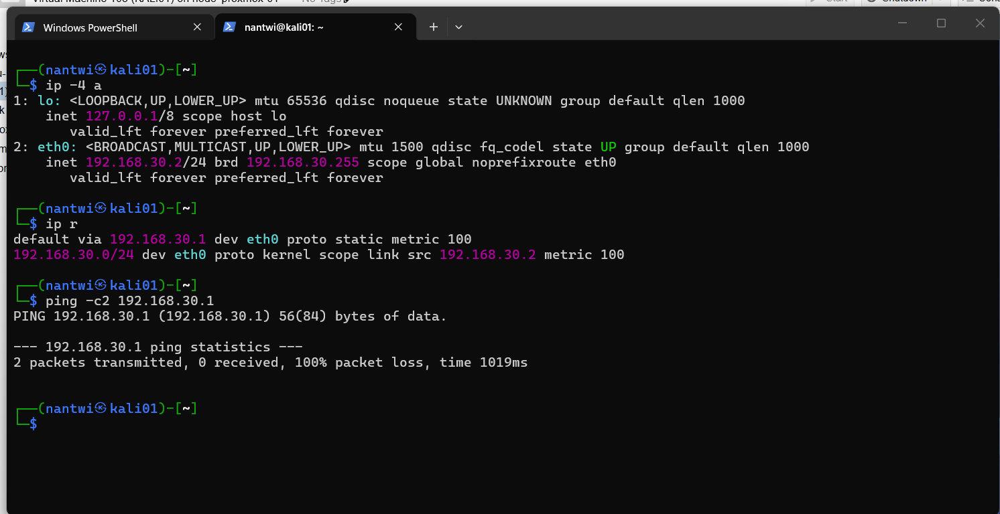
*Figure 15.6: `192.168.30.2/24` with `valid_lft forever`, confirming a static address rather than a lease, and a default route via `192.168.30.1` marked `proto static`. The failed ping to the gateway in the same capture is expected: no REDTEAM rule permits ICMP to the firewall, and its absence is the control (see section 1).*

IPv6 is disabled deliberately. The lab's rulebase is written and tested in IPv4 only, and an unmanaged IPv6 path on a segment whose entire purpose is containment would be an unmonitored route out of it. Reducing a host to only the protocols the environment actually governs is least functionality (NIST CM-7).

Time is synchronised from the firewall rather than the internet:

```bash
sudo sed -i 's/^#\?NTP=.*/NTP=192.168.30.1/' /etc/systemd/timesyncd.conf
sudo systemctl restart systemd-timesyncd
```

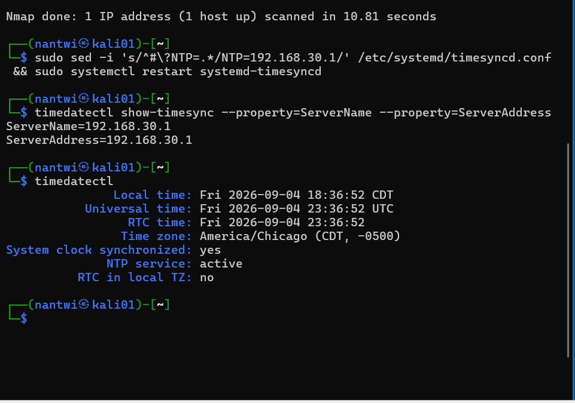
*Figure 15.7: After pointing `systemd-timesyncd` at `192.168.30.1`, the host reports `System clock synchronized: yes` with `NTP service: active`, in the same timezone (`America/Chicago`) as the rest of the estate.*

Accurate, *shared* time matters more here than accurate time. When an exercise from this host is later correlated against SIEM events, firewall logs and Windows Security events, every clock has to agree or the timeline cannot be reconstructed (NIST AU-8).

---

## 5. Management access

`openssh-server` ships with Kali but is disabled by default. It was enabled so the host can be administered from a terminal with a working clipboard and scrollback, rather than through the hypervisor's browser console:

```bash
sudo systemctl enable --now ssh
```

The Proxmox console is retained as the out-of-band path. It is the only way to reach the host when its own networking is broken, which is exactly the situation in which it is needed. Every network change described above was made with that fallback available. This mirrors the role of out-of-band management in a real datacentre, and it is why the network reconfiguration was safe to perform.

---

## 6. Services the segment depends on, and a diagnostic worth learning

Two firewall rules on the REDTEAM interface permit the attack host to use the firewall's own services: `RED-01` for DNS and `RED-02` for NTP. Both rules were correct from the outset. DNS still did not work.

```
$ nslookup kali.org 192.168.30.1
;; communications error to 192.168.30.1#53: timed out
;; no servers could be reached
```

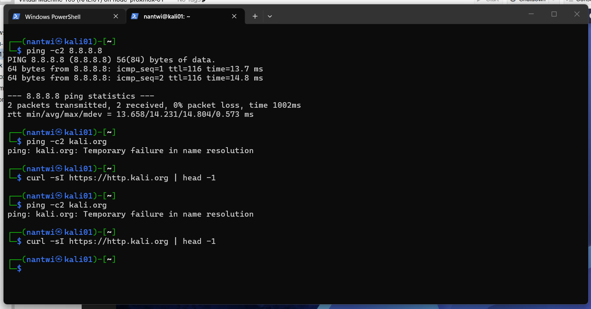
*Figure 15.8: The symptom as first observed. `ping 8.8.8.8` succeeds with `ttl=116`, so routing and NAT work, but every name lookup returns `Temporary failure in name resolution`. The `curl` command returns nothing at all, silently, because `-s` suppresses the same error.*

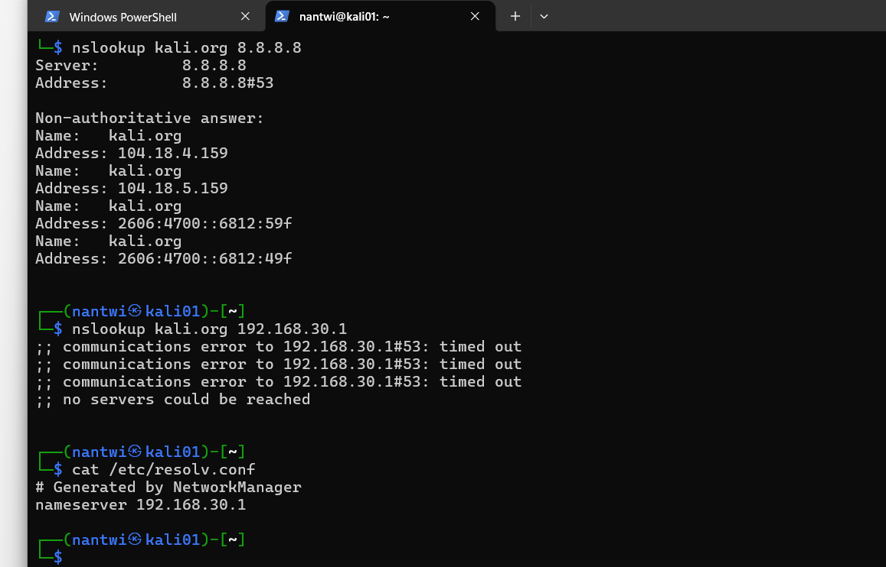
*Figure 15.9: Querying two resolvers separates the possibilities. `nslookup kali.org 8.8.8.8` returns a full answer, proving outbound port 53 is permitted and the path works. The identical query to `192.168.30.1` times out three times. `/etc/resolv.conf` confirms the client is configured correctly. The fault is therefore at the firewall's own resolver, not in the client and not in the rule permitting the traffic.*

**How the cause was located.** The pfSense rules page shows a **States** column, the count of live connection-state entries matched by each rule. `RED-01` showed `3/1 KiB`. That single number settles the question. If the firewall had been blocking the queries there would be no states at all, because a blocked packet never creates one. The states proved the packets were being accepted and delivered to the firewall itself, which meant the failure was not in the rulebase. Nothing was listening.

**Cause.** The pfSense DNS Resolver binds only to the interfaces selected under `Services → DNS Resolver → General Settings → Network Interfaces`. The REDTEAM interface was created after the resolver was first configured and had never been added, so unbound was not listening on `192.168.30.1`. Queries were delivered and silently discarded.


*Figure 15.10: The evidence that settled it. `RED-01` shows **3/1 KiB** in the States column while DNS was failing. A blocked packet never creates a state entry, so these states prove the firewall accepted and delivered the queries. `RED-02` shows `0/0 B` for comparison, no NTP traffic had been attempted yet. The greyed row at the bottom is the legacy any-to-any rule, disabled and later deleted.*

**Fix.** Add the interface to the resolver's binding list. If specific interfaces are selected rather than **All**, `Localhost` must be included too, or pfSense itself loses name resolution.

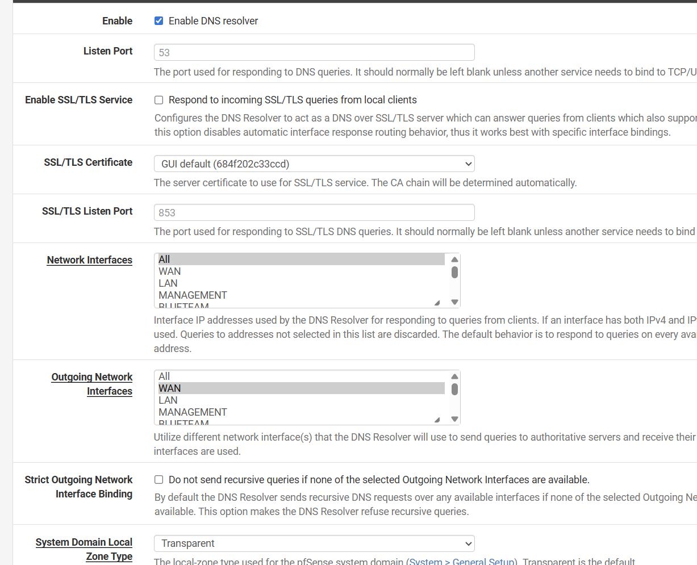
*Figure 15.11: `Services → DNS Resolver → General Settings`. The **Network Interfaces** field controls which addresses unbound will answer on, and its help text states the consequence plainly: queries to addresses not selected here are discarded. **Outgoing Network Interfaces** is set to WAN so recursion can reach the internet.*

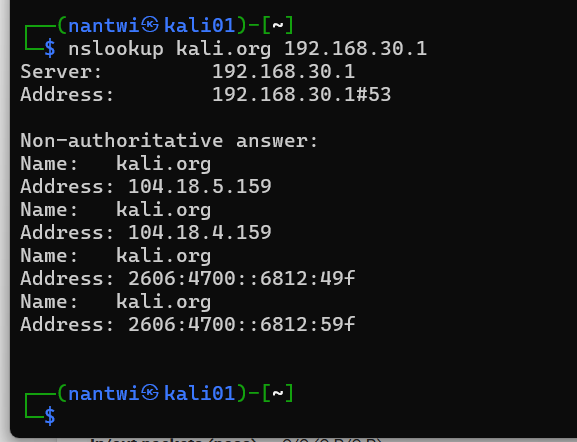
*Figure 15.12: The same query that had been timing out now returns a non-authoritative answer from `192.168.30.1`. RED-01 works end to end: the rule passes the traffic and the service is listening.*

The NTP server was found to be running on the wildcard, listening on every interface including WAN. It was bound explicitly to the internal interfaces, with WAN excluded. WAN rules already blocked inbound traffic, so nothing was exposed in practice, but NTP is a well-known reflection and amplification vector and the service should not be listening on the internet-facing address at all. Removing an unnecessary listener is cheaper than relying on a rule to protect it (NIST CM-7, SC-7).

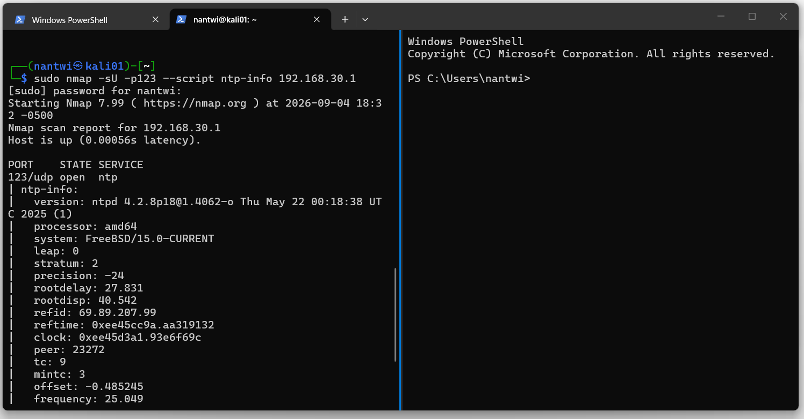
*Figure 15.13: `nmap -sU -p123 --script ntp-info 192.168.30.1` from KALI01. The service answers with `123/udp open` and reports `stratum: 2`, meaning pfSense is one hop from an authoritative source. Using the attack host's own tooling to verify a service it depends on is the natural way to test from inside the segment.*

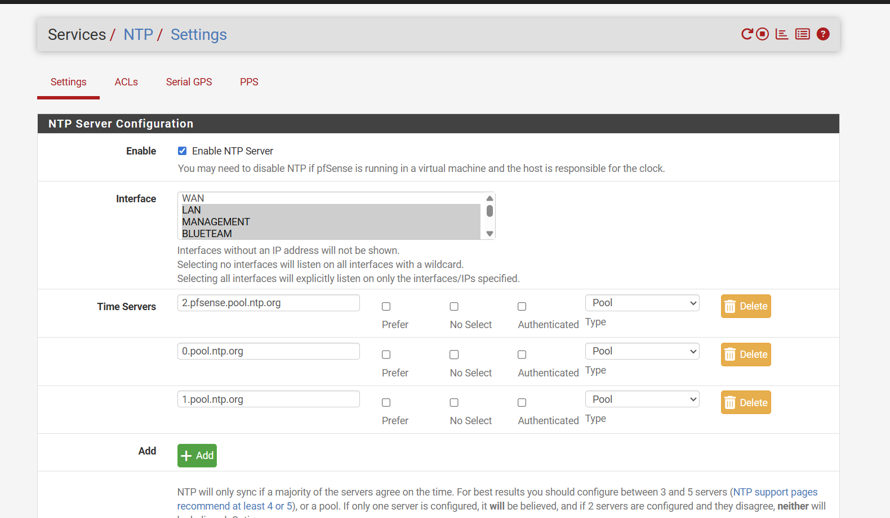
*Figure 15.14: `Services → NTP → Settings`. The interface list previously had nothing selected, which the help text describes as listening on all interfaces with a wildcard. Internal interfaces are now selected explicitly and **WAN is deliberately left unselected**, so the time service is not bound to the internet-facing address.*

### The general lesson

This is the second occasion in this build where the saved configuration was correct and the running system was not doing what it described. The first was a stale filter reload, documented in `docs/13` section 3.1, where pfSense kept enforcing an old ruleset after the rules had been changed.

Both failures present identically to a tester: the expected behaviour does not happen. They have opposite causes and opposite fixes. The discipline that separates them is to **read the state counters before changing any rules**. States present means the traffic was passed and the problem lies beyond the firewall. No states means the firewall is the problem, and the next question is whether the ruleset in the kernel is the one on the screen.

Changing rules first, which is the instinct, produces exactly the wrong outcome: the rulebase is loosened to solve a problem that was never in the rulebase, and the loosening is permanent.

---

## 7. Containment validation

The full results are recorded in `docs/13-firewall-rulebase-governance.md` section 3.1. Summarised:

| Test | From KALI01 | Expected | Result |
|------|-------------|----------|--------|
| `nc -zvw3 192.168.50.2 445` | SMB on DC01 | Blocked | Connection timed out |
| `nc -zvw3 192.168.10.1 443` | pfSense management | Blocked | Connection timed out |
| `ping -c2 8.8.8.8` | Internet | Reachable | 0% packet loss |
| `nslookup kali.org 192.168.30.1` | Firewall resolver | Resolves | Answer returned |
| `timedatectl` | Clock state | Synchronised | System clock synchronized: yes |


*Figure 15.15: The REDTEAM interface at the point of validation. Three rules, each carrying its identifier, justification and NIST control mapping in the description field. The legacy any-to-any rule has been deleted: a disabled permit-all left in place is ambiguous to a reviewer, who should not have to determine whether it is live.*


*Figure 15.16: The containment test, run from KALI01. SMB to the domain controller and HTTPS to the management gateway both return `Connection timed out`. Internet connectivity is unaffected, at 0% packet loss. The attack host is contained and functional at the same time.*

The tests are paired on purpose. Two prove containment, three prove the host still functions. Evidence for a segmentation control has to show both, because a control that also breaks the host is one that gets removed the first time it becomes inconvenient.

Both denials returned **timeouts rather than refusals**. pfSense drops silently rather than returning a TCP reset, so a probe from this segment yields no information: a filtered host is indistinguishable from one that does not exist. A reset would confirm both that something is there and that a filter is in front of it.

---

## 8. What this test does not prove

The containment tests measure the routed paths that the pfSense rulebase governs. They do not measure every path into the segment.

While these tests were running, an SSH session from the administrator's workstation to `192.168.30.2` was open and working. Both observations are true simultaneously, and they do not conflict. The SSH traffic arrived through the Tailscale subnet router, an overlay that terminates inside the perimeter, so pfSense never evaluated it against the REDTEAM interface rules at all.

This is tracked as hardening item **H-02** in `docs/13` section 6. It is recorded here as well because it changes how the control should be stated. The accurate claim is not "VLAN 30 cannot be reached". It is:

> VLAN 30 is contained from the lab's routed paths. Remote administrative reachability is governed separately, by Tailscale device membership rather than by the firewall rulebase.

Two practical points follow, and both generalise well beyond this lab.

**A test of a segmentation control must originate inside the segment.** Had these tests been run from the administrator's workstation towards VLAN 30, they would have measured the overlay and reported success while proving nothing about the rulebase. `KALI01` runs no VPN client and its only route is `default via 192.168.30.1`, which is what makes its results meaningful.

**An environment's reachability is the union of every path, not the contents of the firewall rulebase.** Interface rules can each be individually correct and still fail to describe what can reach what, because authenticated overlays, management networks and out-of-band paths route around them. Finding such a path, documenting it, and stating the control's real scope is a stronger position than a rulebase that merely looks complete.

---

## 9. Operational practice

**Snapshot before every exercise.** The `clean-install` snapshot captures the host as built: static addressing, verified DNS and NTP, no tooling changes. Roll back to it after any engagement that installs software, modifies configuration, or executes untrusted code. This is what makes a virtual attack host preferable to a physical one (NIST CP-10).

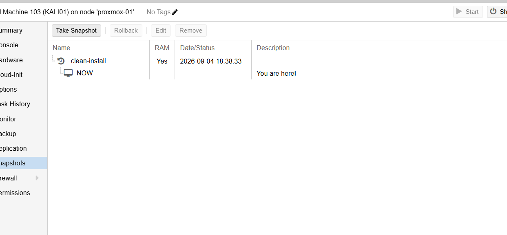
*Figure 15.17: The `clean-install` snapshot, taken once the build was validated and before any tooling was added. It is the rollback point for every exercise run from this host.*

**Grant access for an exercise, then remove it.** Reaching a target from this segment requires a temporary, specific pass rule recorded in the change control log of `docs/13`, and removed when the exercise ends. There is no standing path, by design.

**Reload the filter after rule changes.** Following the incident documented in `docs/13`, any rule change on this interface is followed by `Status → Filter Reload` before the change is treated as being in effect.

---

## 10. Standards alignment

| Practice in this document | Standard |
|---------------------------|----------|
| Untrusted segment isolated from the internal network | **NIST SP 800-53 SC-7** (Boundary Protection) |
| Information flow between segments explicitly controlled | **NIST SP 800-53 AC-4** (Information Flow Enforcement) |
| Deny by default, permit by exception; deny without response | **NIST SP 800-53 SC-7(5)** (Deny by Default) |
| IPv6 and unnecessary listeners disabled | **NIST SP 800-53 CM-7** (Least Functionality) |
| Time synchronised from an authoritative internal source | **NIST SP 800-53 AU-8** (Time Stamps) |
| Snapshot and rollback for a known-good state | **NIST SP 800-53 CP-10** (System Recovery) |
| Documented controls tested against a live host, with recorded evidence | **NIST SP 800-53 CA-7** (Continuous Monitoring) |
| Known gap (H-02) recorded with risk, decision and planned fix | **NIST SP 800-53 CA-5** (Plan of Action and Milestones) |
| Role-based naming supporting asset inventory | **NIST SP 800-53 CM-8** (System Component Inventory) |
| Segmentation of a high-risk system from the trusted estate | **CIS Controls v8, Control 12** (Network Infrastructure Management) |
| Reachability governed by identity rather than network location (direction of travel) | **NIST SP 800-207** (Zero Trust Architecture) |

---

## Related documents

- `docs/13-firewall-rulebase-governance.md`, the rule register, change control log and validation evidence
- `docs/11-domain-controller-firewall.md`, aliases and the rule evaluation model
- `docs/14-proxmox-storage-backup-capacity.md`, naming convention and backup strategy
- `docs/12-lab-expansion-roadmap.md`, the attack and defence scenarios this host will run
