# SIEM01: Rebuilding the SIEM After a Hardware Failure

**Purpose**: Documents the recovery of the lab's log collection capability after the original Wazuh host failed, the hardware role swap that made the rebuild better than the original, and the Wazuh deployment on the new host. Written so a reviewer can see the reasoning behind the placement decision, not only the installation steps.

**Host**: `SIEM01`, Dell OptiPlex 9020, Ubuntu 24.04.2 LTS, `192.168.20.2/24` on VLAN 20 (BlueTeam), switch Port 4.

**Status**: Host live and Wazuh 4.14.7 installed 2026-09-05. No agents deployed yet.

---

## 1. What failed, and the decision that followed

The original SIEM was a physical machine running Rocky Linux 9.6 at `192.168.20.2`. It lost power on 2026-08-29 and did not return. That was the second hardware failure in this lab, after a server NIC, and it left the environment with no central log collection: pfSense continued logging locally, but nothing was being shipped or correlated.

The obvious response was to rebuild the same thing on the same kind of hardware. A better question was which machine *should* hold this role.

At that point the estate had two physical Linux hosts and a hypervisor with spare capacity. The monitoring host was a Dell OptiPlex 9020 with 8 cores and 16 GB of RAM, running Grafana and Prometheus, a workload that comfortably fits in about 2 GB. Meanwhile the service that needed rebuilding, Wazuh, ships an Indexer (an OpenSearch instance) whose practical memory floor is around 8 GB, and which accumulates data that must survive.

So the roles were the wrong way round, and the failure was the opportunity to correct it:

| | Before | After |
|---|--------|-------|
| Dell OptiPlex 9020 (physical) | Grafana and Prometheus, VLAN 60 | **`SIEM01`**, Wazuh, VLAN 20 |
| Proxmox guest | none | `MON01`, Grafana and Prometheus, VLAN 60 |

The principle is worth stating plainly, because it generalises: **put the memory-hungry, data-bearing service on dedicated hardware, and the light, reproducible one on the hypervisor.** Grafana and Prometheus can be rebuilt from a configuration file in minutes. A SIEM's value is its accumulated history and the fact that it keeps running while everything around it is being investigated.

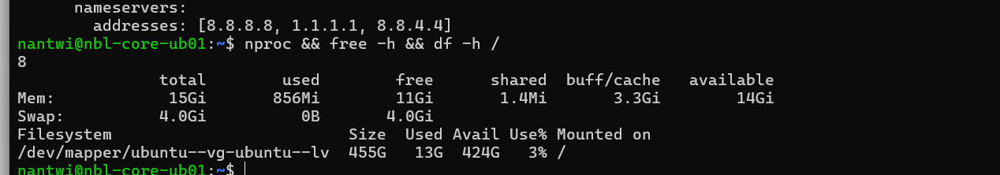
*Figure 16.1: The candidate host: 8 cores, 15 GiB usable RAM, and 424 GB free of a 455 GB volume. The disk figure matters as much as the memory, because the Indexer is what eventually fills a SIEM's storage.*

Full rationale and the naming decisions are in `docs/14` section 5.3.

---

## 2. Repurposing the host in place

The machine was **not** reinstalled. Ubuntu 24.04 carried over, which means Wazuh moved from Rocky Linux to Ubuntu. Three changes moved the host from one role to the other.

**Renamed** to match the convention (`docs/14` section 5.1):

```bash
sudo hostnamectl set-hostname SIEM01
sudo sed -i "s/nbl-core-ub01/SIEM01/g" /etc/hosts
```

The old name, `nbl-core-ub01`, encoded the operating system and nothing about the machine's purpose. That is precisely the failure mode the naming convention exists to prevent.

**Readdressed** from VLAN 60 to VLAN 20, and **recabled** from switch Port 8 to Port 4, the untagged VLAN 20 access port.

### The cloud-init trap

The netplan file on an Ubuntu Server install is named `50-cloud-init.yaml`, and that name is a warning. It is generated by **cloud-init**, the program that configures a fresh machine on first boot. A file written by a program can be rewritten by that program, and a manual edit would be silently reverted at the next boot, leaving the host on its old address on a port that no longer carries that VLAN.

Disabling cloud-init's network management first is what makes the edit durable:

```bash
echo 'network: {config: disabled}' | sudo tee /etc/cloud/cloud.cfg.d/99-disable-network-config.cfg
```

The configuration then uses the current netplan syntax. `gateway4:` is deprecated in 24.04 and replaced by a `routes:` entry, and DNS points at pfSense rather than a public resolver, matching DC01 and KALI01:

```yaml
network:
  version: 2
  ethernets:
    eno1:
      dhcp4: no
      addresses:
        - 192.168.20.2/24
      routes:
        - to: default
          via: 192.168.20.1
      nameservers:
        addresses: [192.168.20.1]
```

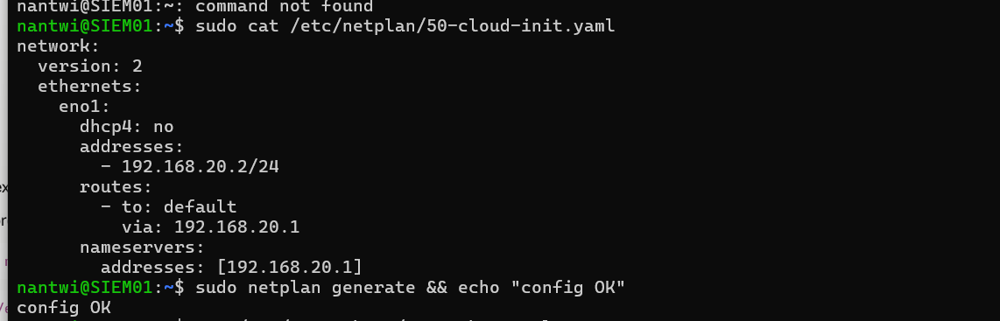
*Figure 16.2: The VLAN 20 configuration after a reboot, with `netplan generate` confirming it parses. That it survived the reboot is the evidence that cloud-init is genuinely no longer managing the interface.*

**The general lesson:** on Linux, a configuration file named after a program is usually owned by that program. Editing it works until the program runs again. Either turn the program off, as here, or place your settings in a higher-numbered file that wins.

---

## 3. Two failures worth recording

**Applying the network change before moving the cable.** `netplan apply` was run while the machine was still plugged into the VLAN 60 port. The host immediately held an address that did not exist on the network it was attached to: unreachable, with no route to its gateway. Nothing was damaged, and moving the cable resolved it, but the correct order is to write the configuration, shut down, move the cable, then power on. A machine should never be left holding an address its physical connection cannot serve.

**SSH refused the connection afterwards.** The address `192.168.20.2` had belonged to the failed Rocky Linux host, whose SSH host key was still recorded in the administrator's `known_hosts`. A different physical machine now answered at that address with a different key, so SSH refused:

```
WARNING: REMOTE HOST IDENTIFICATION HAS CHANGED!
```

This is the control working exactly as designed. SSH cannot distinguish "the hardware was replaced" from "something is intercepting this connection", so it stops and requires a human decision. The response was to verify rather than dismiss: the fingerprint was read directly from the host itself,

```bash
sudo ssh-keygen -lf /etc/ssh/ssh_host_ed25519_key.pub
```

confirmed identical to the one SSH had presented, and only then was the stale record removed with `ssh-keygen -R 192.168.20.2`.

SSH also volunteered corroboration, noting the same key was already known under `192.168.60.2`, the machine's previous address. That is independent confirmation that this was a host that moved, not a stranger.

**The distinction that matters:** deleting the warning and reconnecting is what most people do, and it works. Verifying the fingerprint out of band is what turns a dismissed alert into a cleared one. If that warning ever appears when nothing has changed, it is the one time it is telling you something real.

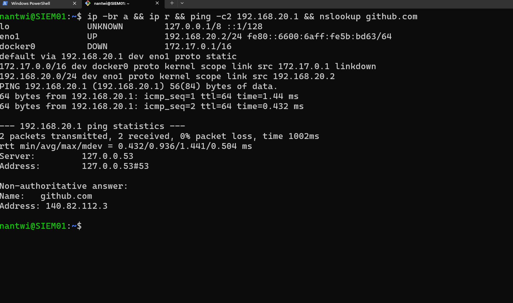
*Figure 16.3: Post-reboot verification: the static address held, the default route is marked `proto static`, the gateway answers, and name resolution works. Four separate things confirmed in one command.*

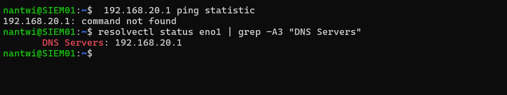
*Figure 16.4: `resolvectl` confirming the upstream resolver is `192.168.20.1`, pfSense, rather than a leftover public server. `127.0.0.53` in an `nslookup` result is systemd-resolved, a local stub that forwards on; it is worth checking what sits behind it.*

---

## 4. Firewall consequences

Two rules were required before the host could be administered, and both were built before the move rather than after.

`MGMT-11` permits the management plane to administer the SIEM, using aliases so the rule reads by intent rather than by number:

| Alias | Type | Value |
|-------|------|-------|
| `SIEM01_HOST` | Host | `192.168.20.2` |
| `SIEM_ADMIN` | Ports | `22` (SSH), `443` (Wazuh dashboard) |

Port 443 was included before Wazuh existed, on the expectation that the dashboard would use it. The installer confirmed this during the run (`Wazuh web interface port will be 443`), so no rule change was needed afterwards.

The rule is **logged**, on the same reasoning as `MGMT-08` on the domain controller: administrative access to a machine holding security evidence is privileged activity and has to be attributable (NIST AC-17, AU-2). Registered in `docs/13` as `MGMT-11`.

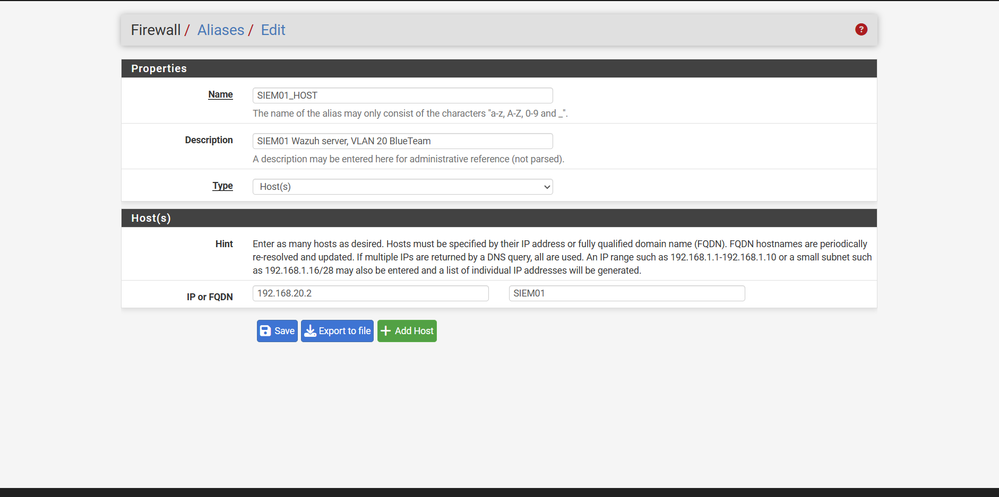
*Figure 16.5: The `SIEM01_HOST` alias. Defining the host once means the rule references intent rather than an address, and re-addressing the machine later becomes a single edit instead of a hunt through the ruleset.*

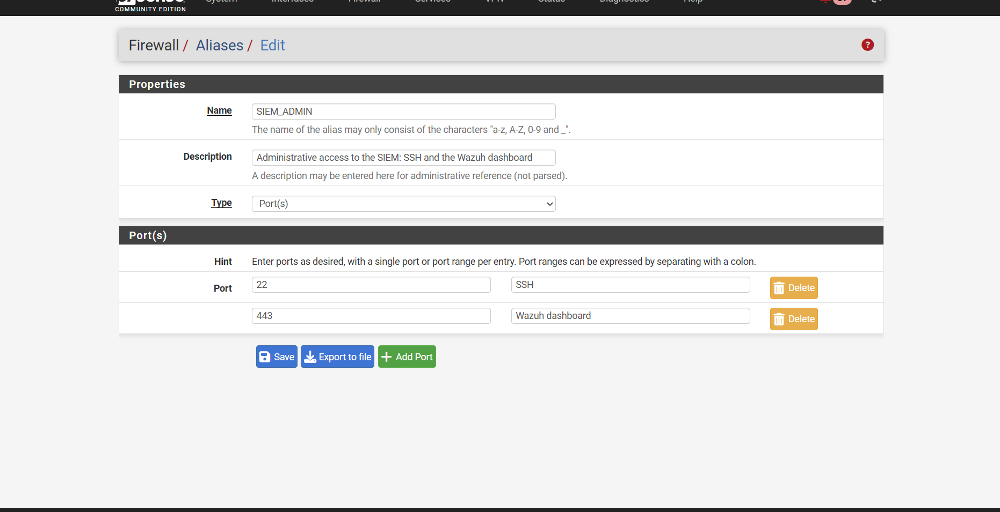
*Figure 16.6: The `SIEM_ADMIN` ports alias, holding SSH and the dashboard with each port individually described. Port 443 was added before Wazuh was installed, on the expectation that the dashboard would use it.*

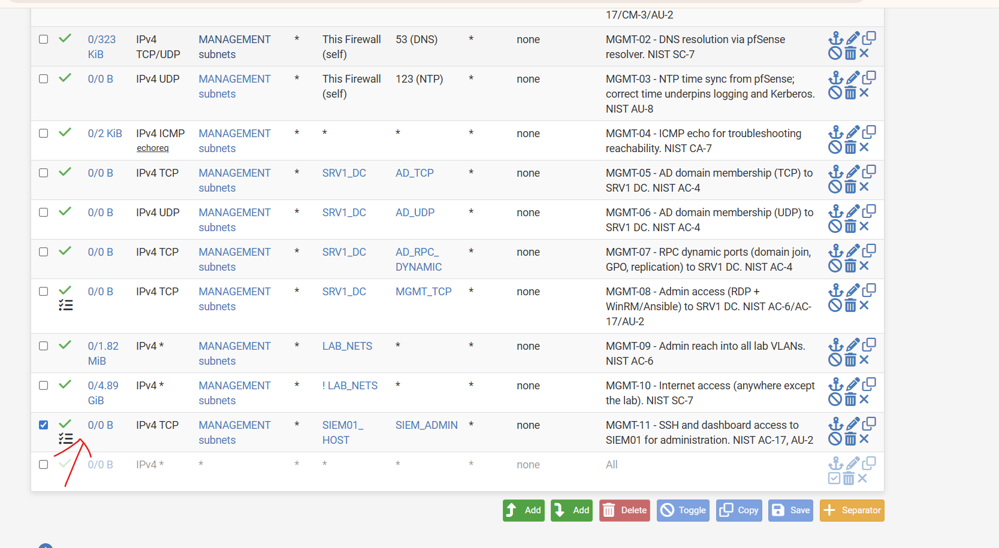
*Figure 16.7: `MGMT-11` at the foot of the MANAGEMENT tab, both aliases resolving as links and the logging icon set. The rules above it show the rest of the management plane's ruleset carrying live traffic.*

**The DNS Resolver check.** Before moving the host, the pfSense DNS Resolver was confirmed to be listening on the BLUETEAM interface. This is the third time in this build that a service bound to the wrong interfaces would have produced a correct-looking configuration and a silent failure, after the same issue on VLAN 30 (`docs/15` section 6). It is now a standing pre-flight check when a host moves to a new segment.

---

## 5. Installing Wazuh

Wazuh is three programs, and knowing which is which is the difference between diagnosing a problem and guessing at one:

| Component | Job | Listens on |
|-----------|-----|------------|
| **Wazuh Indexer** | Stores and searches events. OpenSearch underneath. The memory-hungry component. | 9200 (localhost) |
| **Wazuh Server** | The manager. Agents connect to it; it applies detection rules and forwards results. | 1514, 1515, 55000 |
| **Wazuh Dashboard** | The web interface. | 443 |
| *(Filebeat)* | Ships the manager's own alerts into the Indexer. | n/a |

"Wazuh is down" is never a useful diagnosis. It is one of these.

The all-in-one installer deploys all three on a single host, which suits 16 GB and 8 cores. A distributed deployment only earns its complexity when the Indexer outgrows one machine.

### The agent and manager conflict

The first install attempt was refused:

```
ERROR: Wazuh manager already installed.
```

Investigation showed no manager, only a `wazuh-agent` left from when this machine was the monitoring host reporting to the old SIEM.

**A manager and an agent cannot coexist on one host**, because both packages own `/var/ossec`. It is not a limitation to work around: the manager monitors its own host natively, so an agent on the manager would be redundant as well as conflicting.

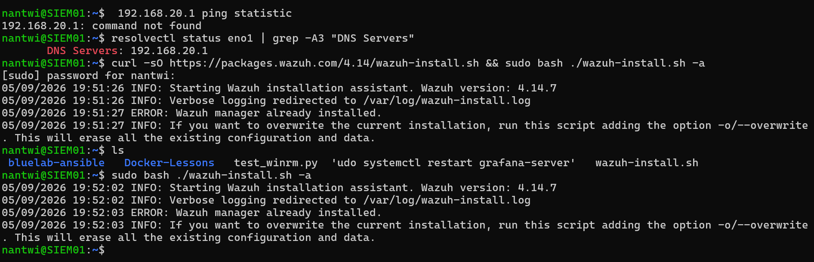
*Figure 16.8: The installer refusing, and the investigation that followed. Only `wazuh-agent 4.11.2` was present, a leftover from the machine's previous role.*

The installer offers `-o/--overwrite`, which erases all existing Wazuh configuration and data. Removing the single package explicitly was preferred, because the overwrite flag is a blunt instrument and on a machine whose job is to be trustworthy it is worth knowing exactly what changed:

```bash
sudo systemctl disable --now wazuh-agent
sudo apt purge -y wazuh-agent
sudo rm -rf /var/ossec
```

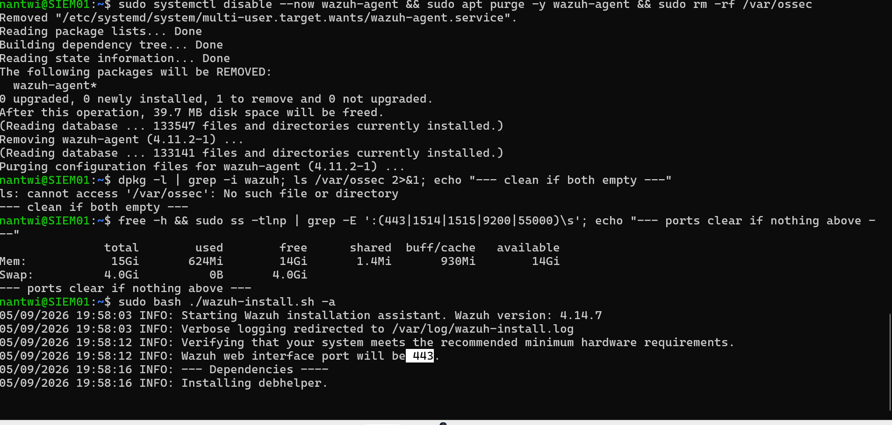
*Figure 16.9: The agent purged, `/var/ossec` gone, Wazuh's ports confirmed free, and the installer proceeding past the check that had blocked it.*

### Running the install

The installer was downloaded to a file rather than piped into a shell:

```bash
curl -sO https://packages.wazuh.com/4.14/wazuh-install.sh
sudo bash ./wazuh-install.sh -a
```

The pattern `curl ... | sudo bash` is common and is worth avoiding on principle. It executes code as root that was never seen, from a server that could have been compromised between publication and retrieval. Downloading first costs nothing and makes inspection possible.

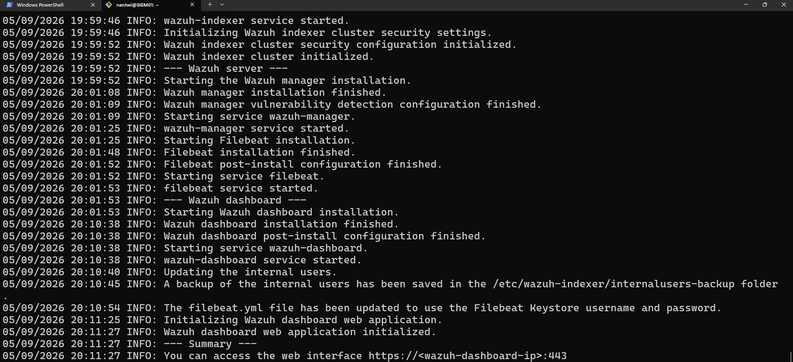
*Figure 16.10: The Indexer, manager, Filebeat and Dashboard each installing and starting in sequence. This screenshot is deliberately cropped: the installer prints the generated admin credentials immediately below, and they must not reach a repository.*

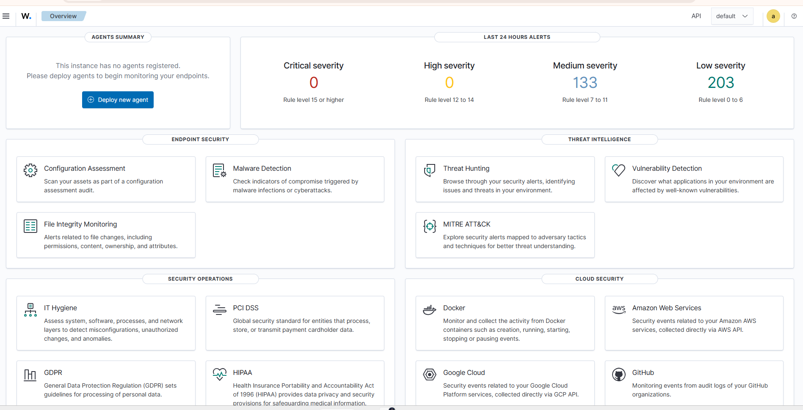
*Figure 16.11: The dashboard on first login. "No agents registered" alongside 336 alerts is not a contradiction: the manager monitors its own host as agent `000`.*

---

## 6. Credentials, and why the dashboard could not change them

The installer prints a generated `admin` password once. Attempting to change it through the dashboard fails:

```
Failed to reset password. {"status":"FORBIDDEN","message":"Resource 'admin' is reserved."}
```

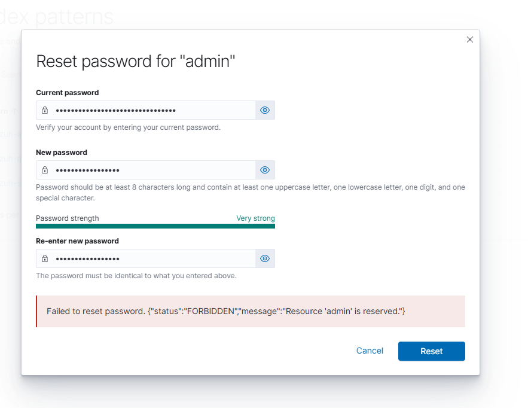
*Figure 16.12: The dashboard refusing to change its own administrative password. The account is a reserved resource in the Indexer's security configuration and cannot be modified through the API the interface uses.*

This is a deliberate boundary rather than a defect. The `admin` account is defined in the security plugin's `internal_users.yml` and marked **reserved**, which makes it immutable from the application layer. A compromised dashboard session therefore cannot lock the owner out of their own cluster. Changing it requires filesystem access to the host, which is a meaningfully higher bar:

```bash
curl -sO https://packages.wazuh.com/4.14/wazuh-passwords-tool.sh
sudo bash wazuh-passwords-tool.sh -u admin -p '<new password>'
```

The tool rewrites the hash and reruns `securityadmin` to push the change into the cluster.

**An evidence-handling rule came out of this.** The moment an installer prints a generated credential is exactly the moment people screenshot it. Figure 16.10 is cropped for that reason. Every screenshot is now checked for passwords, keys and tokens before it enters `images/`, and a credential that has appeared in a screenshot is rotated rather than trusted.

---

## 7. Post-install configuration

### Removing the previous role's software

Grafana and Prometheus were left running through the Wazuh install so nothing was disturbed mid-deployment, then removed. A SIEM holds the evidence for everything else in the environment, which makes unrelated software on it attack surface with no purpose (NIST CM-7).

Grafana came from an apt repository and removed cleanly. Prometheus did not, and the reason is worth knowing:

```bash
sudo apt purge -y grafana prometheus prometheus-node-exporter
```

```
Package 'prometheus' is not installed, so not removed
```

while `systemctl is-active prometheus` still reported **active**. Prometheus is commonly installed from the project's own tarball rather than a distribution package, so apt has no record of it even though it is plainly running:

```bash
which prometheus promtool
ls -d /etc/prometheus /var/lib/prometheus /etc/systemd/system/prometheus.service
```

Binaries in `/usr/local/bin`, a hand-written unit file, and data directories. Removing it means removing those directly:

```bash
sudo systemctl disable --now prometheus
sudo rm -f /etc/systemd/system/prometheus.service
sudo systemctl daemon-reload
sudo rm -rf /usr/local/bin/prometheus /usr/local/bin/promtool /etc/prometheus /var/lib/prometheus
sudo userdel prometheus
```

**The general point:** "apt says it is not installed" is not the same as "it is not on the machine". `/usr/local` exists precisely for software the package manager does not own, and asking systemd and the filesystem is how you find it. On a host being repurposed, check both.

### Dashboard session lifetime, and an outage caused by fixing it

The session expired quickly enough to interrupt work. Two settings in `/etc/wazuh-dashboard/opensearch_dashboards.yml` govern it, and the distinction between them is the useful part:

| Setting | What it controls |
|---------|------------------|
| `opensearch_security.session.ttl` | How long a session may live, in milliseconds |
| `opensearch_security.session.keepalive` | Whether that clock restarts on each interaction |

Without `keepalive` a session ends a fixed time after login regardless of activity, so it can expire mid-investigation. With it, the timeout becomes an **idle** timeout.

**The first attempt took the dashboard down.** The change was appended to the end of the file. The service then failed to start, and `systemctl status` reported repeated restart attempts until systemd gave up:

```
wazuh-dashboard.service: Start request repeated too quickly.
wazuh-dashboard.service: Failed with result 'exit-code'.
```

Recovery was immediate because a backup had been taken in the same breath as the edit:

```bash
sudo cp /etc/wazuh-dashboard/opensearch_dashboards.yml.bak /etc/wazuh-dashboard/opensearch_dashboards.yml
sudo systemctl reset-failed wazuh-dashboard
sudo systemctl start wazuh-dashboard
```

`reset-failed` is required: systemd rate-limits a service that keeps failing, and until that counter is cleared `start` silently does nothing.

**The cause was duplicate keys.** One `grep` found it:

```
17:opensearch_security.cookie.ttl: 900000
18:opensearch_security.session.ttl: 900000
19:opensearch_security.session.keepalive: true
```

The settings were already present. Appending them defined each key twice, and YAML rejects a document that does that, so the configuration would not parse. The defaults also explained the original complaint exactly: `900000` ms is **15 minutes**, and `keepalive` was already enabled, which is why the session survived activity and expired during idle time.

The correct change edits the existing lines rather than adding new ones:

```bash
sudo sed -i 's/^opensearch_security.cookie.ttl: .*/opensearch_security.cookie.ttl: 3600000/; s/^opensearch_security.session.ttl: .*/opensearch_security.session.ttl: 3600000/' /etc/wazuh-dashboard/opensearch_dashboards.yml
sudo systemctl restart wazuh-dashboard
```

**Three lessons, in order of usefulness.** Copy a configuration file before editing it, since the backup turned a failed service into a thirty-second recovery. Check whether a setting already exists before adding it, because appending to a configuration file is not the same as configuring it. And editing a file changes what a service *will* load, not what it is currently running, so the restart and the verification are part of the change rather than optional extras.

**One hour of inactivity** was chosen deliberately rather than for convenience. A long-lived authenticated session on the machine holding all the security evidence is itself a risk, since an unattended workstation stays logged in. A regulated environment would more likely keep the shipped fifteen minutes, backed by single sign-on and MFA, which is the direction the companion IAM lab is building toward. One hour is the lab compromise and is recorded here so the decision is visible rather than assumed (NIST AC-11, Session Lock; AC-12, Session Termination).

### A dormant privileged account

Authenticating a systemd action produced a polkit prompt offering two identities:

```
1.  Noble Antwi (nantwi)
2.  Ansible Automation Service Account (ansible)
```

The second is a local account created when this machine was the monitoring host managed by the Ansible controller. `groups ansible` returns `ansible sudo`, so it holds full administrative rights, and `ANS01` no longer exists, so nothing uses it.

A dormant account with sudo on the host that stores the security evidence is exactly the finding an access review exists to catch. It was locked rather than deleted, because the controller is being rebuilt and will need an account:

```bash
sudo passwd -l ansible
```

`passwd -l` disables password authentication but does **not** prevent key-based SSH, so this is a partial control. It is recorded as `H-03` in the hardening register in `docs/13` for review when ANS01 returns, rather than left to drift (NIST AC-2, Account Management; CA-5).

---

## 8. What it monitors today

With no agents deployed, the dashboard already shows several hundred alerts. They all carry agent ID `000`, which is always the manager itself.

Most are **Security Configuration Assessment** findings: Wazuh ships CIS Benchmark policies and evaluates the host against them at startup. These are not detections of an attack. They are an audit of the machine's own hardening, and they are useful for two reasons.

The first is direct: a SIEM holds evidence of everything else in the environment, which makes it a high-value target, and the tool has just produced a prioritised list of its own weaknesses.

The second is conceptual. SCA is continuous configuration monitoring, which is the same control family being satisfied by hand for pfSense in `docs/13`: NIST CM-2 (Baseline Configuration) and CM-6 (Configuration Settings). The firewall register is a manual implementation of what SCA does automatically for hosts.

### The baseline, recorded before any hardening

Filtering the Configuration Assessment events by result gives the starting position against the **CIS Ubuntu Linux 24.04 LTS Benchmark v1.0.0**:

| Result | Checks |
|--------|--------|
| Passed | **147** |
| Failed | **127** |
| Total evaluated | **274** |
| Pass rate | **53.6%** |

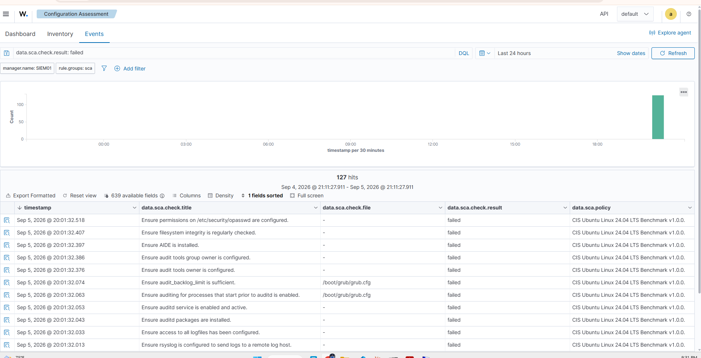
*Figure 16.13: 127 failing checks at first assessment. The visible failures are representative of a stock installation: `auditd` not installed, AIDE absent, no remote log host configured, audit tool ownership unset.*

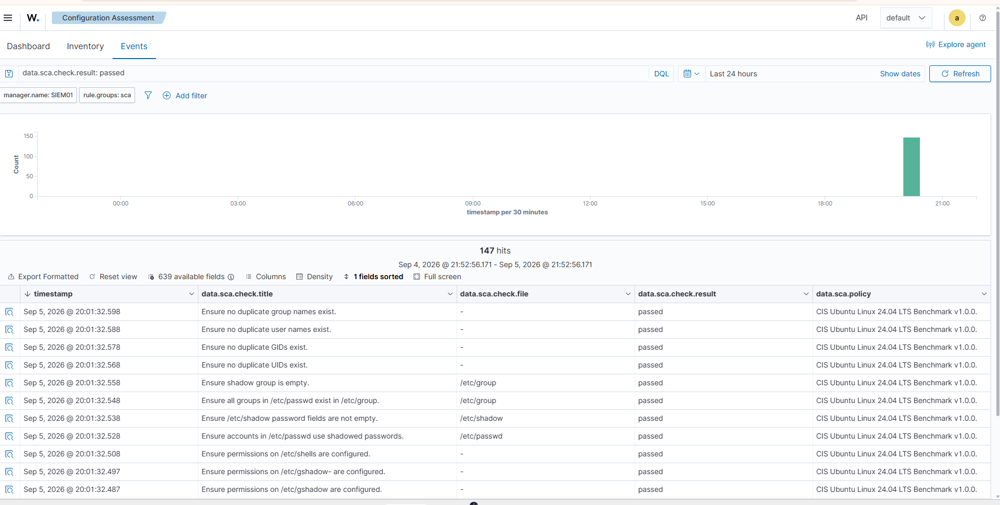
*Figure 16.14: 147 passing checks. Most are account and permission hygiene that Ubuntu gets right by default, such as shadowed passwords and no duplicate UIDs.*

Roughly half a benchmark failing is normal for a default installation, and that is the point: hardening is work that has to be done, not a property an operating system arrives with.

**This baseline cannot be recreated later**, which is why it was captured before anything was changed. It is the "before" half of a before-and-after, in the same shape as the management-plane isolation test in `docs/13` section 3.1, where a control was measured, changed, and measured again.

**Planned as an exercise:** harden a set of the failing checks, starting with the audit subsystem, and show the pass rate improving against these numbers.

**A note on the Inventory tab.** It is empty, and that is expected rather than a fault. Configuration Assessment's Inventory view is scoped to an agent selected from the agents list, and the manager is agent `000`, which does not appear there. The Events tab reads the alerts index directly, which is why the manager's own results are visible at all. Once agents enrol, their assessments populate the Inventory view normally.

---

## 9. The first agent: DC01

Deploying the first agent is where the interface-direction reasoning stops being theory.

**Agents dial out to the manager.** The manager listens. So the rule that lets DC01 report does not belong on the BlueTeam tab; it belongs on **ENTERPRISELAN**, the interface DC01's traffic arrives on. Registered as `ENT-05` in `docs/13`.

### Installing it

The deployment command comes from the dashboard (**Agents → Deploy new agent**), which fills in the manager address and matches the agent version to the manager. Run in PowerShell as Administrator on DC01:

```powershell
Invoke-WebRequest -Uri https://packages.wazuh.com/4.x/windows/wazuh-agent-4.14.7-1.msi -OutFile $env:TEMP\wazuh-agent.msi
msiexec.exe /i $env:TEMP\wazuh-agent.msi /q WAZUH_MANAGER='192.168.20.2' WAZUH_REGISTRATION_SERVER='192.168.20.2' WAZUH_AGENT_NAME='DC01'
NET START WazuhSvc
```

Verification from the agent side, which is the diagnostic worth running first when an agent does not appear:

```powershell
Get-Service WazuhSvc
Test-NetConnection 192.168.20.2 -Port 1514
```

### It did not connect, and why

The agent installed and the service started, but nothing appeared in the dashboard. Two causes, in sequence.

The first was the rule itself, described in `docs/13` section 2.2: `ENT-05` had been copied from `MGMT-11` and carried the wrong source and service, so it matched nothing.

The second, after the rule was corrected, was that **the filter had not been reloaded**. The rule was right, saved, and applied, and the agent still could not connect until **Status → Filter Reload**.

That is the third time a stale filter has produced a different-looking failure in this lab. It has now been promoted to principle 9 of the rulebase in `docs/13`: a saved rule is not an enforced rule.

**The general diagnostic.** An agent that cannot reach its manager is indistinguishable, from the dashboard, from an agent that is broken. Both are simply absent. `Test-NetConnection <manager> -Port 1514` from the endpoint separates the two in seconds: if the port test fails, the problem is the network path and nothing on the endpoint needs touching.

### The result

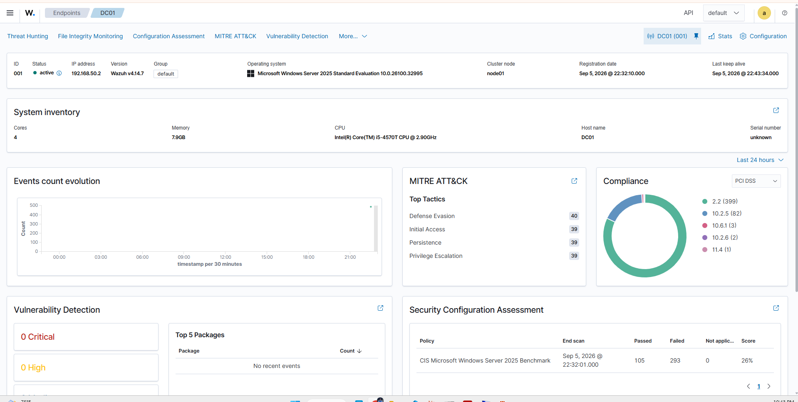
*Figure 16.15: Agent `001`, DC01, active, Windows Server 2025, reporting from `192.168.50.2`. System inventory, MITRE ATT&CK tactic counts, vulnerability detection and a CIS benchmark run all populate from a single agent install.*

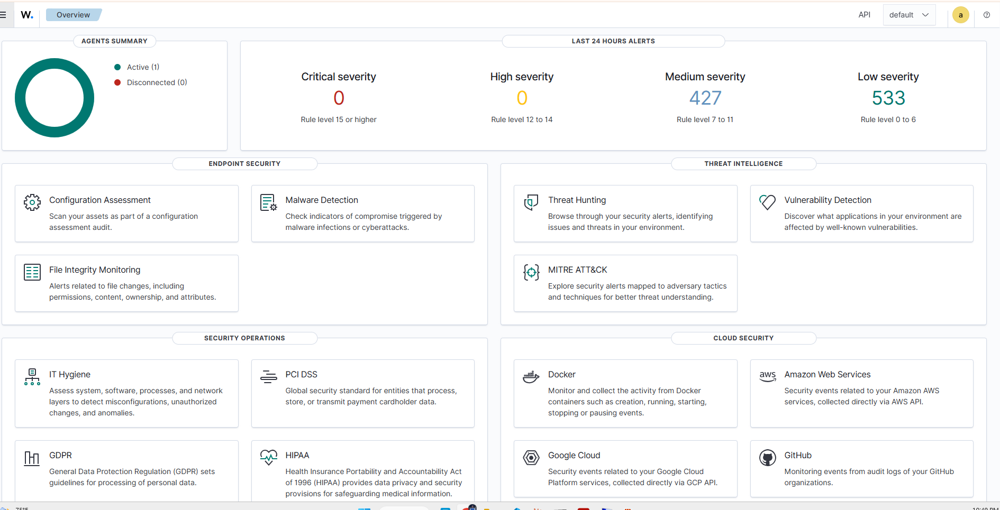
*Figure 16.16: One agent active, none disconnected, and the alert counts on the overview now include a real endpoint rather than the manager alone.*

**Recording:** [Deploying a Wazuh Agent to Windows Server 2025, and debugging the pfSense rule that blocked it](https://youtu.be/Tsh_W0gWIRc) (5:34). The full deployment including both failures and the diagnosis, rather than an edited clean run. The raw file is not committed; see `images/README.md` for the recording policy.

### A second baseline, and an instructive comparison

DC01's first Configuration Assessment run scores against the **CIS Microsoft Windows Server 2025 Benchmark**:

| Host | Benchmark | Passed | Failed | Score |
|------|-----------|--------|--------|-------|
| SIEM01 | CIS Ubuntu 24.04 LTS v1.0.0 | 147 | 127 | **53.6%** |
| DC01 | CIS Microsoft Windows Server 2025 | 105 | 293 | **26%** |

The gap is worth sitting with. It does not mean Windows is less secure than Ubuntu. It means the Windows benchmark is far more prescriptive, covering hundreds of Group Policy settings that simply do not exist as concepts on a Linux host, and that a domain controller installed with defaults satisfies very few of them. A domain controller is also the highest-value host in an Active Directory environment: everything else trusts it.

That makes DC01 the obvious hardening target, and the numbers above the baseline to measure against.

---

## 10. What comes next, and where the rules go

Deploying the first agent is where the firewall model becomes concrete, and it is the point most people get backwards.

**A pfSense rule governs who may start a conversation.** Replies return through the state table and never need a rule. So the question for any service is not "who should reach this server?" but "who initiates?"

Wazuh agents connect **outbound** to the manager. The manager listens. Therefore:

| To achieve this | The rule belongs on | Because |
|-----------------|---------------------|---------|
| DC01 reports to Wazuh | **ENTERPRISELAN (VLAN 50)** | DC01 initiates, and it lives on VLAN 50 |
| KALI01 reports to Wazuh | **REDTEAM (VLAN 30)** | KALI01 initiates |
| Administrator opens the dashboard | **MANAGEMENT (VLAN 10)** | the workstation initiates (`MGMT-11`, built) |

**Almost nothing is added to the BLUETEAM tab itself.** The instinct is to grant the SIEM broad reach on the reasoning that it must "see everything". That is backwards twice over: it does not grant what agents actually need, and it would give the machine holding all the security evidence a standing path across the entire estate.

The agent rules are `ENT-05` and `RED-04`, permitting TCP 1514 (events) and 1515 (enrollment) to `SIEM01_HOST`. They are registered in `docs/13` as they are built.

Also outstanding: Grafana and Prometheus are still installed on this host and should be removed once `MON01` exists, and Docker was removed as unused attack surface on a machine that has no need of it.

---

## 11. Standards alignment

| Practice in this document | Standard |
|---------------------------|----------|
| Centralised collection and retention of security events | **NIST SP 800-53 AU-6** (Audit Record Review), **AU-9** (Protection of Audit Information) |
| Continuous configuration assessment against a benchmark | **NIST SP 800-53 CM-2, CM-6**; **CIS Controls v8, Control 4** |
| Administrative access to the SIEM restricted and logged | **NIST SP 800-53 AC-17, AU-2** |
| Recovery of a failed service onto sound hardware, with placement justified | **NIST SP 800-53 CP-10** (System Recovery) |
| Unnecessary software removed from a security-critical host | **NIST SP 800-53 CM-7** (Least Functionality) |
| Dashboard session bounded by an idle timeout, with the value justified | **NIST SP 800-53 AC-11** (Session Lock), **AC-12** (Session Termination) |
| Host identity verified out of band before trust was re-established | **NIST SP 800-53 IA-3** (Device Identification and Authentication) |
| Role-based naming supporting asset inventory | **NIST SP 800-53 CM-8** |
| Segmentation between the monitored estate and the monitoring segment | **NIST SP 800-53 SC-7**, **CIS Controls v8, Control 12** |

---

## Related documents

- `docs/13-firewall-rulebase-governance.md`, the rule register including `MGMT-11` and the pending agent rules
- `docs/14-proxmox-storage-backup-capacity.md`, the naming convention and the role swap rationale
- `docs/15-kali-attack-host-build.md`, the same interface-direction reasoning applied to the attack segment
- `docs/02-security-monitoring.md`, the original Wazuh deployment on the failed Rocky Linux host
