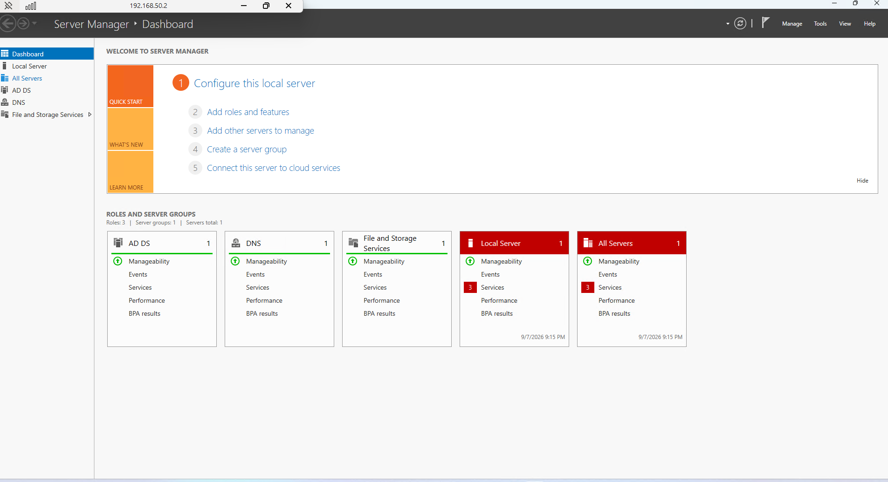
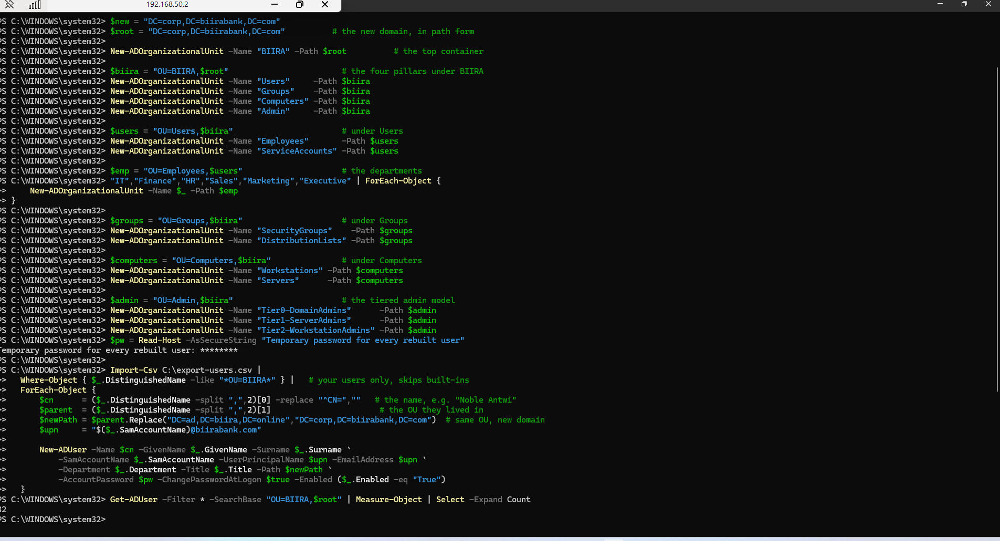
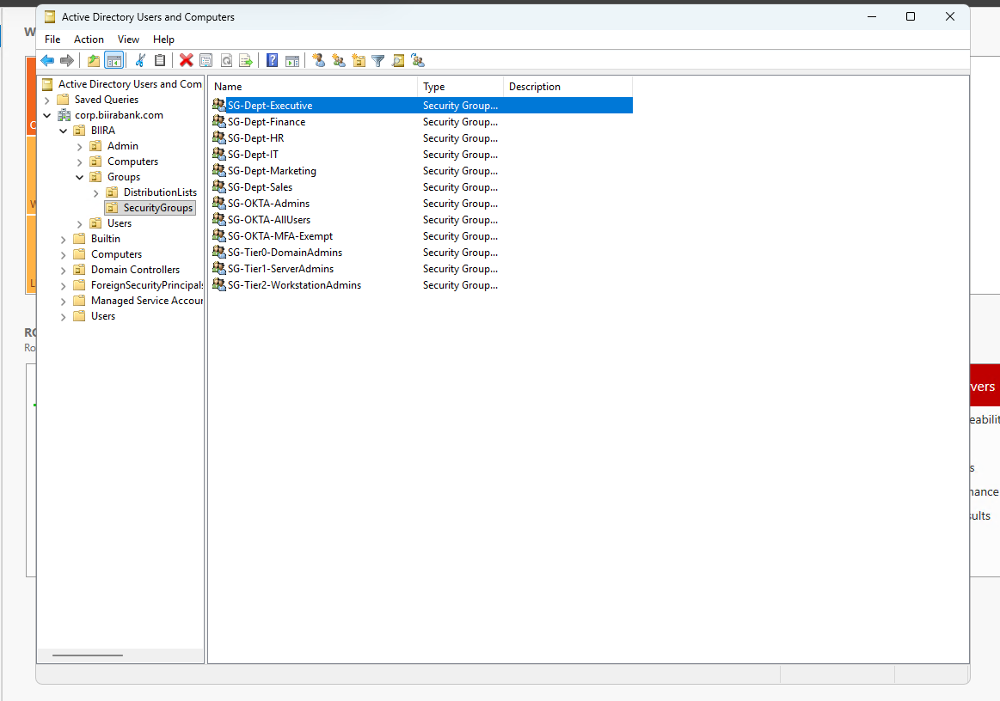
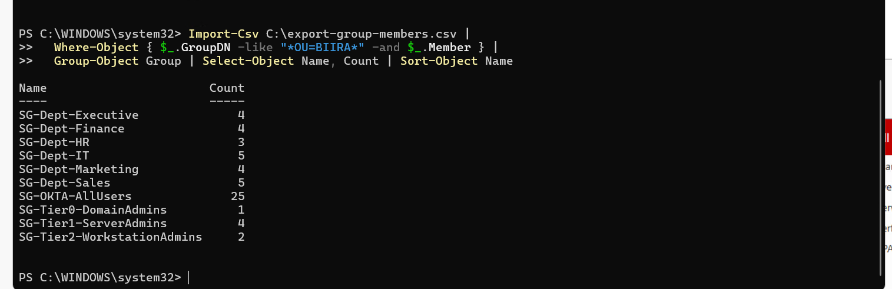

# 17. Domain migration: retiring ad.biira.online for corp.biirabank.com

**Purpose**: Records the migration of the single-domain Active Directory forest from `ad.biira.online` to a new forest `corp.biirabank.com` (NetBIOS `CORP`), the reasoning behind a demote-and-repromote on the existing hardware rather than a rename, the recovery from a lockout that happened during the promotion, and the repopulation of the directory from exported state. Written so a reviewer can see what was done, why, and which controls it touches.

Related decision: `docs/decisions/ADR-001-domains-and-forest-naming.md`.

---

## 1. Why the domain name changed, and why a rename was not used

The public brand moved to `biirabank.com`. The directory was still named after `biira.online`, a domain being retired. Three options existed:

1. **Add a UPN suffix only.** Change what users type at sign-in to `@biirabank.com` while leaving the directory named `ad.biira.online`. Five minutes, no downtime, but the forest keeps a name tied to a domain no longer owned, which blocks split-brain DNS and internal certificates later.
2. **Rename the forest with `rendom`.** Supported, but a multi-stage procedure that reboots every domain controller and every member twice and has no clean rollback if a stage fails. The cost is fixed regardless of directory size, so it is a poor trade for a small estate.
3. **Demote and repromote into a new forest.** Take the existing domain controller down to a standalone server, then promote it as the first controller of `corp.biirabank.com`, and recreate the directory contents from an export.

Option 3 was chosen. The directory held roughly 35 accounts, 21 organisational units and a set of groups, all of which export to CSV and replay as a script. The one thing lost is the live directory content, and that was captured first.

**Naming.** The internal forest is `corp.biirabank.com`, not `biirabank.com` flat. A domain controller becomes the DNS authority for its own name, so naming the domain `biirabank.com` would make the DC authoritative for the public zone and break resolution of the public website from inside the lab. The `corp.` prefix keeps the internal namespace separate from the public one. Users still sign in as `name@biirabank.com` through a UPN suffix, so the internal name is never seen by users. This matches `SC-7` boundary separation in spirit: internal and external namespaces are kept distinct.

## 2. Export first: the only irreversible moment

Before demoting, the directory was exported and copied off the machine.

```powershell
Get-ADOrganizationalUnit -Filter * | Select Name,DistinguishedName |
  Export-Csv C:\export-ous.csv -NoTypeInformation
Get-ADUser -Filter * -Properties * |
  Select SamAccountName,GivenName,Surname,UserPrincipalName,Department,Title,Enabled,DistinguishedName |
  Export-Csv C:\export-users.csv -NoTypeInformation
Get-ADGroup -Filter * -Properties Members | ForEach-Object { <# flattened to one row per member #> } |
  Export-Csv C:\export-group-members.csv -NoTypeInformation
Backup-GPO -All -Path C:\gpo-backup
```

The Group Policy backup returned only the two default policies (`Default Domain Policy`, `Default Domain Controllers Policy`), which the new forest creates for itself, so no policy needed to be carried across. A finding worth recording: the estate had a tiered admin OU structure (`Tier0-DomainAdmins`, `Tier1-ServerAdmins`, `Tier2-WorkstationAdmins`) but no Group Policy enforcing the tier restrictions. Structure without enforcement. Building that enforcement on the new forest is tracked in the backlog.

*Screenshot owed: `Get-ADForest` and `Get-ADDomain` output on the old forest, and the ADUC tree expanded, taken before the demote.*

## 3. Demote

The demote refused at first because the controller was the last DNS server for an AD-integrated reverse lookup zone. That is a safety check, not a failure. The zone dies with the domain and is rebuilt afterwards, so the documented flag was added:

```powershell
Uninstall-ADDSDomainController -LastDomainControllerInDomain -RemoveApplicationPartitions `
  -DemoteOperationMasterRole -IgnoreLastDNSServerForZone -Force
```

The command prompts for a new **local** Administrator password, because once the domain is gone the machine has no domain accounts to log in with. The server reboots into a standalone workgroup member. Confirmed with:

```powershell
Get-WmiObject Win32_ComputerSystem | Select Name, Domain, PartOfDomain   # Domain: WORKGROUP, PartOfDomain: False
```

## 4. Promote the new forest

```powershell
Install-ADDSForest -DomainName "corp.biirabank.com" -DomainNetbiosName "CORP" -InstallDns -Force
```

This prompts for a DSRM (Directory Services Restore Mode) password, which is separate from the local Administrator password and used only for directory recovery. When the first controller of a new forest is promoted, the local Administrator account is carried up to become the domain Administrator, keeping its password.

## 5. The lockout, and the recovery

After the promotion reboot, the sign-in screen rejected the expected password. The cause was a password set over an RDP session where a symbol was transmitted under one keyboard layout and typed back under another, so the stored value did not match what was being typed. The sign-in also showed a longer string than the password that had been set, confirming a mismatch rather than a forgotten password.

RDP alone could not resolve this: every reset method needs console access, which RDP cannot provide without a working account. With a physical screen and keyboard attached, the local Administrator password was reset by booting from Windows Server installation media, replacing `utilman.exe` with `cmd.exe` at the recovery command prompt to obtain a SYSTEM shell at the login screen, and running `net user Administrator <newpassword>`. This is the standard offline local-account reset and works on any Windows machine the operator physically controls.

Reference used during recovery: YouTube, "Reset Windows Server Administrator Password", https://www.youtube.com/watch?v=m4BBSa8uS5E&t=1s

Lesson recorded: set passwords that will be typed at a console using simple, layout-safe characters, or set them locally at the console rather than over RDP. And a control is only in place when a login proves it, not when the tool reports success.


*Figure 17.1: Server Manager on `192.168.50.2` after recovery, showing AD DS, DNS and File and Storage Services all reporting manageable on the new forest. This is the proof that the promotion completed and the lockout was resolved without data loss.*

## 6. Repopulating the directory

The new forest starts empty. The UPN suffix, organisational units and users were recreated from the export.

```powershell
Get-ADForest | Set-ADForest -UPNSuffixes @{Add="biirabank.com"}
```

The organisational units were recreated top down so each parent exists before its children, reproducing the exact tree from `export-ous.csv`. The users were recreated from `export-users.csv`, filtered to those under `OU=BIIRA` so the domain's built-in accounts were not touched, each placed back in its original organisational unit by swapping the old domain suffix in its stored distinguished name for the new one. Every account received one temporary password and `ChangePasswordAtLogon`, which is correct behaviour because passwords cannot be exported.


*Figure 17.2: The organisational unit tree and user accounts recreated on `corp.biirabank.com` from the exported CSV files, ending with the account count.*

The rebuild was verified by comparing the source data against the result rather than trusting the run:

```powershell
$expected = (Import-Csv C:\export-users.csv | Where-Object { $_.DistinguishedName -like "*OU=BIIRA*" }).Count
$actual   = (Get-ADUser -Filter * -SearchBase "OU=BIIRA,$root").Count
"expected $expected, rebuilt $actual"     # expected 32, rebuilt 32
```

Twenty organisational units and 32 user accounts were restored, each account placed back in the organisational unit it originally occupied. Every account received a single temporary password with `ChangePasswordAtLogon` set, because password hashes are not exported and must not be.

Groups were replayed from `export-group-members.csv` in two passes: one to create each group in its original organisational unit with its original scope and category, and a second to restore membership, translating each stored member reference from the old domain suffix to the new one.

Twelve security groups were restored under `OU=SecurityGroups,OU=Groups,OU=BIIRA`. The estate uses an `SG-` prefix convention across three families: departmental groups (`SG-Dept-IT`, `SG-Dept-Finance` and so on), tiered administration groups (`SG-Tier0-DomainAdmins`, `SG-Tier1-ServerAdmins`, `SG-Tier2-WorkstationAdmins`), and Okta integration groups (`SG-OKTA-AllUsers`, `SG-OKTA-Admins`, `SG-OKTA-MFA-Exempt`). The last three are the objects the identity provider consumed, so they matter when Okta is repointed at the new forest.

Note the distinction between the tiered **organisational units** under `OU=Admin` and the tiered **groups** under `OU=SecurityGroups`. The organisational units hold the administrative accounts; the groups grant them rights. Both carry the tier name, and confusing the two produces an object-not-found error rather than anything harmful.


*Figure 17.3: The twelve security groups restored under `OU=SecurityGroups`, showing the `SG-` prefix convention and the three group families: departmental, tiered administration, and Okta integration.*

### Verifying membership rather than assuming it

Groups existing is not the same as groups being populated. Membership was counted in the rebuilt directory and compared against the same figures derived from the export file:

| Group | Exported | Rebuilt |
|-------|---------:|--------:|
| `SG-Dept-Executive` | 4 | 4 |
| `SG-Dept-Finance` | 4 | 4 |
| `SG-Dept-HR` | 3 | 3 |
| `SG-Dept-IT` | 5 | 5 |
| `SG-Dept-Marketing` | 4 | 4 |
| `SG-Dept-Sales` | 5 | 5 |
| `SG-OKTA-AllUsers` | 25 | 25 |
| `SG-OKTA-Admins` | 0 | 0 |
| `SG-OKTA-MFA-Exempt` | 0 | 0 |
| `SG-Tier0-DomainAdmins` | 1 | 1 |
| `SG-Tier1-ServerAdmins` | 4 | 4 |
| `SG-Tier2-WorkstationAdmins` | 2 | 2 |

The figures reconcile internally as well as against the export. The six departmental groups total 25 members, which matches `SG-OKTA-AllUsers` exactly, and those 25 plus the seven tiered administrative accounts account for all 32 restored users.

Two of the counts are worth reading as findings rather than data. **`SG-Tier0-DomainAdmins` contains one account**, which is what a correctly implemented tier model looks like; a Tier 0 group with six members would be the problem. **`SG-OKTA-MFA-Exempt` is empty**, which is the desired state for an exemption group. Exemption groups are among the first objects an assessor examines, and an empty one is a clean result.


*Figure 17.4: Membership counts derived from the export file, matching the rebuilt directory group for group. The two Okta groups absent from this list are the two that were empty before the migration, confirming the replay missed nothing.*

*Screenshot owed: a user's Account tab showing the `@biirabank.com` suffix, and the rebuilt tree in Active Directory Users and Computers.*

## 7. Knock-on effects

- **Wazuh agent 001** on this host reports by machine, not by domain, so it survives the migration. To be reconfirmed against the manager.
- **Member machines** joined to `ad.biira.online` are orphaned and must be rejoined to `corp.biirabank.com`, authenticating with their local Administrator accounts in the meantime.
- **Okta** any AD agent still pointing at `ad.biira.online` points at a domain that no longer exists and must be repointed. Tracked with the IAM lab.
- **Reverse DNS zone** for `192.168.50.0/24` should be recreated on the new forest so logs and Wazuh show hostnames rather than bare addresses.
- **Backups** the controller remains physical. A second controller (`DC02`) on separate hardware, installed as Server Core, is the durable fix, because Active Directory replication makes the directory itself redundant. Tracked in the backlog.

## 8. Controls touched

- **CM-2, CM-3** baseline and change: the directory was rebuilt to a known, scripted baseline rather than an accreted state.
- **SC-7** boundary: internal (`corp.biirabank.com`) and external (`biirabank.com`) namespaces kept distinct.
- **IA-5** authenticator management: temporary passwords with forced change at first logon.
- **CP-10** recovery: the lockout was recovered without data loss because state was exported before the irreversible step.
