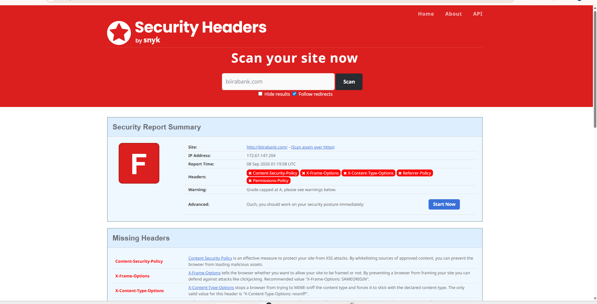
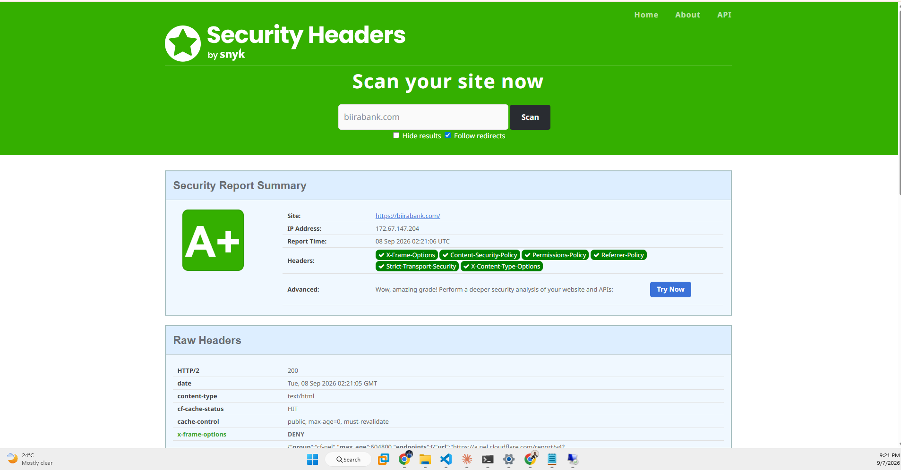

# 18. Public web presence and edge hardening: biirabank.com

**Purpose**: Records the build and hardening of `biirabank.com`, the public face of the fictional institution this lab is modelled on. Covers the hosting decision, an exposure found and closed during the build, the transport and header controls applied at the edge, and the before and after evidence from independent public graders. Written so a reviewer can see that each control was verified from outside the platform's own dashboard.

---

## 1. Why the lab needed an external tier

Every prior chapter in this lab describes an internal control: VLAN segmentation, internal firewall policy, an internal SIEM, an internal directory. That is one half of enterprise security. The half that was missing is the part of the estate the internet can reach.

A public website supplies it, and it brings controls that have no internal equivalent: a web application firewall, transport security graded by third parties, browser security headers, bot filtering and edge rate limiting. It also gives the RedTeam host a target that is legitimately in scope, since the domain is owned by the lab.

**Boundary.** The site is deliberately hardened and uninteresting. It collects nothing, authenticates nobody, and runs no application logic. It carries a visible notice in three places stating that Biira Bank is fictional and not a financial institution. Anything intentionally vulnerable stays internal, behind the firewall. A public site that harvested credentials would be indistinguishable from a phishing kit regardless of intent.

## 2. Hosting decision: Workers static assets, not Pages

Cloudflare offers two ways to host a static site. Cloudflare Pages is the older product and is now labelled the legacy workflow in the dashboard. Workers with static assets is the path Cloudflare recommends for new projects.

Workers was chosen. The site is a folder of static files today, but the roadmap adds server-side behaviour: a sign-in that hands off to Okta on `corp.biirabank.com`, and later an AI support assistant governed as a non-human identity. Those need code at the edge. Starting on Pages would have meant migrating at exactly the point where the interesting work begins.

The cost of the choice was one configuration file declaring the asset directory. Deployment is triggered by a push to `main`, and reaching the edge takes several minutes, which matters when verifying a change.

## 3. An exposure found by testing rather than reading

After the custom domains were attached, the site was also reachable at its default `biirabank.<subdomain>.workers.dev` hostname. The dashboard toggles for that hostname appeared to be off.

This matters because **every control in this chapter is applied at the zone level**, on `biirabank.com`. The WAF, the header transform rule and the TLS minimum do not apply to Cloudflare's own `workers.dev` domain. An attacker using that hostname would have received the same content with none of the protections: a textbook alternate-hostname bypass, and the kind of finding that leads a penetration test report.

The route was disabled for both production and preview. Requests continued to succeed for a short period afterwards, then began returning `404`. The lag is propagation across Cloudflare's edge, not a dashboard misreport, but the lesson stands and matches firewall principle 9 in `docs/13`:

> A control is in place when a request proves it, not when the tool reports success.

## 4. Transport hardening

Three settings, each verified from outside afterwards.

| Setting | Before | After |
|---------|--------|-------|
| Encryption mode | Full | **Full (Strict)** |
| Plain HTTP | served content with `200 OK` | **`301` redirect to HTTPS** |
| Minimum TLS version | TLS 1.0 | **TLS 1.2** |

**Full (Strict)** requires the origin to present a certificate from a real authority. Plain Full encrypts but accepts any certificate including a forged one, which leaves the origin leg open to interception. The site is currently served by a Worker, so Cloudflare is the origin and there is no origin leg to protect today. The setting is zone hygiene: it means the day any record on this domain points at a real server, that connection is already validated.

**Always Use HTTPS** closed a real gap. Before it, `http://biirabank.com` returned content over an unencrypted connection rather than redirecting.

**Minimum TLS 1.2** was confirmed by attempting handshakes at each version. TLS 1.0 and 1.1 are refused; 1.2 and 1.3 succeed.

## 5. Security headers, and preparing the page to deserve them

Six response headers were applied with a single Transform Rule matching all incoming requests:

| Header | Value |
|--------|-------|
| `Strict-Transport-Security` | `max-age=31536000; includeSubDomains` |
| `X-Content-Type-Options` | `nosniff` |
| `X-Frame-Options` | `DENY` |
| `Referrer-Policy` | `strict-origin-when-cross-origin` |
| `Permissions-Policy` | `camera=(), microphone=(), geolocation=(), payment=()` |
| `Content-Security-Policy` | `default-src 'none'; style-src 'self' https://fonts.googleapis.com; font-src https://fonts.gstatic.com; img-src 'self' data:; base-uri 'self'; form-action 'self'; frame-ancestors 'none'; upgrade-insecure-requests` |

The Content Security Policy is the one worth reading closely. `default-src 'none'` denies everything by default and permits only what is named afterwards: stylesheets from the site itself and Google Fonts, font files from Google's font host, images from the site or inline data. There is **no `script-src` directive at all**, which means no JavaScript may execute on the page from any source.

That is only possible because the page was refactored first. The stylesheet was moved out of the HTML into `styles.css`, the three inline `style` attributes became classes, and a small footer script was removed. **Order matters**: applying this policy to the original page would have rendered it unstyled, because a policy this strict forbids the inline styles the page relied on. The refactor was deployed and verified live before the rule was created.

## 6. The policy blocked Cloudflare's own script

On first load under the new policy, the browser console reported one violation. Cloudflare Web Analytics was injecting `beacon.min.js` into every response at the edge, and the policy refused to execute it.

Two things are worth drawing out. First, the policy worked exactly as designed: it caught a third party modifying the page in transit, which is precisely the class of attack a Content Security Policy exists to stop. Second, the injection was invisible to command-line testing, because Cloudflare only adds the script for requests carrying browser-like headers. It was found by loading the page in a real browser and reading the console.

The remedy was to disable the injection rather than to allow the script. Adding `script-src https://static.cloudflareinsights.com` would have restored the analytics at the cost of making "no JavaScript runs on this page" untrue. For a site modelling a bank's public face, the stronger posture was worth more than page-view statistics. Server-side request logging is unaffected and remains enabled.

## 7. Evidence: a grade that moved

The site was scanned by an independent grader before any hardening and again afterwards. The same argument as the CIS baselines in `docs/16`: a score on its own proves nothing, a score that moves proves the work happened. The difference here is that the scoreboard is public and not under the lab's control.

*Figure 18.1: securityheaders.com, 08 Sep 2026 01:19 UTC. Grade **F**, with Content-Security-Policy, X-Frame-Options, X-Content-Type-Options, Referrer-Policy and Permissions-Policy all absent. Note the scan resolved over plain `http://`, which is itself the finding that led to enabling Always Use HTTPS.*

*Figure 18.2: The same site at 02:21 UTC, roughly one hour later. Grade **A+**, all six headers present, scanned over `https://`. The `cf-cache-status: HIT` line in the raw headers confirms the page is served from Cloudflare's edge cache rather than reaching an origin server.*

## 8. Controls touched

- **SC-7** boundary protection: the edge is a distinct enforcement point in front of the site, and the alternate-hostname bypass in section 3 was a gap in that boundary.
- **SC-8** transmission confidentiality: HTTPS enforced, weak TLS versions refused.
- **SC-18** mobile code: the Content Security Policy denies script execution outright.
- **CM-7** least functionality: analytics injection disabled rather than permitted.
- **CA-7** continuous monitoring: independent external grading, repeatable at any time.
- **RA-5** vulnerability identification: the exposure in section 3 was found by testing the live service, not by reading configuration.

## 9. Outstanding

- **SSL Labs** grade capture, a second independent scoreboard covering the TLS work specifically.
- **SPF, DMARC and null-MX** records so the domain cannot be used to spoof email, per `ADR-001`.
- **WAF managed rules** enabled, with a screenshot of Security Events showing a genuine blocked request.
- **Screenshots owed**: the Transform Rule with its six headers, the TLS minimum version setting, and the `workers.dev` routes disabled.
