# 19. Vulnerability scanning: SCAN01, Greenbone, and a least-privilege scan identity

**Purpose**: Records the deployment of the lab's network vulnerability scanner, `SCAN01`, running Greenbone Community Edition, the three failures met during the build and how each was recovered without losing data, and the design of the identity the scanner uses to log in to Windows targets. The identity work is the centre of the chapter: a scanner needs administrative access to read inside a machine, and the question answered here is how to give it that access without handing it the domain. Written so a reviewer can see what was built, why each decision was made, and which controls it supports.

**Status**: In progress. Sections 1 to 6 describe what exists as of 2026-09-11, including the policy proven on the first member workstation and the logon rights that restrict it. Section 7 lists what remains before the first credentialed scan, and is completed as that work lands.

Related: `docs/14` section 4 (the Tier 0 classification rule), `docs/16` (Wazuh, which covers the domain controller where this scanner deliberately does not).

---

## 1. Why a network scanner when Wazuh already finds CVEs

Wazuh already performs agent-based vulnerability detection: each agent reports its installed packages, and the manager matches them against CVE data. On PVE01 alone it reported 22 critical and 120 high findings. A network scanner is not a duplicate of that. The two look from opposite directions.

| | Wazuh vulnerability detection | Greenbone network scanning |
|---|---|---|
| Viewpoint | Inside, from the agent's package inventory | Outside, from the network, and inside when given credentials |
| Sees | Vulnerable package versions on hosts that run an agent | Which ports actually answer, exposed services across VLANs, weak TLS, default credentials, and patch level when credentialed |
| Blind to | Anything without an agent; how a host looks to an attacker | Hosts it cannot route to; detail inside a host without credentials |

An attacker meets the outside view first, so the lab needs both. CIS Controls v8 safeguard 7.5 asks for exactly this pairing: automated vulnerability scans of internal assets, both authenticated and unauthenticated. Together they implement NIST SP 800-53 `RA-5`, vulnerability monitoring and scanning.

## 2. Tool choice: Greenbone over Nessus Essentials

Nessus Essentials was the first choice, for the familiarity of the Tenable interface in job descriptions. Its terms, checked on 2026-09-08, rule it out: **5 IP addresses on a 30-day licence**. It once offered 16 addresses on a perpetual licence, and older write-ups still say so.

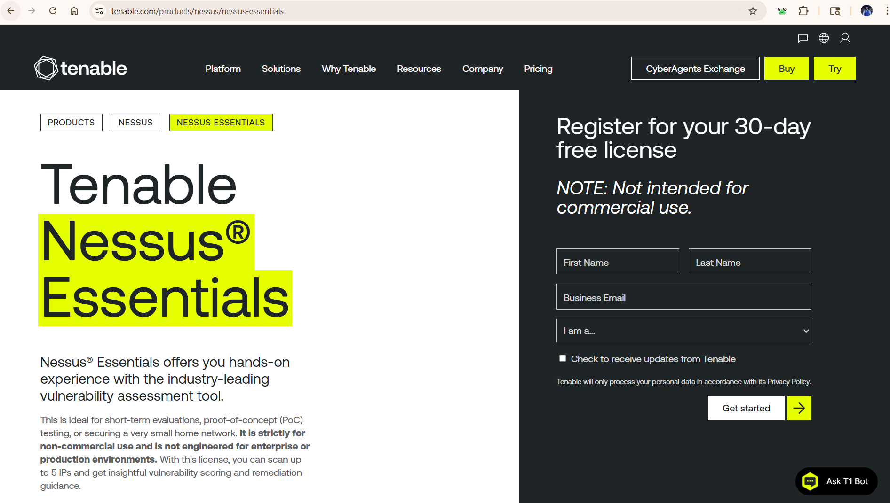
*Figure 19.1: Tenable's own page on 2026-09-08: a 30-day licence, not for commercial use, scanning up to 5 IPs. The decision rests on the vendor's current terms, not on older write-ups.*

Two problems follow. Five addresses cannot cover an estate of nine hosts, and coverage is the point of vulnerability management. And a licence that expires in a month cannot support a remediation loop, which depends on scanning, fixing, and scanning again to show the finding closed.

Greenbone Community Edition has no target limit, no expiry, and is fully open source. Its supported deployment route is the Greenbone Community Containers under Docker Compose, which is what runs on SCAN01. Tenable interface familiarity, if a particular role asks for it, is an afternoon on a trial licence and not worth structuring the lab around.

## 3. SCAN01: a VM, because it is a Tier 0 asset

| Property | Value |
|---|---|
| Proxmox guest | VM 104, originally named `NESSUS01`, renamed `SCAN01` when the tool changed |
| Segment | VLAN 20 (BlueTeam). Installed on DHCP at `192.168.20.50`, then cut over to static `192.168.20.3` with netplan |
| Operating system | Ubuntu 26.04 LTS |
| Resources | 2 vCPU, 8 GB RAM (built with 4 GB, raised for Greenbone), 100 GB virtual disk (see 4.1) |
| Web interface | Ports 443 and 9392 bound to `192.168.20.3` explicitly, not `0.0.0.0` |

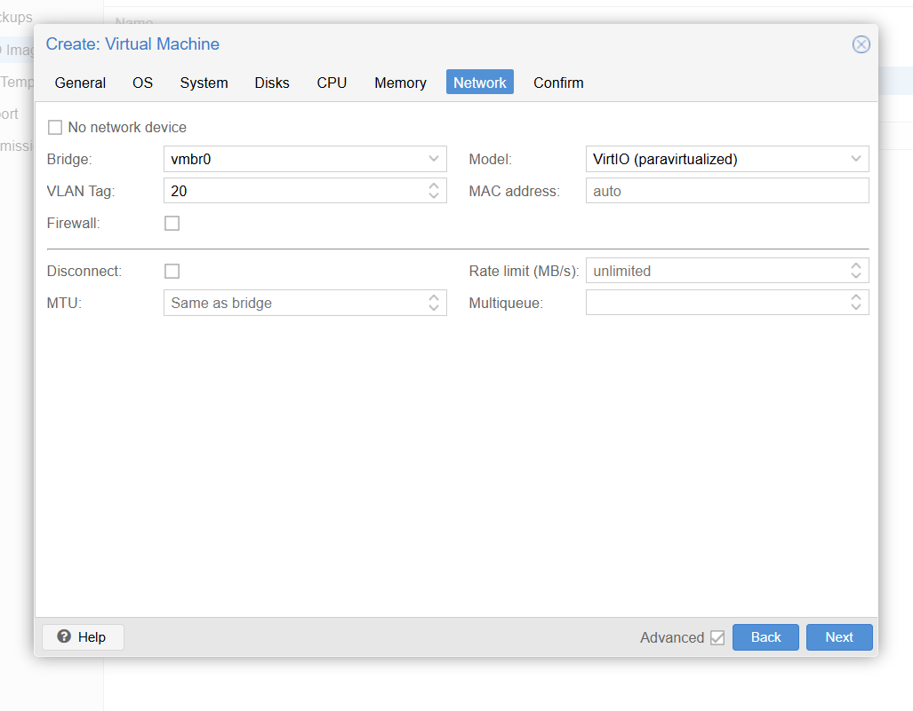
*Figure 19.2: The VM's network interface at creation: bridge `vmbr0`, VLAN tag 20. The guest is placed on the BlueTeam segment by the hypervisor, not by anything the guest itself configures.*

The lab's placement rule (`docs/14` section 4) runs Linux services as LXC containers by default. SCAN01 is the exception, because a scanner is a **Tier 0 asset**: it stores administrative credentials for every host it scans, so compromising it yields the estate. A VM gives it a hardware isolation boundary rather than a shared kernel with other containers.

Two further decisions on the host:

- **The web interface is bound to one address.** The default compose file listens on localhost only. The fix is to name the interface the service should listen on, not to open it to every interface.
- **Membership of the `docker` group is equivalent to root** on this host, because any container can mount the host filesystem. On a Tier 0 machine that is recorded as a decision, not left as a convenience default.

The hostname follows the lab convention of naming roles, not products (`docs/14` section 5.1). The machine was named after Nessus and was wrong within hours; `SCAN01` stays correct through any future change of tool.

## 4. Deployment, and three failures worth recording

Docker came from the Ubuntu archive (`docker.io` 29.1.3 with the Compose v2 plugin). The compose file URL given in many guides, `docker-compose-22.4.yml`, now returns 404; Greenbone publishes the current file as `compose.yaml`. Its two published ports were rebound from `127.0.0.1` to `192.168.20.3` before the first start.

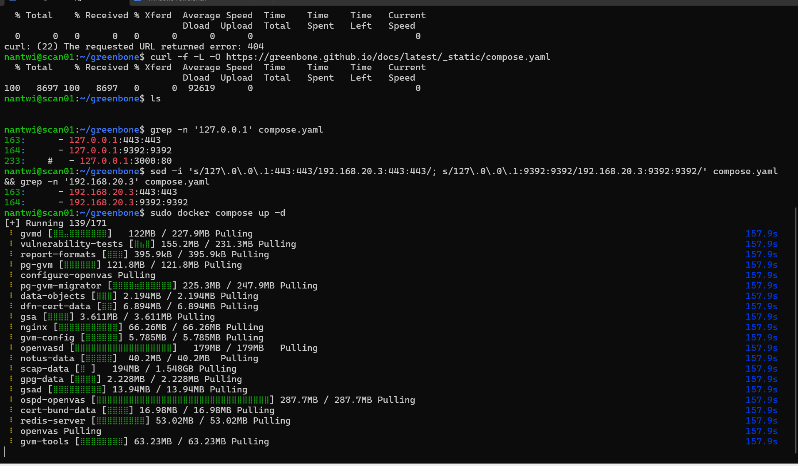
*Figure 19.3: The 404 on the old file name, the current `compose.yaml` fetched, ports 443 and 9392 rebound from localhost to the SCAN01 address with `sed`, verified with `grep`, and the first image pull under way.*

The containers deployed cleanly. Getting the feeds loaded did not. Each failure below was a different kind of problem, and each recovery kept the 11 GB of downloaded feed data intact.

### 4.1 The disk that was only half allocated

Ubuntu's installer, given a 60 GB disk with LVM, built a 58 GB volume group but created a logical volume of only **29 GB**, leaving the rest unallocated. That is the installer's default, not a fault. The Greenbone feeds filled the 29 GB to 100%.

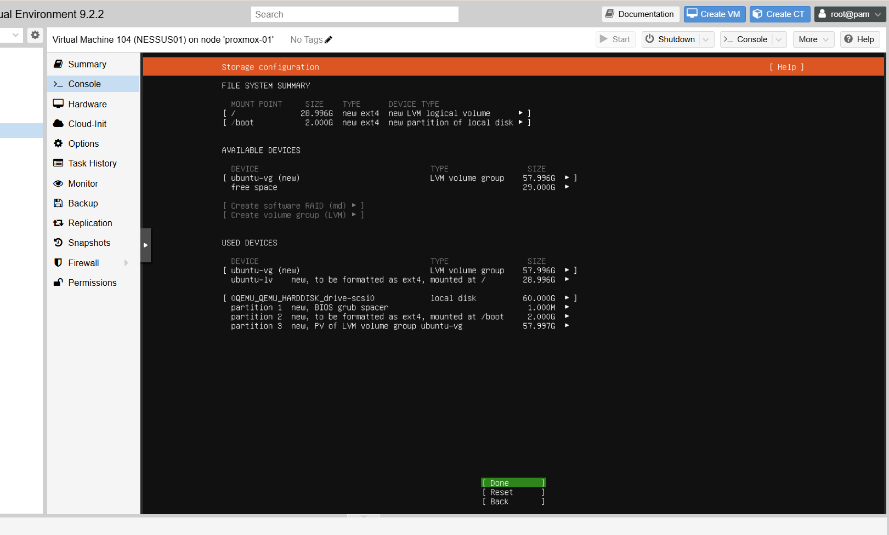
*Figure 19.4: The root cause, visible at install time: `/` on a 28.996 GB logical volume inside a 57.996 GB volume group, with 29 GB left free. Accepting the default here produced the disk-full failure a day later.*

Extending the volume taught a precise lesson. `lvextend` printed that the volume had changed from 29 GB to 58 GB, then failed a side task, writing its metadata backup to `/etc/lvm/archive`, because the disk had zero bytes free. On that failure LVM rolled the whole change back. The success message described the intent, not the result; `lvs` still reported 29 GB. Running the extend with automatic metadata backup turned off, `lvextend -A n -l +100%FREE`, succeeded, and `resize2fs` then grew the filesystem into the space.

During the overnight feed load the disk filled again, to **96%** with 2.7 GB free.

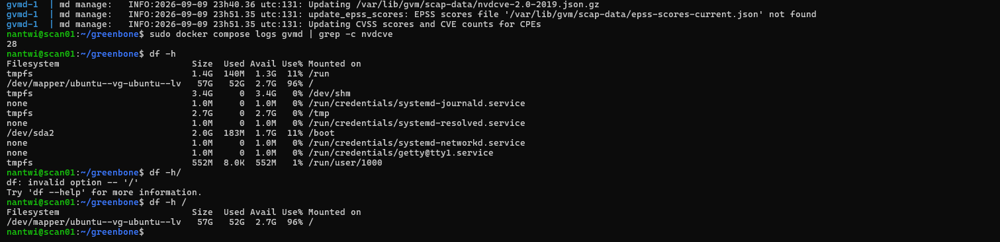
*Figure 19.5: SCAP loading its 28th CVE year file while the root volume stood at 52 GB of 57 GB. The same condition had corrupted the database the first time (4.2), so the extend happened before it filled.*

This time the virtual disk itself was grown in Proxmox to 100 GB and the change carried up through every layer:

```bash
sudo growpart /dev/sda 3                          # partition fills the larger disk
sudo pvresize /dev/sda3                           # LVM physical volume notices
sudo lvextend -l +100%FREE /dev/ubuntu-vg/ubuntu-lv
sudo resize2fs /dev/ubuntu-vg/ubuntu-lv           # filesystem grows, online
```

Result: **97 GB, 57% used**. The finished installation uses about 52 GB.

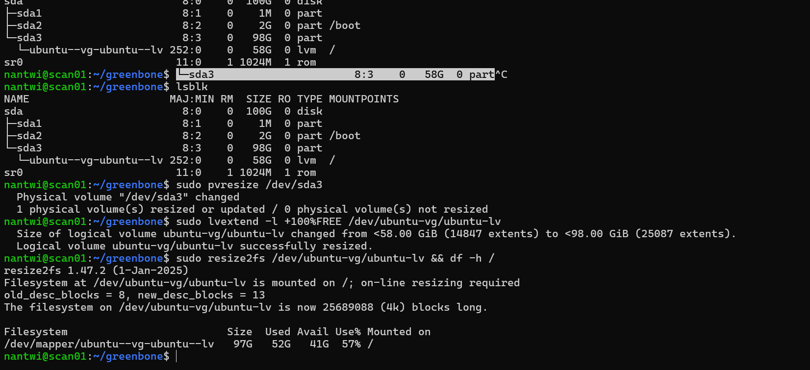
*Figure 19.6: Each layer confirmed in turn: `lsblk` showing the 100 GB disk and 98 GB partition, `pvresize`, `lvextend` from 58 GB to 98 GB, an online `resize2fs`, and `df` reporting 97 GB with 41 GB free. Done with the containers running and SCAP still loading.* The second extend did not need `-A n`, because 2.7 GB free was enough room for LVM to write its archive. Same command, different outcome, for a reason worth understanding.

### 4.2 The half-written database

When the disk first hit 100%, Postgres was part way through initialising its data directory. After the extend, the database migrator container failed on every start:

```
pg-gvm-migrator-1  | Detected current major: 13
pg-gvm-migrator-1  | Target major: 17
pg-gvm-migrator-1  | ERROR: could not start old cluster 13 for recovery.
pg-gvm-migrator-1  | but could not open file "/var/lib/postgresql/13/main/global/pg_control": No such file or directory
```

Because Greenbone's compose file starts each service only when its dependencies are healthy, the migrator's failure left `pg-gvm`, `gvmd`, `gsad` and `nginx` sitting at `Created`, never started. One broken piece of storage stopped the whole product.

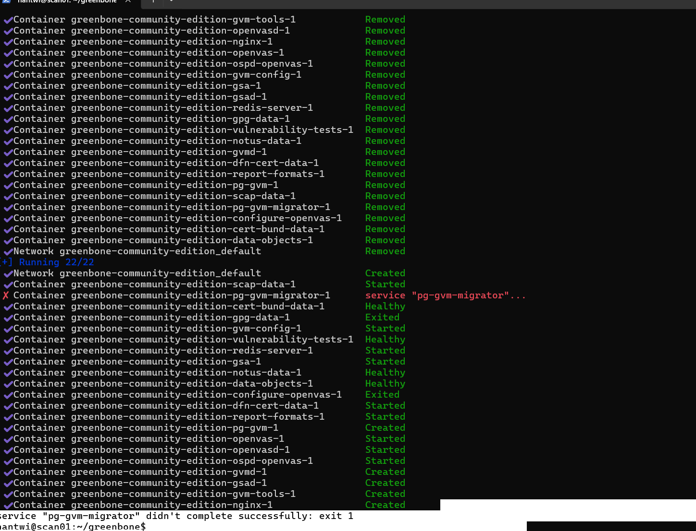
*Figure 19.7: A full restart that changes nothing: the migrator fails, and `pg-gvm`, `gvmd`, `gsad`, `gvm-tools` and `nginx` stay at `Created`. Restarting could not fix a fault that lived in storage, not in a container.*

The fix was to delete the broken volume and nothing else. Sizes were measured first, so the decision rested on evidence:

| Volume | Size | Decision |
|---|---|---|
| `scap_data_vol` | 10.02 GB | Keep |
| `notus_data_vol` | 715 MB | Keep |
| `vt_data_vol` | 502.7 MB | Keep |
| `cert_data_vol` | 179.6 MB | Keep |
| `psql_data_vol` | 82 MB | **Delete** |

82 MB is the size of an empty Postgres catalogue, and `gvmd_data_vol` at 0 bytes confirmed the manager had never run. The volume was removed by name with `docker volume rm`. `docker volume prune` was deliberately not used, because it removes every unused volume, which at that moment included all the feeds. On the next `docker compose up -d` the migrator found no old cluster, initialised PostgreSQL 17, and Compose reported all 23 services started.

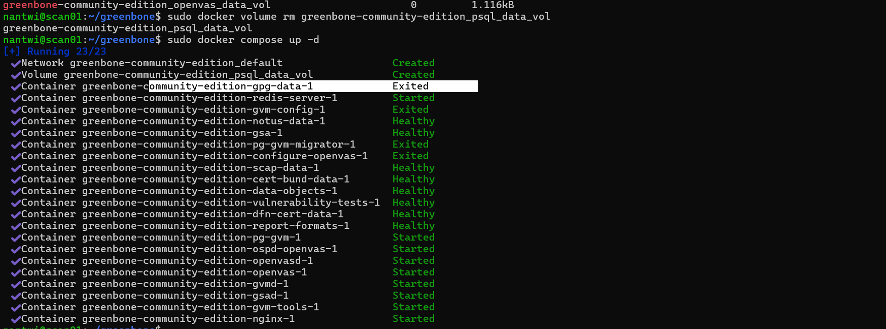
*Figure 19.8: The single named volume removed, then `Running 23/23`: a fresh database volume created, the migrator exiting cleanly, and every previously blocked service started.*

Because the database was new, the web administrator's password had to be set again. `gvmd` takes the password as a command-line argument, so it appears on screen and in shell history; the capture of that step is deliberately excluded from this evidence set.

Two things this made visible about containers: `docker compose down` removes containers but not named volumes, which is why the feeds survived it twice; and some containers are jobs rather than services, so `Exited` with code 0 is success for the migrator.

### 4.3 The manager that crashed when the interface was used

Opening the web interface while the SCAP feed was loading crashed `gvmd`:

```
sql_exec_internal: constraint violation: ERROR: duplicate key value violates unique constraint "settings_uuid_owner_key"
```

The manager tried to insert a user setting that already existed, Postgres rejected it, and `gvmd` treats a SQL constraint error as fatal. Docker restarted the container, which resumed from the volumes and cleared stale feed-lock flags left by the abort. The operating rule since: **stay out of the web interface until the feeds report Current.**

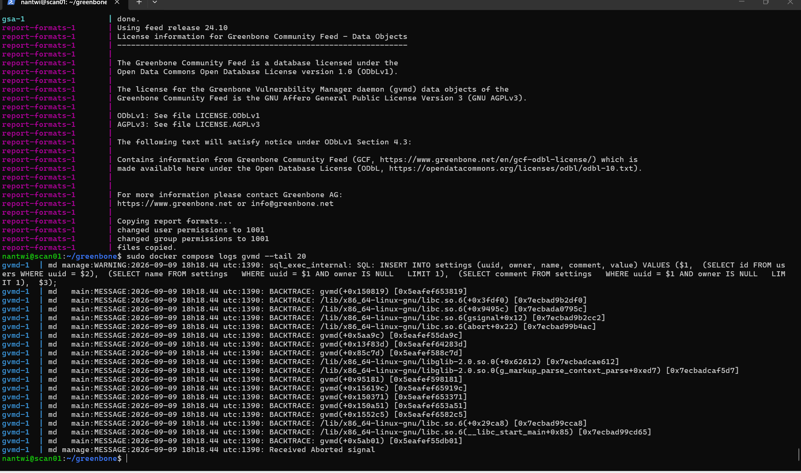
*Figure 19.9: The rejected `INSERT INTO settings` at 18:18:44 UTC, the backtrace, and `Received Aborted signal`. A constraint error handled as fatal, triggered by the interface, not by the feed.*

### 4.4 Feed status

| Feed | State |
|---|---|
| NVT (vulnerability tests) | **186,567 tests loaded**, 2026-09-09 18:39 UTC |
| CERT advisories | Loaded |
| SCAP (CVE and CPE data, about 10 GB) | Loaded, confirmed 2026-09-11 |
| GVMD_DATA (scan configs, port lists) | Loaded, confirmed 2026-09-11 |

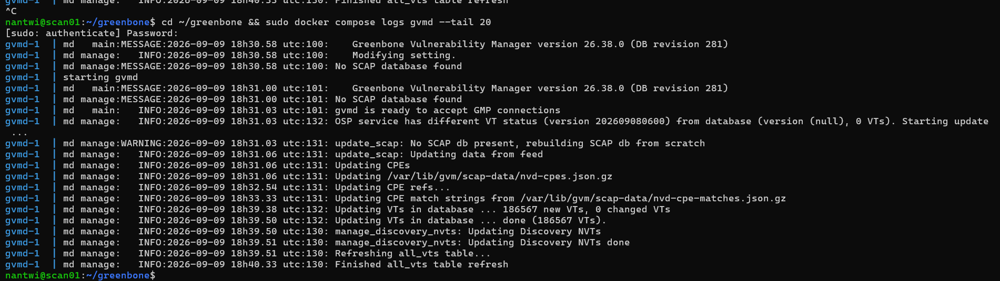
*Figure 19.10: Greenbone Vulnerability Manager 26.38.0 ready for connections at 18:31 UTC, rebuilding SCAP from scratch, then `186567 new VTs` and the `all_vts` refresh complete at 18:40. This is the moment the scanner became capable of scanning.*

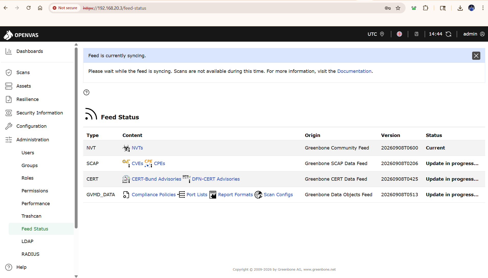
*Figure 19.11: Feed Status on `https://192.168.20.3`: NVT Current, the other three still updating, and scans disabled until they finish. The browser's bookmarks bar has been blanked in this capture.*

The initial load took about four hours on 2 vCPU and 8 GB, bound by disk I/O rather than CPU.

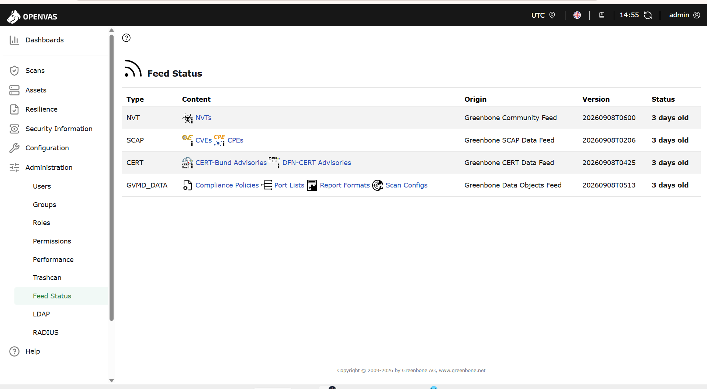
*Figure 19.12: Feed Status on 2026-09-11, 14:55 UTC: all four feeds loaded, no sync running, and scanning available. "3 days old" is the age of the feed release dated 2026-09-08, not a fault.*

**What "3 days old" means.** The status column reports the age of the feed data, not the state of the load. In the Community Containers the feed does not update itself: each feed ships as a data container image, and newer data arrives only when those images are pulled and the containers restarted.

```bash
cd ~/greenbone
sudo docker compose pull notus-data vulnerability-tests scap-data dfn-cert-data cert-bund-data report-formats data-objects
sudo docker compose up -d notus-data vulnerability-tests scap-data dfn-cert-data cert-bund-data report-formats data-objects
```

Every refresh makes `gvmd` reload the changed data, which on this disk means hours of I/O, so refreshes are scheduled rather than run ad hoc: weekly, outside scan windows, and never while the interface is in use (4.3). A scanner running week-old vulnerability tests misses what was published since, which is why the refresh cadence belongs in the chapter's control story (`RA-5(2)`, update vulnerabilities to be scanned).

A Proxmox snapshot named `greenbone-feeds-loaded`, including RAM, was taken on 2026-09-11 at 14:31, so the four-hour initial load never has to be repeated.

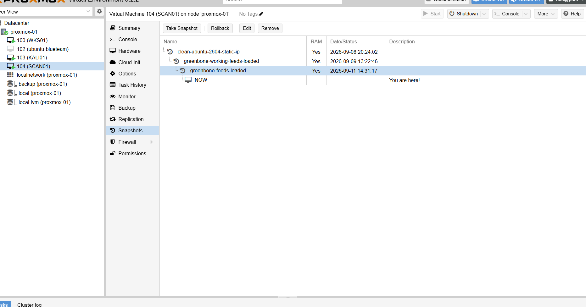
*Figure 19.13: SCAN01's snapshot chain: the clean static-IP install, the first working state on 2026-09-09, and `greenbone-feeds-loaded` with all four feeds in place. A rollback point for every stage that took hours to reach.*

## 5. The scan identity

### 5.1 The design question

Greenbone can inspect a Windows machine from outside, or log in and inspect it from inside. Logging in is what turns "port 445 is open" into "this machine is missing a specific update". Reading the registry, installed software and patch level remotely requires membership of the target's local **Administrators** group.

So the question is how to give a scanner administrative rights inside many machines without giving it any power over the domain. NIST SP 800-53 has a control written for exactly this: **`RA-5(5)`, privileged access for vulnerability scanning**. The answer built here is a chain of four pieces, each doing one job.

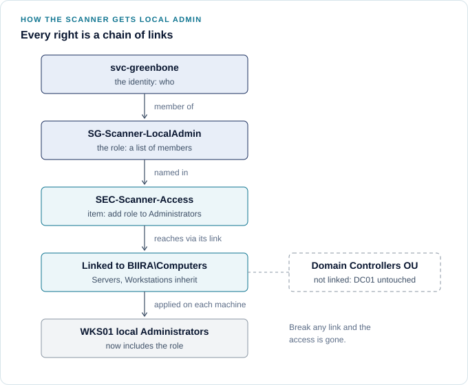
*Figure 19.14: The four pieces and how each passes the right to the next. The Domain Controllers OU sits outside the link, so DC01 is never in scope.*

The scanner's access exists only while every link holds. Remove the account from the group, the group from Administrators, or the machine from scope, and the access is gone. That is the property a reviewer should look for in any privileged grant.

At scan time the chain is used in four steps. The account is never checked against a list of approved scanners; the machine only asks the domain who is connecting and whether that identity's groups appear in its own Administrators group.

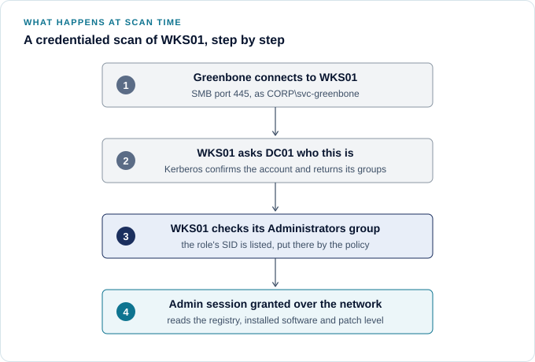
*Figure 19.15: What happens when Greenbone scans WKS01. Step 3 is where the policy's work pays off: the role's SID is in the local Administrators group because the policy put it there.*

### 5.2 The account: `svc-greenbone`

A non-human identity: an account belonging to software, with one purpose and a named human owner. Created 2026-09-09 in `OU=ServiceAccounts,OU=Users,OU=BIIRA`.

| Setting | Value | Why |
|---|---|---|
| User must change password at next logon | Off | The scanner cannot answer an interactive prompt. Left on, every scan fails with a logon error that says nothing about the cause |
| User cannot change password | **On** | A service account never rotates its own credential. If it did, Greenbone's stored copy would go stale, and an attacker holding the credential could lock the owner out |
| Password never expires | **On** | Chosen for availability: a scan credential that expires silently stops scanning. Recorded as a debt under `CA-5`, closed when VAULT01 issues short-lived credentials (section 7) |
| Account is sensitive and cannot be delegated | **On** | This account authenticates to nearly every member host. Kerberos delegation would let a compromised host reuse its ticket to reach other systems as the scanner. The flag tells the domain controller never to permit that |
| Description | Purpose, the group that grants its rights, and the owner | An account nobody can explain is an account nobody dares remove. `AC-2`, `CM-8` |

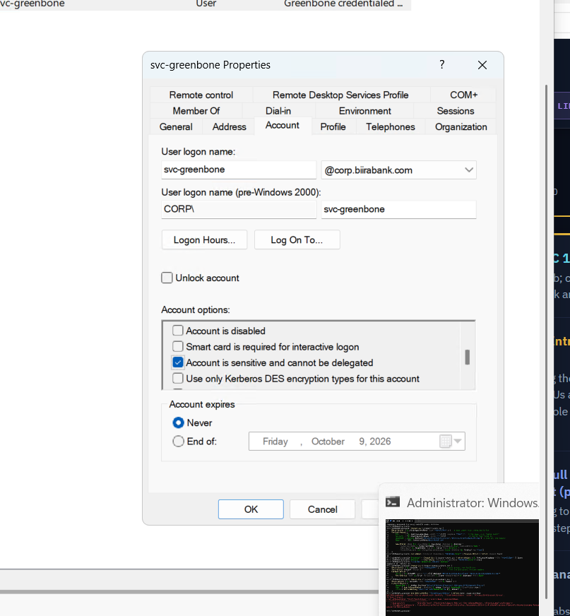
*Figure 19.16: "Account is sensitive and cannot be delegated" set on the Account tab. The most important flag on this account, and one the creation wizard does not offer.*

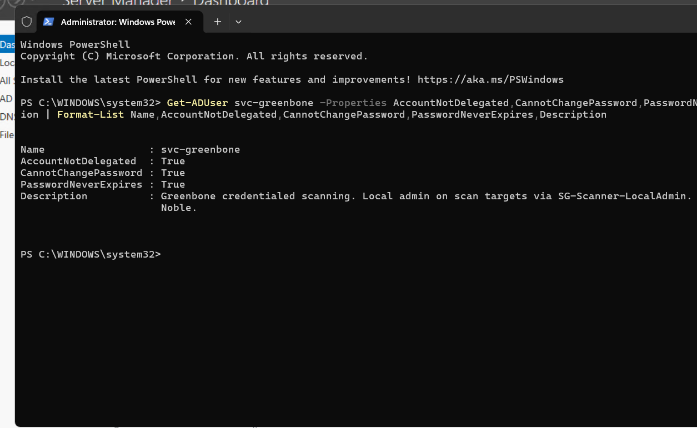
*Figure 19.17: The settings read back from the directory rather than assumed: `AccountNotDelegated`, `CannotChangePassword` and `PasswordNeverExpires` all True, and the description naming purpose, granting group and owner.*

**Why a domain account, not a local account on each host.** Three reasons. A domain account is disabled, audited or rotated once, for every machine at the same moment. A local "scanner" account with the same password on every host is the classic lateral-movement setup: take the password hash from one machine and log in to all of them, which is the problem Microsoft's LAPS exists to solve. And Windows **UAC remote restrictions** filter the administrative token of *local* accounts connecting over the network, but not of domain accounts, so a local account could not scan properly without first weakening a security setting.

### 5.3 The role: `SG-Scanner-LocalAdmin`

A Global security group in `OU=SecurityGroups,OU=Groups,OU=BIIRA`, created 2026-09-09 with `svc-greenbone` as its only member.

Rights are granted to groups, never directly to accounts. The group can change its membership without the policy changing: when VAULT01 issues scanner accounts, or a second scanner is added, only the member list moves. The question "who can do this?" is answered by reading one list. And the name states what it grants: `SG` security group, `Scanner` who it is for, `LocalAdmin` what it confers.

The group grants nothing by itself. It is a list of members, and it only carries power because the policy in section 6 names it. Global scope follows Microsoft's standard pattern of accounts in Global groups, and Global groups placed in the group that sits on the resource. Here the resource-side group is each machine's own local Administrators group.

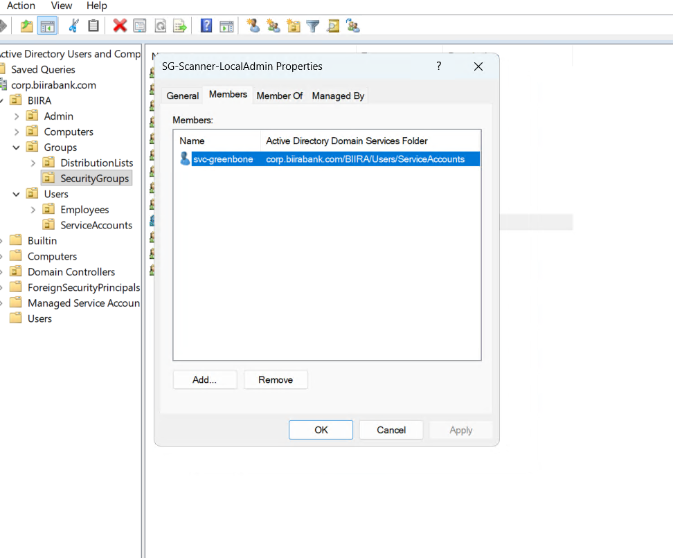
*Figure 19.18: `SG-Scanner-LocalAdmin` with exactly one member, `svc-greenbone`, from the ServiceAccounts OU.*

## 6. Delivering the right: the `SEC-Scanner-Access` policy

Each Windows machine keeps its own local account database, which Active Directory cannot edit directly. A Group Policy object is how one instruction, written centrally, is carried out by every machine on itself.

### 6.1 Scope: domain controllers are excluded by design

The policy is linked to `OU=Computers,OU=BIIRA`, whose `Servers` and `Workstations` OUs inherit it. It is not linked at the domain root, and never to the `Domain Controllers` OU.

The reason is what "local Administrators" means on each kind of machine. On a member server it governs that one machine. A domain controller has no local account database: its Administrators group is the domain's built-in Administrators, which is effectively control of the forest. The same instruction that makes the scanner an administrator of APP01 would, on DC01, make a never-expiring credential stored in a scanner's database one of the most privileged objects in the directory. Because DC01 lives in a separate container from the member OUs, linking to `BIIRA\Computers` excludes it structurally rather than by luck.

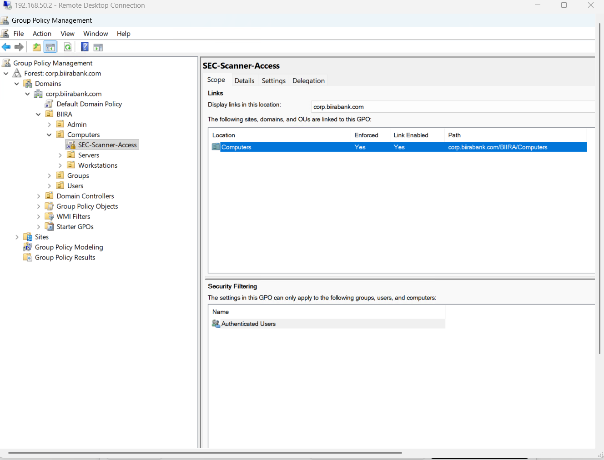
*Figure 19.19: `SEC-Scanner-Access` linked at `corp.biirabank.com/BIIRA/Computers` only, with Authenticated Users as the security filter. The `Domain Controllers` OU sits outside the link. The link shows Enforced, which 6.5 records for correction.*

There is a second layer behind the first. The Group Policy Preferences extension used below does not process on domain controllers at all, because they have no local groups. It is not relied on, because the logon-rights settings still to be added to this same policy are ordinary security policy and *would* apply to a domain controller. Where the policy is linked is the control.

That leaves the honest question of vulnerability coverage for DC01. There is no clean least-privilege answer to credentialed scanning of a domain controller, and the lab does not pretend otherwise. It is covered in layers instead:

- an **unauthenticated Greenbone scan**, which still finds exposed services, weak TLS and patches that announce themselves on the wire;
- **Wazuh Security Configuration Assessment**, already running on DC01, which performs CIS benchmark checks locally through an agent that already has the access, so no new privilege is created (`docs/16`);
- a **separate, vaulted account** later, if full credentialed scanning of domain controllers becomes a requirement, used only in a scheduled window with an alert on every use.

### 6.2 The membership item

Configured under *Computer Configuration, Preferences, Control Panel Settings, Local Users and Groups*, as a Local Group item.

| Field | Value | Why |
|---|---|---|
| Action | Update | Adds the specified member and leaves every other member alone. *Replace* deletes and rebuilds the group; *Create* acts only if the group is missing |
| Group name | Administrators (built-in), chosen from the list | Stores the well-known SID `S-1-5-32-544`, identical on every Windows installation in any language. A typed name breaks on a non-English build |
| Delete all member users / groups | Both clear | Ticking either removes every existing administrator on every machine in scope, the failure mode of the older Restricted Groups mechanism |
| Member | `CORP\SG-Scanner-LocalAdmin`, Add to this group | Selected by browsing, so the editor resolved and stored the group's SID. Renaming the group later would not break the policy |
| Remove this item when it is no longer applied | No | Ticking it silently switches the action to *Replace*. Its consequence for retirement is covered in 6.4 |

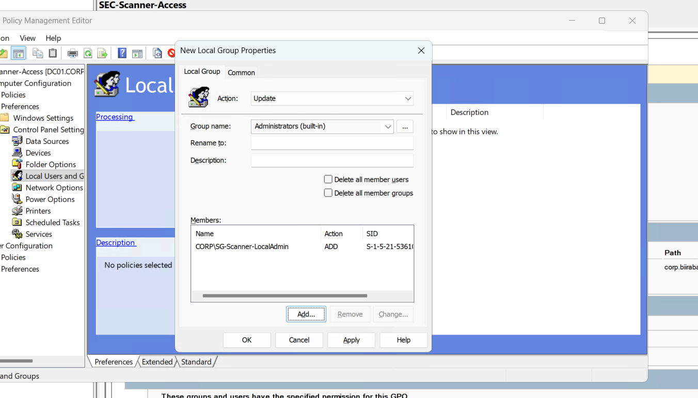
*Figure 19.20: The item as built: action Update, Administrators (built-in), both delete boxes clear, and the member stored with its SID. The single clearest piece of evidence for the least-privilege grant.*

Preferences are used rather than Restricted Groups because Preferences can **add** a member. Restricted Groups replaces the whole membership list, which on a real estate removes administrators nobody meant to remove.

Machines in scope read the policy at startup and roughly every 90 minutes. If the entry is removed by hand, the next refresh restores it, which is what central enforcement of a configuration setting means in practice (`CM-6`).

### 6.3 Finding: the OU the policy targets was empty

Before building further, the directory was checked for the machines the policy would reach:

```powershell
Get-ADComputer -Filter * | Select-Object Name, DistinguishedName
```

It returned **one computer, DC01**. Every member machine had been joined to the retired forest and lost its membership in the 2026-09-07 migration (`docs/17`), and none had rejoined. The policy was linked correctly and applied to nothing, silently. A policy is only a control once it is proven on a real machine.

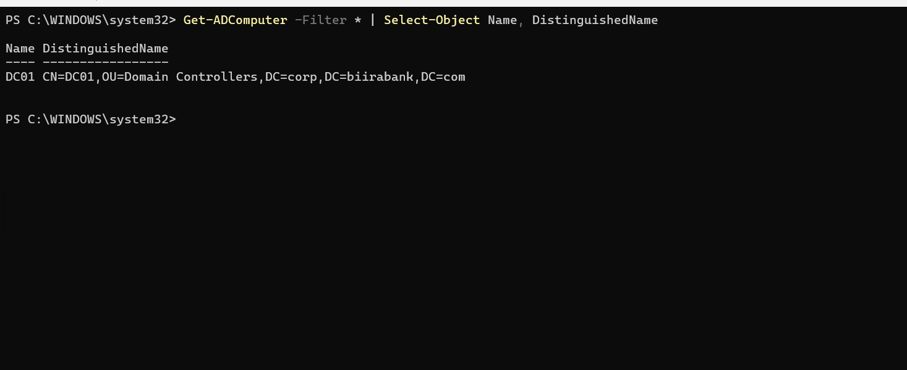
*Figure 19.21: `Get-ADComputer` on 2026-09-11 returns one object, DC01 in the Domain Controllers OU. The policy's target OU held no computers.*

The first member, `WKS01`, was **pre-staged**: its computer account was created in the target OU before the machine joins.

```powershell
New-ADComputer -Name "WKS01" -Path "OU=Workstations,OU=Computers,OU=BIIRA,DC=corp,DC=biirabank,DC=com"
```

At join time the domain controller looks for an existing computer account with the joining machine's name. If it finds one it uses it, wherever it sits; if not, it creates one in the default `CN=Computers` container, which is a container rather than an OU and cannot receive a policy link. Two consequences follow. The machine must be named `WKS01` before or during the join, since a fresh install's `DESKTOP-` name would miss the reserved account and land in the default container. And the join must be performed by a Domain Admin: since Microsoft's 2022 domain-join hardening (KB5020276), reuse of an existing computer account is blocked unless the account's creator, or a member of Domain Admins, performs the join.

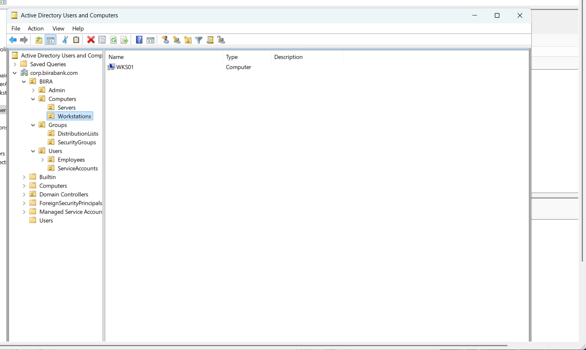
*Figure 19.22: The pre-staged `WKS01` computer account in `BIIRA\Computers\Workstations`, waiting for the machine to join. Inside the policy's scope from the moment the machine first boots on the domain.*

**Finding: the Enterprise LAN handed out public DNS.** Before joining, WKS01's network settings were checked. DHCP on VLAN 50 had given it an address, `192.168.50.56`, but DNS servers of `8.8.8.8` and `1.1.1.1` and a connection suffix of `duckdns.org`. A domain join finds its domain controller through DNS, so against public resolvers it cannot find `corp.biirabank.com` at all. Every Windows machine placed on the Enterprise LAN would have failed the same way.

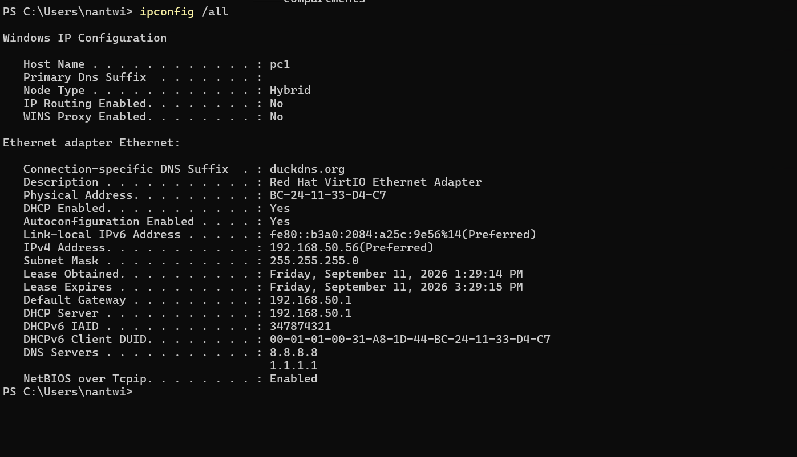
*Figure 19.23: WKS01 as DHCP configured it: public resolvers and a `duckdns.org` suffix. Correct for a home network, wrong for a domain member.*

For this machine the DNS server was set to DC01 directly, and the domain's own locator record was queried to prove the machine could now find a controller:

```powershell
Set-DnsClientServerAddress -InterfaceAlias "Ethernet" -ServerAddresses 192.168.50.2
Resolve-DnsName -Type SRV _ldap._tcp.dc._msdcs.corp.biirabank.com
```

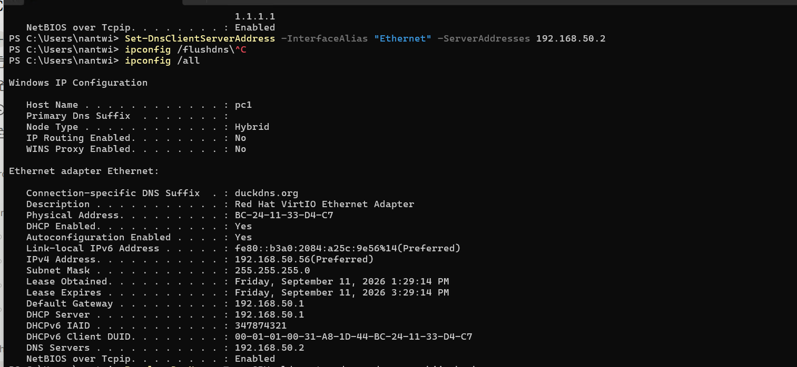
*Figure 19.24: The DNS server changed to `192.168.50.2` on the interface, confirmed in `ipconfig /all`.*

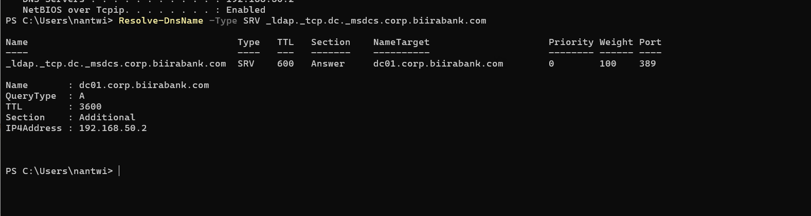
*Figure 19.25: The SRV record every domain join relies on, answered by DC01: `dc01.corp.biirabank.com` on port 389 at `192.168.50.2`. The pre-join test that separates a DNS problem from a credentials problem.*

The durable fix belongs in pfSense rather than on each machine: the VLAN 50 DHCP scope should hand out `192.168.50.2` as its DNS server and `corp.biirabank.com` as its domain, and WKS01 should receive a reserved address so a scan target does not move between scans. Tracked in section 7.

One misstep is worth recording. `New-ADComputer` was also tried on WKS01 and failed as an unrecognised command. It belongs to the Active Directory PowerShell module, which is part of RSAT and installed automatically on domain controllers only. It was not needed: the account had already been pre-staged on DC01. Installing RSAT on the workstation to make the command work would have been the wrong fix, because it places directory administration tools on a Tier 2 machine. Joining the domain needs no such tools. `Add-Computer` is built into Windows, and the domain controller does the work using the credentials supplied.

**The join.** The machine was renamed from `pc1` to `WKS01` first, then joined. The first three attempts failed with *Access is denied*.

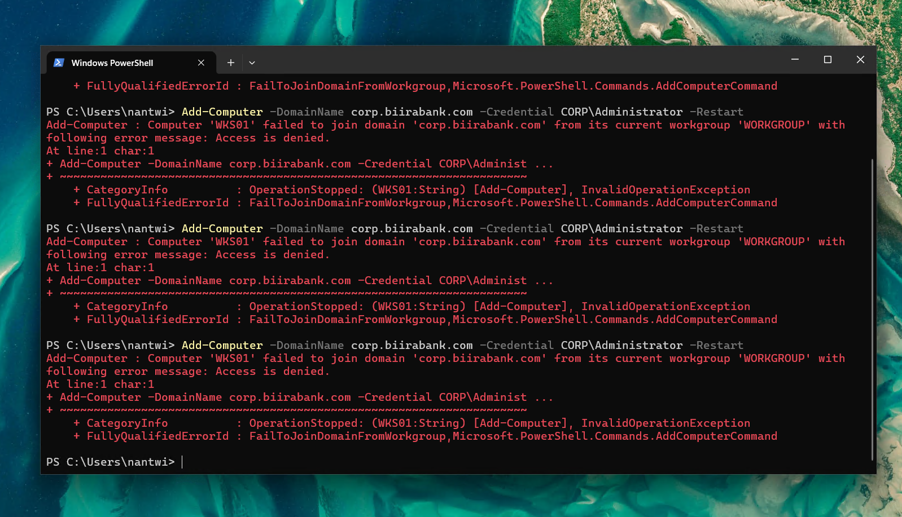
*Figure 19.26: Three identical refusals. Not a wrong password, which Windows reports as "The user name or password is incorrect", and not the account-reuse block, which has its own message. The window title shows the cause: a PowerShell session that is not elevated.*

A domain join needs two separate permissions. The domain must allow the supplied account to use the computer account, which `CORP\Administrator` satisfied. The local machine must allow the session to change its own membership, which requires an **elevated** administrator session. User Account Control runs even members of the local Administrators group with a filtered token until they elevate. The same mechanism, applied to network logons, is why section 5.2 uses a domain account for scanning rather than a local one. Run from an elevated session, the same command succeeded.

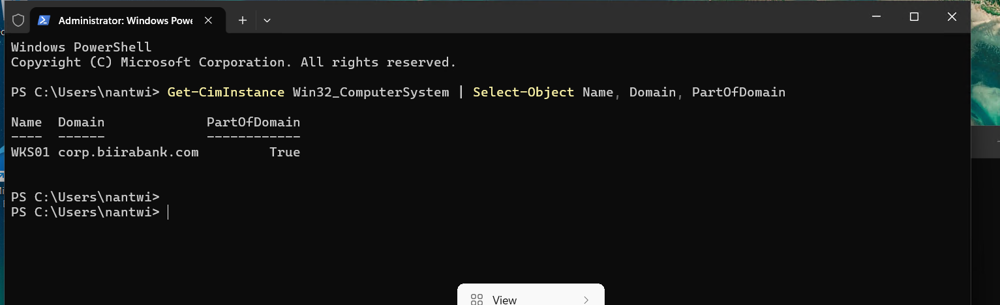
*Figure 19.27: From the workstation's side, in an elevated session: `WKS01`, domain `corp.biirabank.com`, `PartOfDomain` True.*

The directory gives an independent check. A pre-staged computer account that no machine has used has an empty `OperatingSystem` attribute; a machine writes its own version into its account after it joins. Queried before the join, the attribute was blank. Queried after:

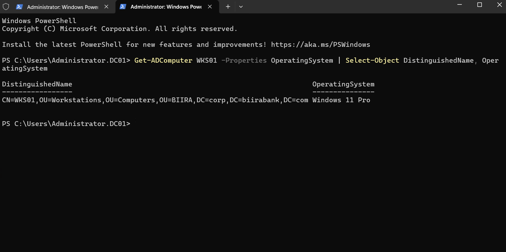
*Figure 19.28: The same account, still in `OU=Workstations`, now reporting `Windows 11 Pro`. Proof from the directory's side that the real machine took over the reserved account, rather than a second account appearing somewhere else.*

One exposure is recorded honestly. The join was authorised with `CORP\Administrator`, a Tier 0 credential, typed on a Tier 2 workstation. That is common in labs and wrong in the tiered model this estate claims (`docs/17` section 2): a compromised workstation could capture it. The fix is delegation, granting a Tier 2 group the right to join computers to the Workstations OU, and it belongs with the tier-enforcement work in the backlog.

### 6.4 Retiring the scanner

Because the membership item leaves its change behind when the policy stops applying, unlinking the policy does **not** remove the scanner's access. The group would remain in every machine's Administrators list, and any account later added to it would become an administrator everywhere. Retirement is therefore an ordered procedure:

1. **Disable `svc-greenbone`.** Every machine verifies the account with the domain controller at logon, so this single change stops all new access immediately.
2. **Delete the credential** from Greenbone.
3. **Change the item's member action** from *Add to this group* to *Remove from this group*, and leave it applied long enough for every machine to refresh. The mechanism that added the entry removes it.
4. **Then** unlink and delete the policy, and delete the account and group. In that order: deleting the group first leaves an unresolvable SID in every machine's Administrators list, which an auditor rightly flags as an unknown principal.

### 6.5 Housekeeping on the policy

Both items below were corrected on 2026-09-11.

- The link was created with **Enforced** set. This policy does not need to override lower policies or break through blocked inheritance, and an enforced link should always carry a justification. **Cleared.**
- The policy uses only Computer Configuration. Its status is now **User configuration settings disabled**, so machines skip the empty half and anyone reading the policy later can see the intent.

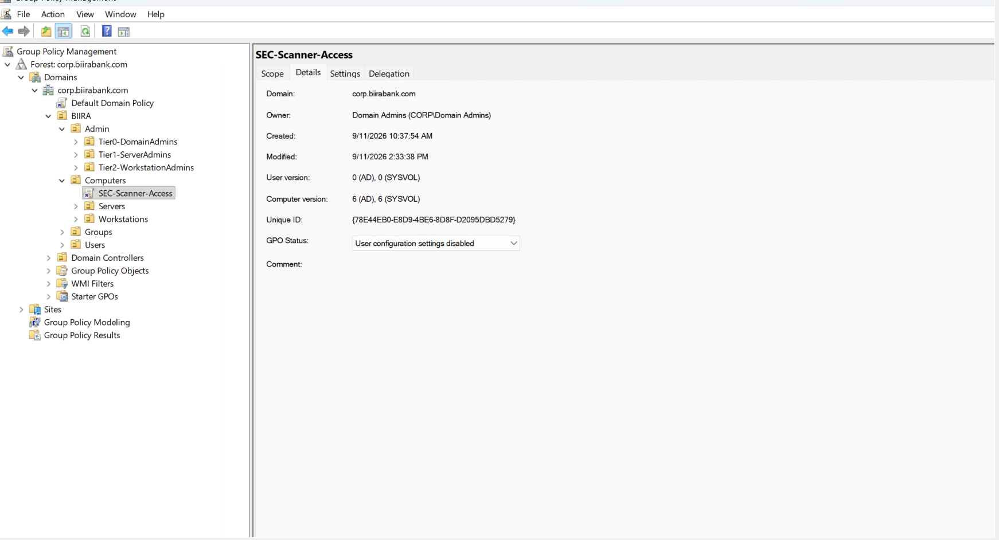
*Figure 19.29: User configuration disabled, and the computer version reading 6 in Active Directory and 6 in SYSVOL. A policy lives in two places, an object in the directory and a folder of files in SYSVOL, and matching numbers show the two halves agree. A mismatch is the first thing to check when a policy refuses to apply.*

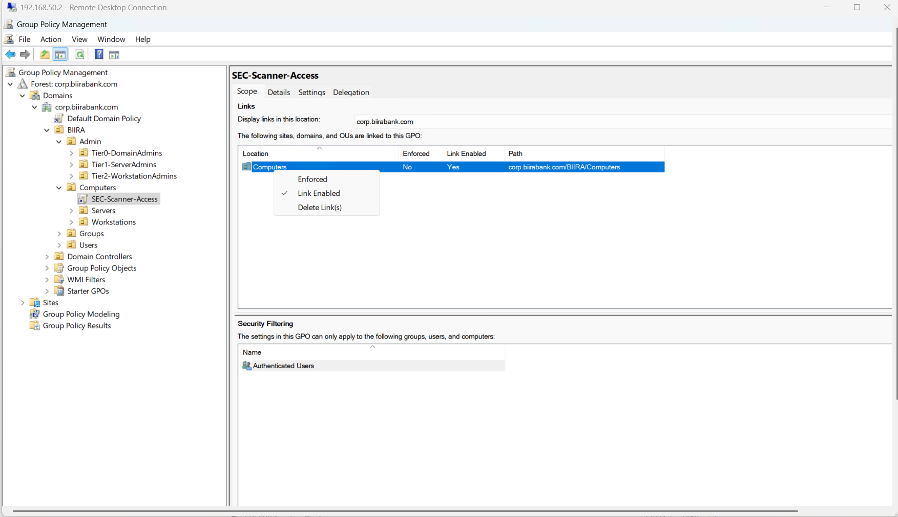
*Figure 19.30: The link on `BIIRA/Computers` with Enforced now No and the link still enabled.*

One lesson from getting here: the Settings tab in Group Policy Management is a report generated once and cached. Two captures taken hours apart both read "collected 10:39:46" with zero revisions, long after the item had been saved. Its "Data collected on" time must be checked, and the view refreshed, before a report is taken as evidence.

### 6.6 Proof on a real machine

Everything above shows intent: a policy configured correctly in a console. The control is proven only when a machine in scope reports that it received the policy and the resulting state is visible on that machine. Both were checked on WKS01 on 2026-09-11, from an elevated session.

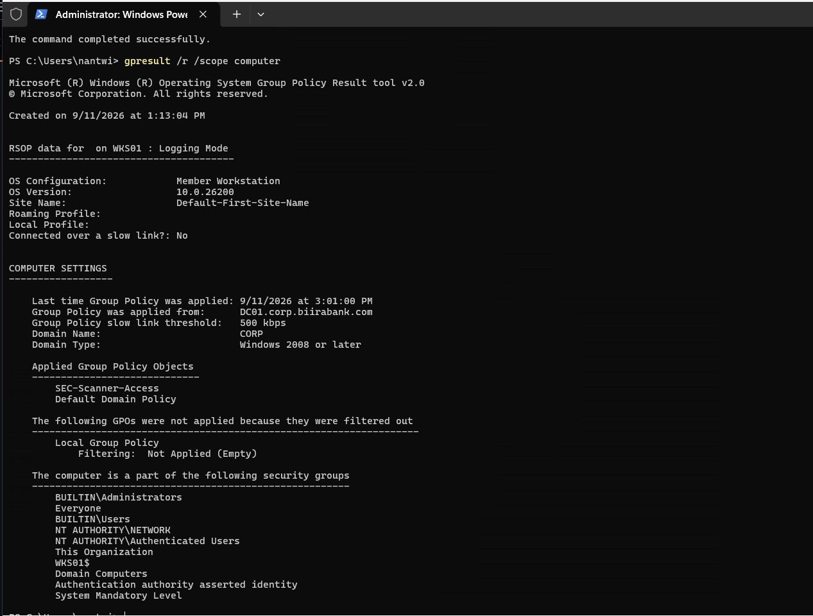
*Figure 19.31: WKS01's own account of its policy: a member workstation, policy applied from `DC01.corp.biirabank.com`, and `SEC-Scanner-Access` listed under Applied Group Policy Objects. `WKS01$` in its security groups is the machine's own computer account, the one pre-staged in 6.3.*

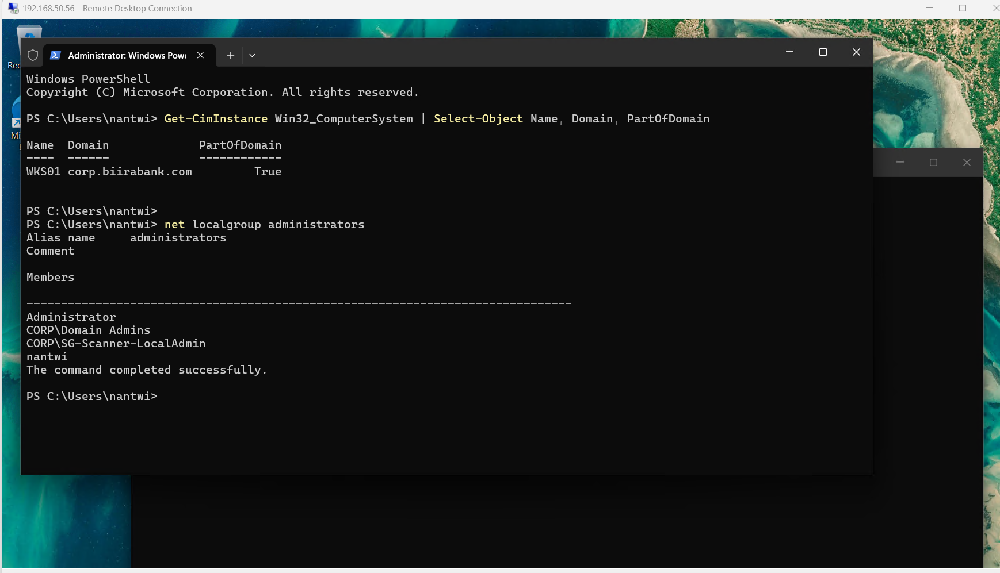
*Figure 19.32: The result, on the machine: `CORP\SG-Scanner-LocalAdmin` in the local Administrators group, placed there by the policy and not by hand. Through it, `svc-greenbone` is an administrator of WKS01 and of nothing it has not been scoped to.*

The list holds four entries, and one was not added by anyone in this lab. `CORP\Domain Admins` is inserted into every member's local Administrators group automatically at the moment of joining. That is how domain administrators manage every member machine, and it is the reason the tiered model exists: any Domain Admin who signs in to a workstation leaves a credential on it that controls the whole domain, so compromising one workstation where that happened compromises the forest. The standard countermeasure is to deny Domain Admins every kind of logon to member workstations and servers through Group Policy, as Microsoft's guidance on securing Active Directory administrative groups describes. It belongs with the tier-enforcement work in the backlog, alongside the delegated join right noted in 6.3.

The same session found WKS01 set to Pacific time, two hours behind the rest of the estate. Kerberos compares clocks in UTC, so the join was unaffected, but event times from different machines must line up once Wazuh collects them. WKS01 was set to Central time (`AU-8`, time stamps).

### 6.7 Logon rights: one door open

Membership makes the scanner an administrator on member machines, and an administrator may sign in to Windows in every way it offers. The scanner needs exactly one of them. Every sign-in answers two separate questions: whether the account is who it claims to be, which the domain controller settles by checking the password, and whether that account may sign in this way on this machine, which each machine settles from its own logon rights. A correct password still fails the second question if the door is closed.

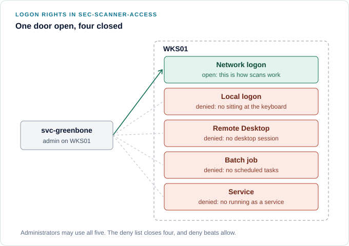
*Figure 19.33: The five ways an account can sign in to a Windows machine, and the four closed to the scan identity. Administrators are allowed all five; the deny list overrides four of them.*

The threat this addresses is the scanner's own credential. Its password is stored in Greenbone's database and does not expire, so the design assumes it leaks. Without logon restrictions, a stolen scanner credential is a console session, a Remote Desktop session, a scheduled task or a service on every member machine. With them, it is network access only.

| Right in `SEC-Scanner-Access` | Setting | Why |
|---|---|---|
| Deny log on locally | `Guests`, `CORP\SG-Scanner-LocalAdmin` | No console use of the scanner credential; `Guests` carried over from the machine's own list |
| Deny log on through Remote Desktop Services | `CORP\SG-Scanner-LocalAdmin` | No desktop session |
| Deny log on as a batch job | `CORP\SG-Scanner-LocalAdmin` | No scheduled task running as the scanner |
| Deny log on as a service | `CORP\SG-Scanner-LocalAdmin` | No service running as the scanner |
| Deny access to this computer from the network | **Not Defined** | The scanner's one working door, and the machine keeps its own entry |

Two rules decided the table. **Deny beats allow**, so the scanner keeps its administrator membership, which scanning requires, while losing every door it does not use. And **defining a right replaces it**: a User Rights Assignment setting in a policy becomes the machine's entire list for that right, while a right left Not Defined keeps the machine's own value. WKS01's existing deny rights were therefore read before anything was defined.

```powershell
secedit /export /areas USER_RIGHTS /cfg $env:TEMP\rights.inf
Select-String 'SeDeny' $env:TEMP\rights.inf
```

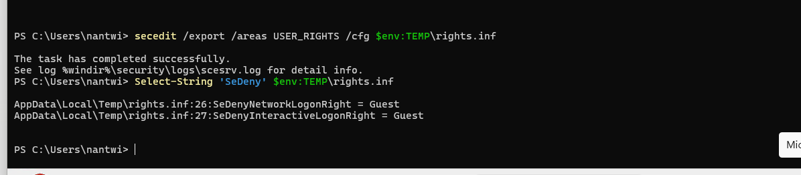
*Figure 19.34: WKS01 before the policy: two deny rights defined, both holding only `Guest`. Defining "Deny log on locally" with the scanner group alone would have silently removed that entry.*

The carried-over entry is the `Guests` group, not the `Guest` account. Searching the directory for it offers both, and they are not interchangeable. `Guest` is the domain's own guest account, a different object with a different SID from each machine's local Guest. `Guests` is the built-in group with the well-known SID `S-1-5-32-546`, identical on every Windows installation, which each machine resolves to its own local Guests group containing its own Guest account. The same reasoning chose *Administrators (built-in)* in 6.2.

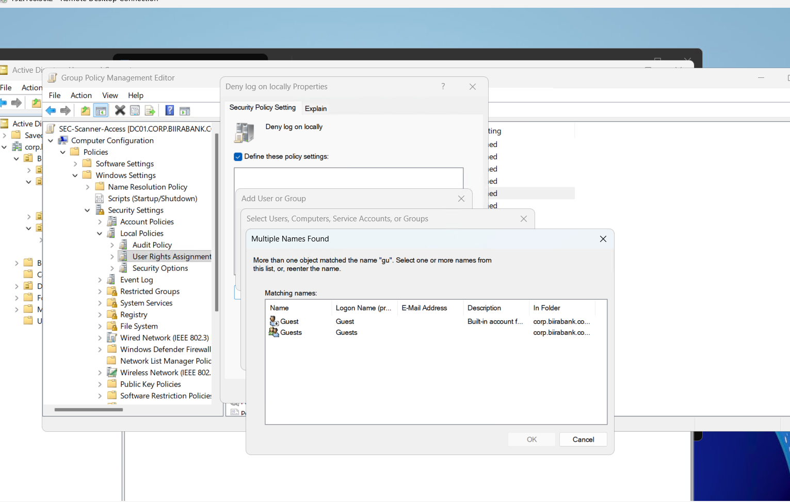
*Figure 19.35: Two matches for a partial name: the domain `Guest` account and the built-in `Guests` group. The group is the correct choice.*

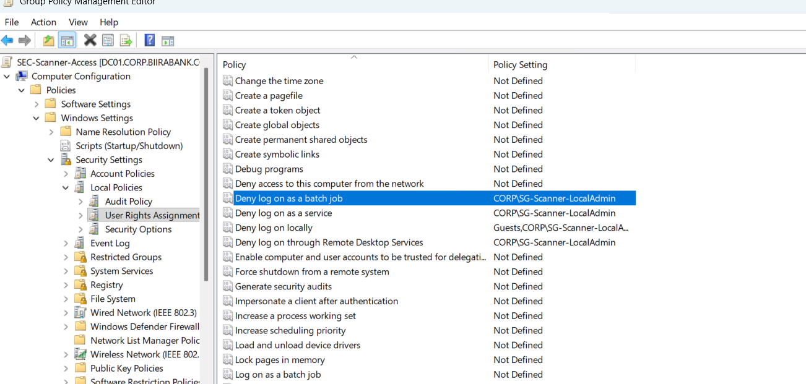
*Figure 19.36: The four deny rights defined, and "Deny access to this computer from the network" deliberately left Not Defined.*

The limit is stated plainly. An administrator arriving over the network can still do real damage, so these rights narrow a stolen credential rather than neutralise it. The remaining layers are alerting on any use of the account outside a scan window, and replacing its permanent password with short-lived credentials from VAULT01 (section 7).

## 7. Outstanding before the first credentialed scan

| Item | Detail | Control |
|---|---|---|
| Fix VLAN 50 DHCP | pfSense DHCP for the Enterprise LAN: DNS server `192.168.50.2`, domain `corp.biirabank.com`, and a static mapping for WKS01 | `CM-6`, `SC-22` |
| Prove logon rights on WKS01 | Configured 2026-09-11 (6.7). Re-export the deny rights after `gpupdate /force`, and show a Remote Desktop sign-in as `CORP\svc-greenbone` refused | `AC-6`, `AC-17` |
| Schedule feed refresh | Weekly pull of the feed data containers, outside scan windows | `RA-5(2)` |
| First scans | Credentialed against WKS01; unauthenticated against DC01, alongside its Wazuh SCA result | `RA-5`, `RA-5(5)` |
| BLUETEAM ruleset | Written from the traffic the scanner actually needs. A scanner has to cross every boundary the firewall exists to enforce | `SC-7`, `AC-4` |
| Monitor the identity | Wazuh alert on any `svc-greenbone` logon outside a scan window | `AU-6`, `AC-6(9)` |
| Close the password debt | VAULT01 issues a short-lived credential per scan, retiring *password never expires* | `IA-5`, `CA-5` |

## 8. Control mapping

| Control | How it is met here | Evidence |
|---|---|---|
| NIST SP 800-53 `RA-5` | Network scanner deployed with 186,567 vulnerability tests and all four feeds loaded | Section 4.4 |
| `RA-5(2)` Update vulnerabilities to be scanned | Feed refresh procedure defined; weekly schedule outstanding | 4.4, 7 |
| `RA-5(5)` Privileged access | A dedicated identity with administrative access to member systems only, granted through a group and a scoped policy | Figures in 5 and 6 |
| `AC-6`, `AC-6(5)` Least privilege | Local administrator on members, never Domain Admin; domain controllers excluded by the link | Section 6.1 |
| `AC-17` Remote access | Remote Desktop, console, batch and service logon denied to the scan identity; network logon only | 6.7 |
| `AC-2` Account management | Named owner and purpose on the account; retirement procedure defined | 5.2, 6.4 |
| `IA-5` with `CA-5` | Non-expiring password recorded as a tracked debt with a closure plan | 5.2, 7 |
| `CM-6` Configuration settings | Membership enforced centrally, restored at every refresh, and proven on WKS01 | 6.2, 6.6 |
| `CM-8` Inventory | SCAN01 classified and named by role; WKS01 pre-staged in its OU | 3, 6.3 |
| `CP-10` Recovery | Corrupted database rebuilt without losing 11 GB of feed data | 4.2 |
| CIS Controls v8 7.5 | Authenticated and unauthenticated internal scanning | 1, 7 |
| CIS Controls v8 5.4 | Administrative rights held by a dedicated account, not a general one | 5.2 |
| PCI DSS 11.3 | Internal vulnerability scanning with a remediation loop the licence can sustain | 2 |

## 9. Lessons

- **A success message describes intent; the system's own state is the truth.** `lvextend` said 58 GB while `lvs` said 29 GB.
- **Measure before deleting.** Sizing every volume turned "delete the database volume" from a guess into a certainty, and naming it avoided the prune that would have taken the feeds.
- **Rights go to groups, and every right should be explainable as a chain.** The scanner's access exists only while the account is in the group, the group is in Administrators, and the machine is in scope. Break any link and it is gone.
- **A policy linked to an empty OU is not a control.** Prove it on a real machine.
- **Preferences leave their changes behind.** Plan the removal when you plan the grant.
- **Deny beats allow, and defining a right replaces it.** Read the machine's current list before a policy overwrites it.
