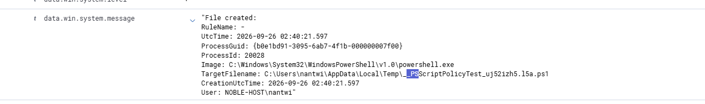
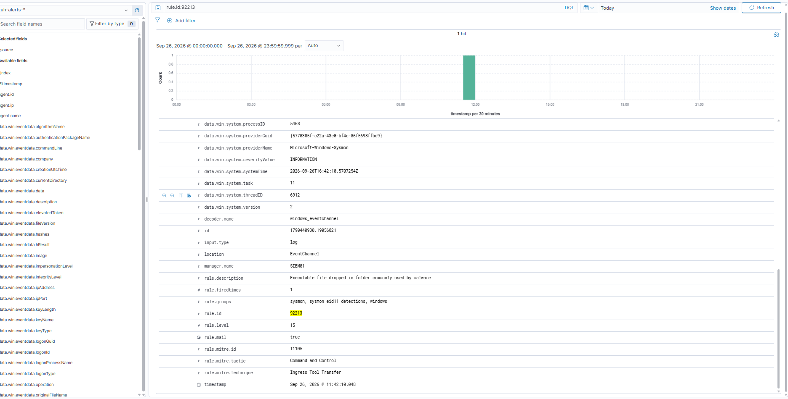
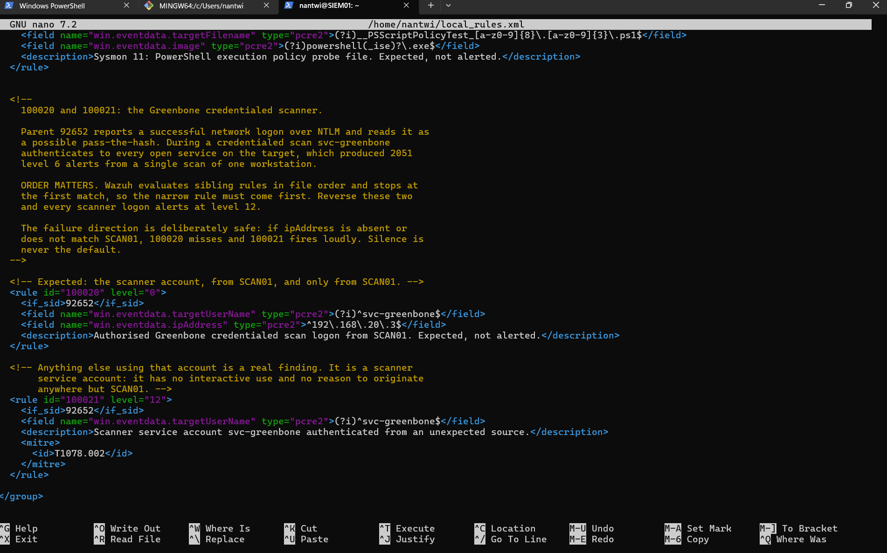
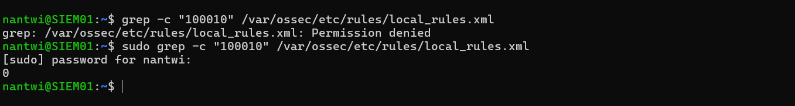
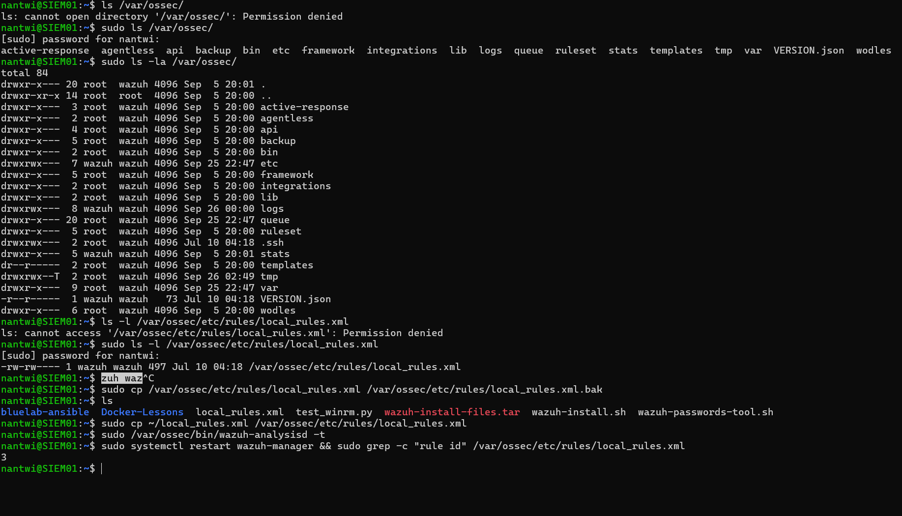
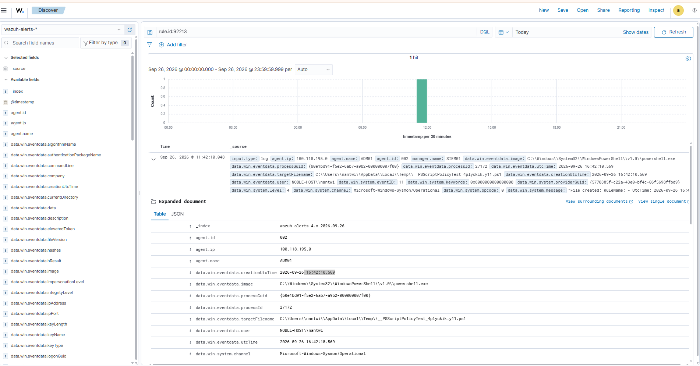
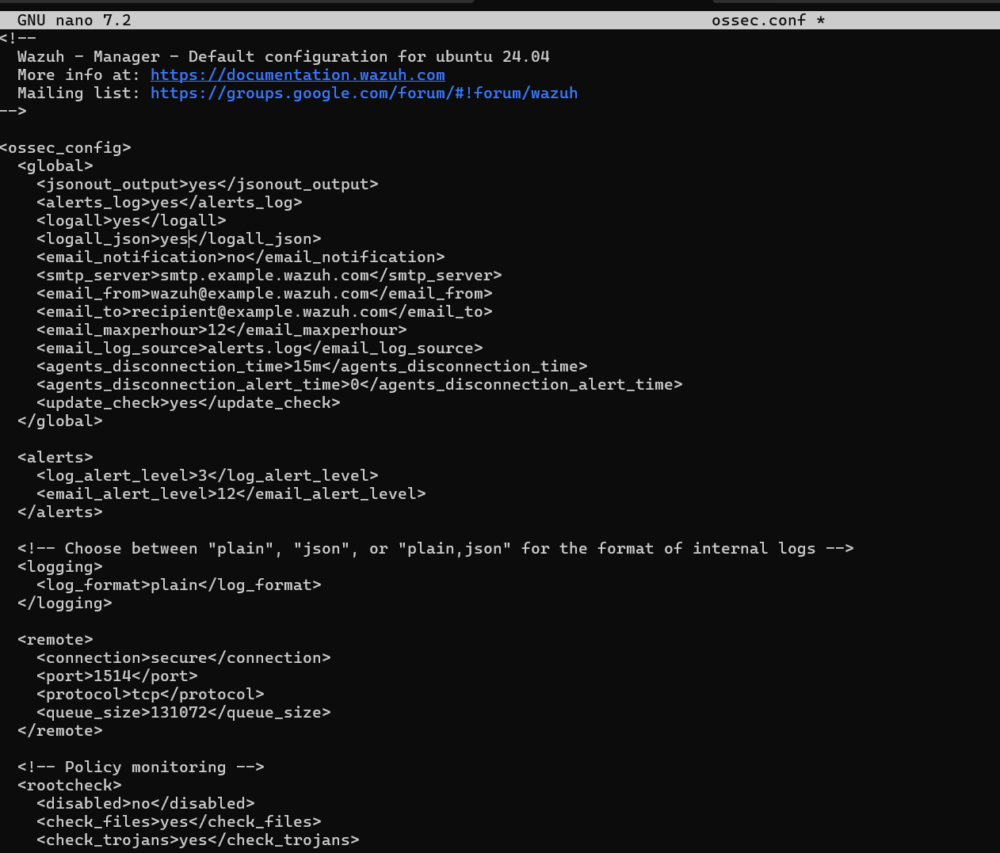
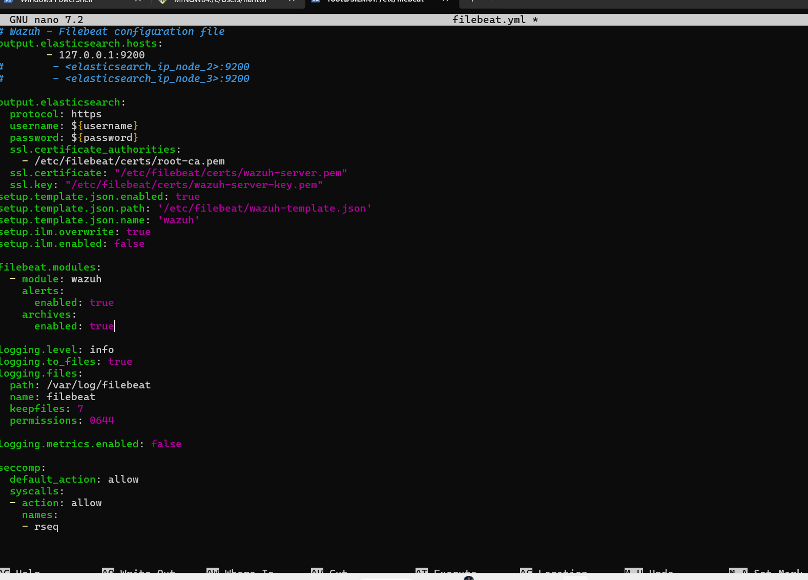
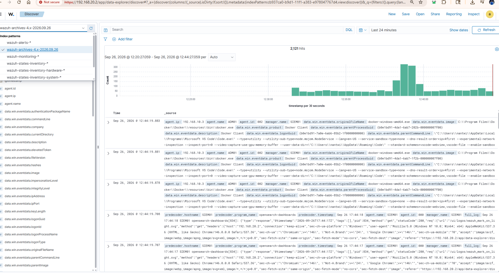

# 20. Detection engineering: tuning a false positive, and turning on the record

**Purpose**: Records the lab's first piece of detection engineering. A built-in Wazuh rule was firing at the highest severity on behaviour Windows performs on itself, several times an hour, on every endpoint. This chapter covers how it was found, why the rule was not wrong, how it was tuned without creating a blind spot, and the two traps that made the first attempt fail silently. It then covers the change that makes such tuning honest: enabling archives, so that a suppressed alert still leaves an event on the record. Written so a reviewer can see the reasoning, not only the configuration.

**Status**: Current. Rules deployed to SIEM01 on 2026-09-26 and verified. Archives enabled the same day. Retention is outstanding and is listed in section 8.

Related: `docs/16` (the SIEM build and the agent estate), `docs/19` section 7 (the credentialed scan whose 2,051 alerts motivated half of this work).

---

## 1. The alert that should not have been there

While reviewing the Wazuh dashboard on 2026-09-25, a Sysmon event ID 11 (FileCreate) appeared, reporting that `powershell.exe` had written a `.ps1` file into a temporary folder.


*Figure 20.1: The event as it appeared in the dashboard. A PowerShell process writing a script file into `AppData\Local\Temp`. Every element of that sentence looks suspicious in isolation.*

The rule metadata is what made it worth stopping for.


*Figure 20.2: Rule 92213, "Executable file dropped in folder commonly used by malware", firing at **level 15** with `rule.mail: true` and MITRE technique **T1105**, Ingress Tool Transfer. Level 15 is the top of Wazuh's severity scale.*

A permanent level 15 alert, tagged as an attacker transferring tooling onto the host, firing on all three Windows endpoints, several times an hour.

## 2. The rule was not wrong

Rule 92213 is part of Wazuh's `sysmon_eid11_detections` group. In plain terms it says: if a program or script file appears in a folder that malware commonly uses, alert at the highest severity.

That is a sound heuristic. Attackers really do stage tooling in temporary directories, and T1105 is a real and common technique.

What the rule cannot know is that Windows does the same thing to itself.

## 3. What PowerShell was actually doing

Before running any script or loading any module, PowerShell must resolve the **execution policy**: may a script be run from here, given where it came from and whether it is signed. That check is defined in terms of files, so PowerShell answers it by creating a real file.

It writes a throwaway `.ps1` into the caller's temporary directory, submits it to the policy provider, reads the verdict, and deletes it. The whole cycle takes milliseconds and happens constantly.

The filename is generated by .NET's `Path.GetRandomFileName()`, which always returns 8.3 format in lowercase alphanumerics:

```
__PSScriptPolicyTest_4plyckik.y11.ps1
__PSScriptPolicyTest_fwonwlyt.yzn.ps1
```

So the event is genuine, the rule's description is accurate, and the activity is entirely benign. This is the textbook shape of a false positive: not a broken rule, but a rule meeting a case its author did not anticipate.

### 3.1 Why this is worse than ordinary noise

An analyst who sees level 15 forty times a day stops reading level 15. The rule's own purpose is defeated by its own volume. Tuning is therefore not a convenience, it is what keeps the alert queue readable, and a readable queue is the only kind that protects anything.

The lab already had the opposite lesson on record. The credentialed scan of 2026-09-19 (`docs/19` section 7) produced **2,051** alerts from rule 92652 in a single run. Two different rules, one disease.

## 4. The suppression, and the rule that must not be written

The fix is a child rule at level 0. Level 0 means the event is decoded, matched, and then deliberately produces no alert.

```xml
<rule id="100010" level="0">
  <if_sid>92213</if_sid>
  <field name="win.eventdata.targetFilename" type="pcre2">(?i)__PSScriptPolicyTest_[a-z0-9]{8}\.[a-z0-9]{3}\.ps1$</field>
  <field name="win.eventdata.image" type="pcre2">(?i)powershell(_ise)?\.exe$</field>
  <description>Sysmon 11: PowerShell execution policy probe file. Expected, not alerted.</description>
</rule>
```

`<if_sid>92213</if_sid>` means this rule is only considered once 92213 has already matched. Rule 92213 itself is untouched and remains enabled. What has been added is a single exception.

**Two `<field>` conditions, not one.** Both must be true. This is the important design decision in the whole chapter.

A suppression written on the filename alone would be a hole in the estate's loudest rule: an attacker who names a dropped payload `__PSScriptPolicyTest_aaaaaaaa.bbb.ps1` would walk straight through it. Requiring that the writing process is also `powershell.exe` closes most of that gap. The residual risk, an attacker using PowerShell itself to write a file matching the probe's exact random-name shape, is accepted and recorded here rather than left implicit.

| Event | Alerts? |
|---|---|
| PowerShell writes its execution policy probe | No |
| Any other file dropped in the same folder | Yes, level 15 |
| A file named like the probe, written by anything else | Yes, level 15 |

## 5. Two traps, both found by testing against a real event

The first version of rule 100010 would never have fired. Neither fault produces an error message. A rule that does not match simply does nothing, silently, forever.

**Trap one: Sysmon path fields arrive with doubled backslashes.** Running a real event through `wazuh-logtest` decoded the path as:

```
win.eventdata.targetFilename: 'C:\\Windows\\SystemTemp\\__PSScriptPolicyTest_fwonwlyt.yzn.ps1'
```

Those are two literal backslashes, not an escaping artefact of the display. A pattern written against single backslashes matches nothing.

**Trap two: the probe does not live in one folder.** The same test revealed `C:\Windows\SystemTemp`, the SYSTEM account's temporary directory, where the earlier example had been `AppData\Local\Temp` under a logged-on user. Anchoring the pattern to a folder was wrong in both directions.

The fix for both was the same, and it generalises: **anchor on the part of a Windows path that contains no separators.** The final rule contains no backslashes at all.

## 6. The scanner pair, and why order matters

The same ruleset closes the 2,051-alert problem from `docs/19`.


*Figure 20.3: Rules 100020 and 100021. The narrow rule is deliberately placed first.*

Rule 92652 reports a successful NTLM network logon and reads it as possible pass-the-hash. During a credentialed scan, `svc-greenbone` authenticates to every service it probes, so the rule fires correctly and constantly.

Two rules rather than one:

| Rule | Level | Matches |
|---|---|---|
| 100020 | 0 | `svc-greenbone` **from 192.168.20.3** (SCAN01) |
| 100021 | 12 | `svc-greenbone` from **anywhere else**, mapped to T1078.002 |

This is the inversion that makes the tuning worth more than the noise it removes. `svc-greenbone` is a scanner service account: it is denied every interactive logon type (`docs/19` section 5) and has no legitimate reason to originate anywhere but SCAN01. Before this pair existed, its use was buried in two thousand identical alerts. After it, normal use is silent and abnormal use is louder than it was.

Wazuh evaluates sibling rules in file order and stops at the first match, so 100020 must precede 100021. Reversed, every scanner logon would alert at level 12.

The failure direction is deliberately safe. If `ipAddress` is absent or does not match SCAN01, rule 100020 misses and 100021 fires loudly. Silence is never the default outcome.

## 7. Deployment, and proving it worked

### 7.1 The repository is the source of truth

The ruleset lives at `detections/wazuh/local_rules.xml` in this repository and is pulled onto SIEM01 from the raw URL, rather than edited in place on the appliance. The appliance holds a copy; the repository holds the reasoning, the history and the review trail.

A first attempt was believed deployed and was not. The check that caught it:


*Figure 20.4: `grep -c "100010"` returning **0**. A manager restart had been performed against an unchanged configuration. Assuming a deployment succeeded is the most common way to spend an evening debugging a rule that is not there.*

Note also that plain `grep` returned "Permission denied" and only `sudo grep` worked. `/var/ossec/etc/rules/` is deliberately not world readable: a ruleset tells a reader exactly what the estate does and does not detect.

### 7.2 The deployment


*Figure 20.5: Reading the existing file's ownership first, backing it up, copying the new ruleset into place, validating, restarting, and confirming three rules present.*

```bash
curl -o ~/local_rules.xml <raw URL from this repository>
sudo cp /var/ossec/etc/rules/local_rules.xml /var/ossec/etc/rules/local_rules.xml.bak
sudo cp ~/local_rules.xml /var/ossec/etc/rules/local_rules.xml
sudo /var/ossec/bin/wazuh-analysisd -t
sudo systemctl restart wazuh-manager
sudo grep -c "rule id" /var/ossec/etc/rules/local_rules.xml
```

Two details in that sequence are not incidental.

**`wazuh-analysisd -t` is not optional.** A malformed `local_rules.xml` prevents `wazuh-manager` from starting at all. A typo does not break one rule, it takes the whole SIEM offline. The test produces no output when the ruleset compiles.

**`cp` was used, not `mv`.** Copying onto an existing file writes through the existing inode, so the destination keeps its `wazuh:wazuh` ownership and `660` mode. `mv` would have replaced the file, delivering it owned by the invoking user, and `wazuh-analysisd` could not have read its own ruleset.

### 7.3 The proof


*Figure 20.6: A search for `rule.id:92213` across the whole of 2026-09-26 returns exactly **one** hit, at **11:42:10**.*

The ruleset was copied into place at **11:56**, recorded by the modification time of `/var/ossec/etc/rules/`. The single remaining alert precedes the rule by fourteen minutes, and nothing has fired since.

This is a cleaner demonstration than any test-harness output, because it is measured on live data. It is also the first genuine before-and-after in the lab's detection work.

## 8. Alerts are not events

A suppression is only defensible if the evidence survives it. Otherwise "I chose not to be told about this" and "I made myself blind to this" are the same configuration.

By default they are the same configuration, because **Wazuh indexes alerts, not events**.

```
event -> decoded -> matched against rules -> scored
                                               |
                          score >= log_alert_level (3)  ->  alerts.json
                          anything lower, or no match   ->  discarded
```

Nothing is written to disk until after the score. An event matching no rule was not deleted from storage; it was never stored. A level 0 rule therefore did not merely silence an alert, it erased the event.

Archives change that one thing: every decoded event is written down regardless of what any rule decided.

### 8.1 Three changes, in three systems, in order

Each step hands off to the next, so a gap anywhere produces nothing visible and looks identical to failure.

| Step | File | Decides |
|---|---|---|
| 1 | `/var/ossec/etc/ossec.conf` | whether the manager **writes** the archive |
| 2 | `/etc/filebeat/filebeat.yml` | whether filebeat **ships** it to the indexer |
| 3 | Dashboards Management, index patterns | whether Discover can **query** it |


*Figure 20.7: `logall` and `logall_json` enabled in the manager configuration. Also visible is `<log_alert_level>3</log_alert_level>`, the threshold that decides what becomes an alert.*


*Figure 20.8: The wazuh module's `archives` fileset enabled. This fileset reads `archives.json` only.*


*Figure 20.9: The `wazuh-archives-*` index pattern returning **2,121 events in 24 minutes**, including events that raised no alert at all.*

### 8.2 `logall` was reverted, deliberately

`<logall>` writes `archives.log` in plain text; `<logall_json>` writes `archives.json`. Both contain the same events. Filebeat's archives fileset reads only the JSON file, so the plain-text copy was written, never shipped, and never read by anything.

It was set back to `no` on the same day, after measurement: `archives.log` had reached **171 MB** in five and a half hours, a full-size duplicate of data already held.

## 9. Capacity, measured rather than estimated

The first estimate of archive growth in this lab was wrong by roughly four times, in the optimistic direction. It was corrected by measurement, which is the only reason it is worth recording.

| Reading, 2026-09-26 18:08 | Value |
|---|---|
| `archives.json` | 364 MB |
| `archives.log` | 171 MB |
| Total, over 5.5 hours | 535 MB, about **2.3 GB/day** |
| Indexer total (`/var/lib/wazuh-indexer/`) | 988 MB |
| Filesystem | 455 GB, 7% used |

The two piles behave differently, and that difference decides where retention effort belongs.

**Files on disk are cheap.** `archives.json` rotates at midnight into a dated folder and is compressed. Log text compresses roughly ten to one, so a 364 MB day lands as tens of megabytes.

**The index is not cheap.** It holds the data plus the structures that make it searchable instantly, and it does not shrink overnight.

So retention belongs on the indexer first. The intended control is an ISM policy deleting `wazuh-archives-*` after 14 days, with `wazuh-alerts-*` left untouched because alerts are small and are the valuable half.

### 9.1 Health under the new load

```
events_dropped          0
event_queue_usage       0.00
total_events_decoded    39322
alerts_written          1963
```

Zero drops with empty queues: the additional disk write per event has not strained the manager. Worth noting that **1,963 alerts out of 39,322 events is 5%**, which quantifies exactly what was being discarded before archives existed.

### 9.2 Integrity, and why a bank cares

`/var/ossec/logs/archives/` contains a `.sum` checksum file for every daily archive. These exist so that a log can later be shown not to have been altered. If a regulated institution tells an auditor "these are our September logs", the next question is how it knows nobody edited them.

PCI DSS requires twelve months of audit log retention with the most recent three months immediately available for analysis. A fourteen-day policy on a single node does not meet that. The gap is not hidden here: it is the difference between what one server can carry and what a real institution would be required to buy, and it is the reason tiered storage exists in commercial deployments.

## 10. Outstanding

- **Retention.** ISM policy on `wazuh-archives-*`, plus a cleanup job for the compressed files. Not urgent at 7% disk, and deliberately deferred rather than forgotten
- **Audit the remaining high-severity rules.** 92213 was found by accident. Sort alerts by rule id, take the top ten by volume, and make a decision on each
- **Confirm the scanner pair under load.** The next credentialed scan should produce close to zero rule 92652 alerts. Until that run happens, rules 100020 and 100021 are deployed but not proven at scale
- **Exclude the dashboard's own access logs.** With archives enabled, SIEM01 records every request made by its own web interface, inflating volume with pure noise
- **A detection for the inverse case.** The execution policy is not a security control: `-ExecutionPolicy Bypass` requires no administrative rights, which is why it appears constantly in real intrusions. Sysmon event 1 already captures full command lines on all three Windows endpoints, so the data to detect it is being collected

## 11. Control mapping

| Control | How this chapter satisfies it |
|---|---|
| NIST SP 800-53 `SI-4` | System monitoring: rule tuning so that monitoring output remains actionable |
| NIST SP 800-53 `AU-6` | Audit record review and analysis: alert triage, and the decision about what warrants an alert |
| NIST SP 800-53 `AU-4` | Audit log storage capacity: growth measured, and capacity planned against it |
| NIST SP 800-53 `AU-9` | Protection of audit information: per-archive checksums |
| NIST SP 800-53 `AU-11` | Audit record retention: policy defined, gap against PCI stated |
| CIS Controls v8 `8.2`, `8.5` | Collect audit logs, and collect detailed audit logs. Archives are what makes 8.5 real |
| CIS Controls v8 `8.3` | Ensure adequate audit log storage |
| CIS Controls v8 `8.11` | Conduct audit log reviews |
| CIS Controls v8 `13.1` | Centralised security event alerting |
| MITRE ATT&CK `T1105` | The technique rule 92213 exists to catch, preserved rather than disabled |
| MITRE ATT&CK `T1078.002` | Domain account misuse, the mapping given to rule 100021 |

## 12. Lessons

**A failing rule is silent.** A regex that never matches produces no error, no warning and no log line. Detection logic must be tested against a real event, not reasoned about. `wazuh-logtest` and the raw event in `alerts.json` are the tools for that.

**Never suppress on a single field.** An exclusion matching one string is a documented hole in the rule it modifies. Two independent conditions make it substantially harder to enter deliberately.

**Suppress at the alert layer, not the collection layer.** Filtering in the Sysmon configuration means the event is never written, shipped or indexed, which is the right choice for pure volume. A level 0 rule keeps the evidence and withholds only the alert, which is the right choice when the event has investigative value.

**Verify deployment, do not assume it.** A restart of an unchanged configuration is indistinguishable from a successful deployment until something is checked.

**Validate before restarting.** `wazuh-analysisd -t` costs one second. A malformed ruleset costs the whole SIEM.

**Measure before estimating, and correct the estimate publicly.** The first capacity figure in this work was wrong by a factor of four. Recording the correction is more useful to a later reader than quietly replacing the number.
