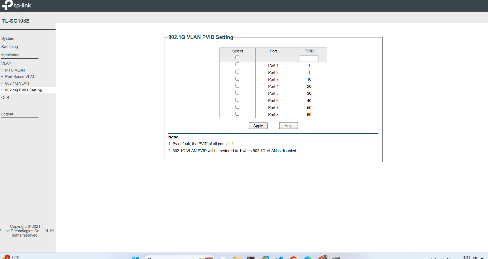

# Evidence Library and Naming Convention

This folder holds the visual evidence for the homelab: screenshots and short screen recordings that prove each configuration step was actually performed. It is organised so that any image can be found from its name alone, and so that the collection reads as an audit trail rather than a pile of `image-1.png` files.

The convention was reset on 2026-08-15. Older, unlabelled files (`image.png`, `image-1.png`, and similar) are **legacy** and are being replaced area by area as the lab is rebuilt. Do not add to the legacy set; use the scheme below.

---

## 1. Why a convention (the standards angle)

Evidence that cannot be traced to what it shows, when it was captured, and which configuration it proves is not evidence, it is decoration. Naming and registering evidence is exactly what audit frameworks expect:

- **NIST SP 800-53 AU-3 / CM-2**, records and configuration baselines must be identifiable and current.
- **CIS Control 12.4**, maintain up-to-date documentation and diagrams of the network.
- General audit practice, every artifact maps to a control or a procedure it supports.

A predictable filename does most of that work for free.

---

## 2. Folder layout

Evidence is grouped by subsystem, one folder per area:

```
images/
  net/     network: switch ports, VLANs, pfSense interfaces, IP addressing
  fw/      firewall: pfSense rules, aliases, NAT
  dc/      domain controller: AD DS, DNS, promotion, ipconfig
  mon/     monitoring: Wazuh, Grafana, Prometheus
  auto/    automation: Ansible controller, playbooks, runs
  vault/   HashiCorp Vault
  pve/     Proxmox VE: VMs, bridges, snapshots
  red/     RedTeam: Kali, attack evidence (lab-only)
  vpn/     remote access: Tailscale
  sys/     endpoints: Windows clients, member servers, Linux members
```

Add a new area folder only when a genuinely new subsystem appears.

---

## 3. Filename format

```
<area>-<NN>-<subject>.<ext>
```

- **`<area>`**, the folder code above (`net`, `fw`, `dc`, ...). Repeating it in the filename keeps names unambiguous when files are moved or embedded in docs.
- **`<NN>`**, two-digit sequence in capture order within the area (`01`, `02`, ... `10`, `11`). Zero-padded so they sort correctly.
- **`<subject>`**, short kebab-case description of what the image shows. Be specific: `dc01-ipconfig-all`, not `ipconfig`.
- **`<ext>`**, `png` for screenshots, `mp4` for recordings, `gif` for short silent clips.

### Examples

| Filename | Shows |
|----------|-------|
| `net/net-01-switch-vlan-table.png` | The 802.1Q VLAN list on the managed switch |
| `net/net-02-switch-port-mapping.png` | Which ports are trunk vs access, and their VLANs |
| `dc/dc-03-dc01-ipconfig-all.png` | `ipconfig /all` output on the DC |
| `fw/fw-05-alias-lab-nets.png` | The `LAB_NETS` alias definition |
| `auto/auto-01-controller-build.mp4` | Recording of the Ansible controller rebuild |

---

## 4. Recordings

- Keep clips **short and purposeful** (one procedure per file), ideally under 2 minutes.
- Use `mp4` for narrated or long clips, `gif` for a silent 5–15 second loop that shows one action.
- Name them exactly like screenshots, with the recording's subject: `dc/dc-07-dcpromo-run.mp4`.
- Large media bloats git history. Prefer keeping raw video out of the repo (see the repo `.gitignore`) and embedding a still frame plus a link, or committing a compressed clip only when it genuinely adds value.

---

## 5. Referencing evidence in docs

From a file in `docs/`, images are one level up then into `images/`:

```markdown

*Figure: Ports 1–2 trunk (all VLANs), Ports 3–8 access per VLAN.*
```

Always add a one-line caption in italics under the image saying what it proves.

---

## 6. Optional: evidence register

For full audit rigour, `docs/evidence-register.md` can list every file with its capture date, what it shows, and the doc or control it supports. Worth adding once the volume grows; the filename convention alone is enough to start.

---

## 7. Migrating the legacy images

The old `image-*.png` files are still referenced by existing docs, so they are not deleted yet. As each subsystem is rebuilt with fresh captures, its doc is updated to point at the new `<area>/<area>-NN-*.png` files, and the superseded legacy images are removed in that same change. This keeps every doc's images working at all times.
